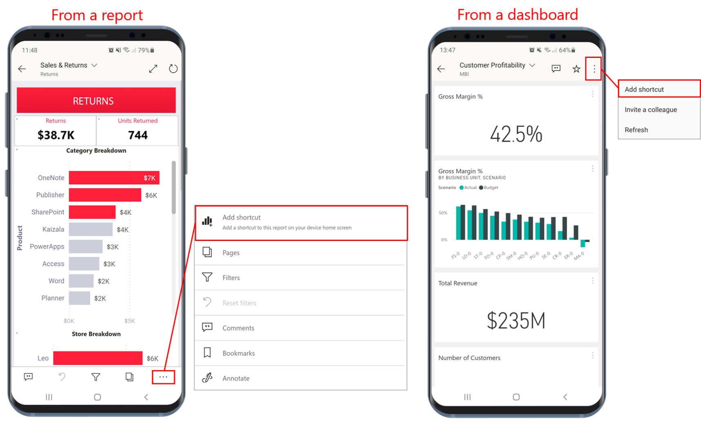
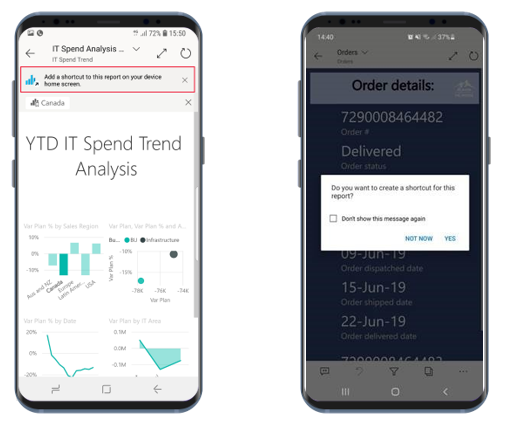
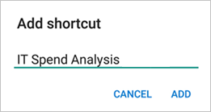
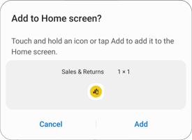
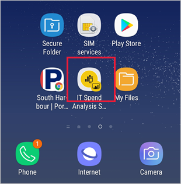
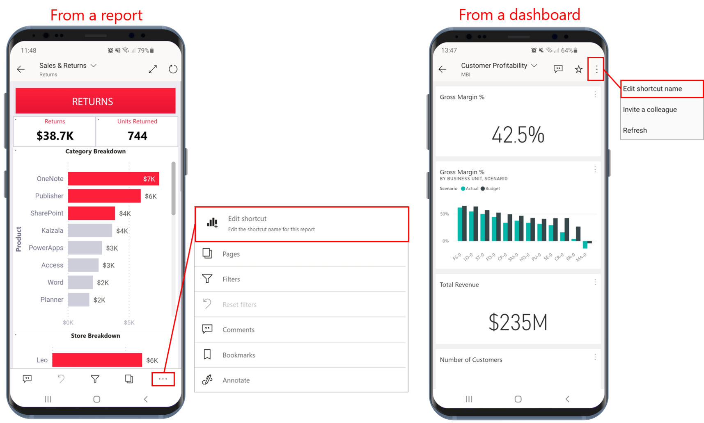
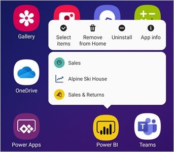

# Use Android app Shortcuts in the Power BI Android app

Applies to:

|  |  |
|:--- |:--- |
| Android phones |Android tablets |

The Power BI mobile app for Android provides two easy ways to get straight to the reports or dashboards you need, without having to navigate through the app: **device home screen shortcuts** and **app launcher shortcuts**.
 * **Device home screen shortcuts**: You can create a shortcut to any report or dashboard and pin it to your device's home screen. The report or dashboard doesn't have to be in one of your workspaces - you can also create shortcuts to reports and dashboards that are inside apps, or even to reports or dashboards that are located on an external (B2B) tenant.
 * **App launcher shortcuts**: You can get directly to frequently viewed reports and dashboards just by doing a long tap on the app launcher icon on your device's home screen to open the app launcher. A quick access menu provides shortcuts to three frequently viewed items. These items change from time to time - the Power BI mobile app keeps track of what you're viewing often and changes the shortcuts accordingly.

 >[!NOTE]
 >Android app shortcuts are available from Android 8 and higher.
>
> Android app shortcuts can be created for only for reports and dashboards hosted in the Power BI service. Shortcuts for Report Server content are not supported. 

## Create a shortcut to any report or dashboard

You can create shortcuts to any report or dashboard.

1. From a report, on the Actions menu, tap **More options...** and select **Add shortcut**. From a dashboard, tap **Add shortcut** on the Actions menu.

   

   Additionally, if the Power BI app sees that you are often accessing an item, it will suggest creating a shortcut to the item. This happens in two ways:
   * On frequently viewed reports and dashboards, the **Add shortcut** option will appear in a banner when you open the item.
   * If you frequently use a link to get to a report (for instance, from a shared email, annotation etc.), after a few times of using this link, a window will open asking you if you'd like to create a shortcut. **Yes** will open the **Add shortcut** dialog (see below), **Not now** will continue to take you to the item you were trying to access.
   
   These two experiences are illustrated below.

   

 1. An **Add shortcut** dialog will option with the name of your item. You can edit the name if you like. When you're done, tap **ADD**.

    

1. You will be asked to confirm if you want to add the shortcut. Tap **ADD** to add the shortcut to your device's home screen.

   

   A shortcut dashboard or report icon will be added to your device's home screen with the name you entered.

   

## Edit the shortcut name

To edit the name of a shortcut, from a report, on the actions menu tap **More options...**, and then choose **Edit shortcut name**. From a dashboard, tap **Add shortcut**. The **Edit shortcut name** dialog will appear.

 

## Use the Power BI mobile app launcher to access frequently viewed content

You can use the Power BI mobile app launcher to get directly to frequently accessed items.

Long tap the app launcher to display a quick access menu for frequently viewed items. Then tap a shortcut to open the desired item.

You can create a permanent shortcut to any of the listed items just by dragging the desired shortcut icon to your device's home screen.

## Next steps
* [Find and access your content with Google Search](mobile-app-find-access-google-search.md)
* If you are on iOS and are looking for Siri shortcuts, see [Using Siri Shortcuts in Power BI Mobile iOS App](mobile-apps-ios-siri-shortcuts.md).
* [Favorites in the Power BI mobile apps](mobile-apps-favorites.md)
