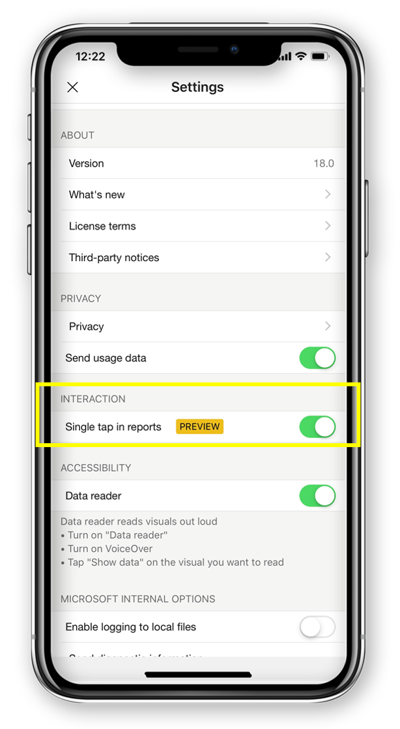

# Configure report interaction to single tap or double tap (preview)
Applies to:

|  |  | 
|:--- |:--- |
| iPhones |Android phones |

A Power BI report is an interactive view of your data, with visuals representing different findings and insights from that data.

You can configure how to interact with your data. You can decide if you want to have single tap interaction or double tap interaction.

* With double tap interaction, your first tap on a visual selects it, and only the second tap in a visual performs the action itself, like slicer item selection, cross highlight, or click on a link, button, and so on.

* With single tap interaction, one tap does both - selects the visual and executes the action.

Starting from Power BI app version 18.0 for iOS and 112540 for Android, all new installations will be configured with Single tap as a default behavior.
Users that already have Power BI installed on the phone and will upgrade to these new versions, will be offered to switch to single tap.

To change the interaction behavior, you can go to the app settings, and turn on/off single tap interaction.

This article applies for both landscape and phone reports.

## Next steps
* [View and interact with Power BI reports optimized for your phone](mobile-apps-view-phone-report.md)
* Questions? [Try asking the Power BI Community](http://community.powerbi.com/)

