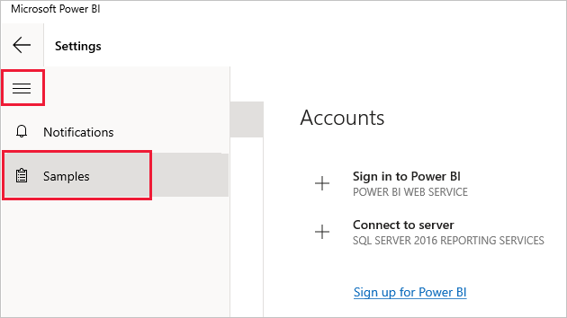
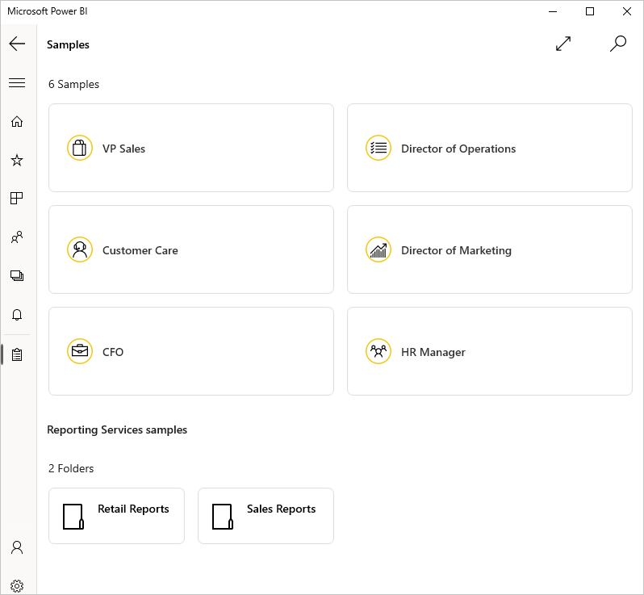
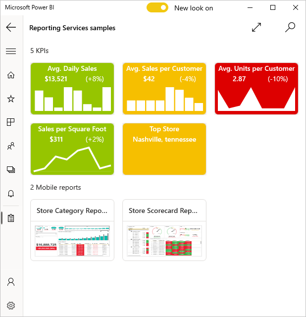
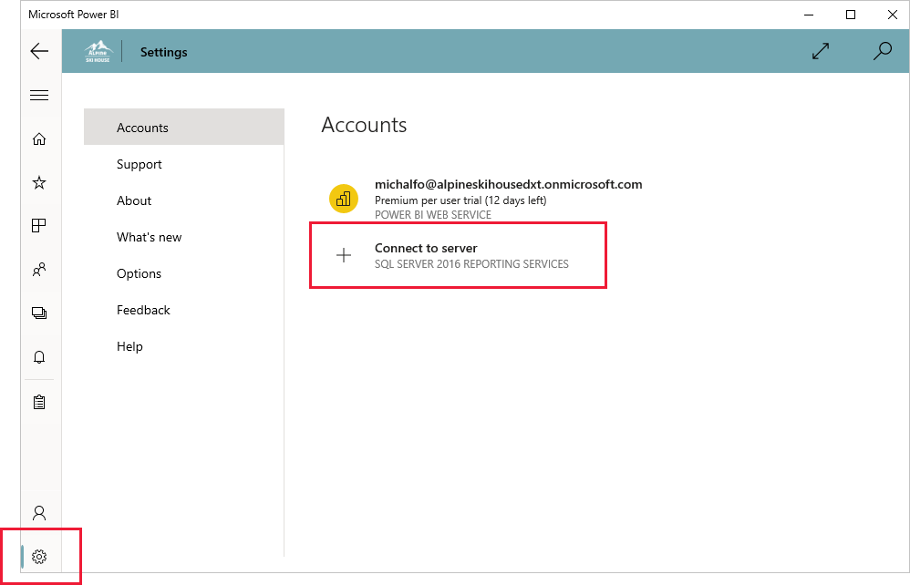
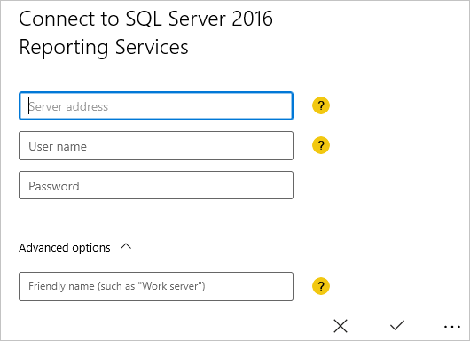
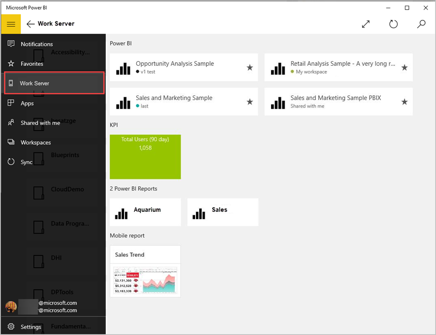
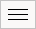
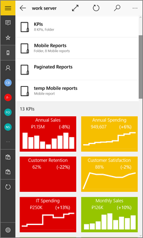
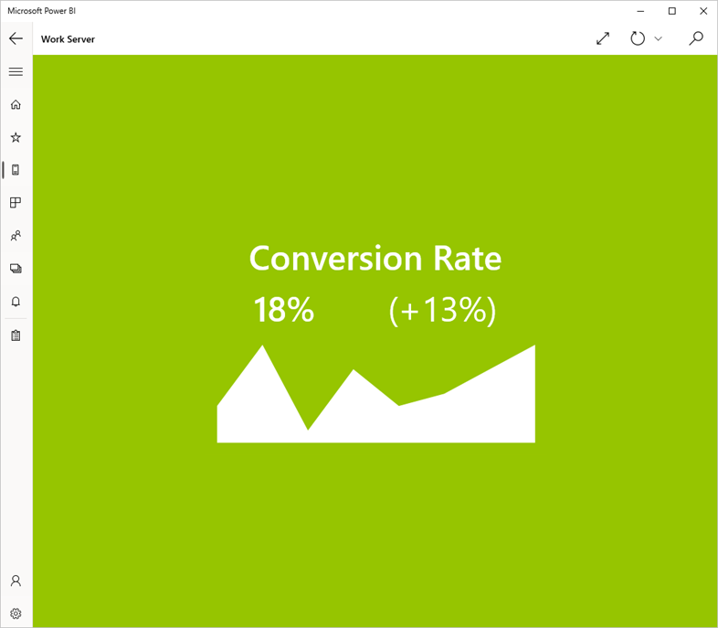
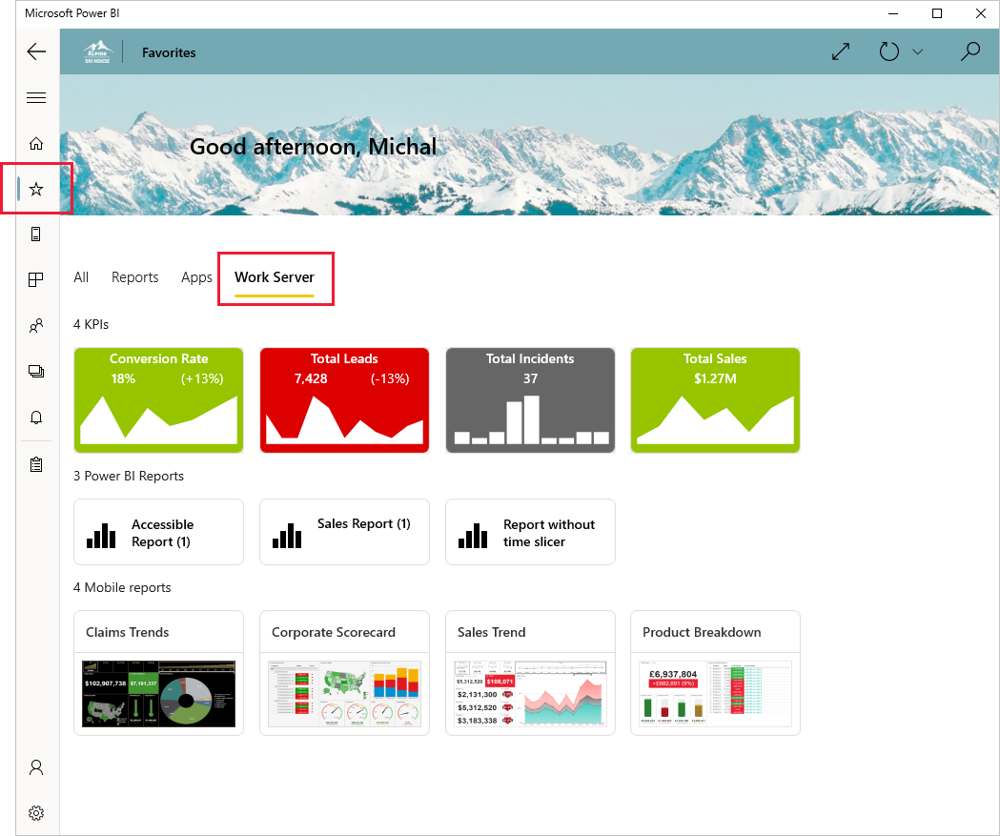

# View on-premises KPIs in the Power BI Windows app

>[!NOTE]
> The Power BI Windows app was retired on December 31st, 2023, and is no longer supported. It's been removed from the Microsoft apps store, and no further product updates for it will be released. Please use [the Power BI service](https://app.powerbi.com/) to view your Power BI content on Windows devices.
>
> This notice only applies to the Power BI Windows app. It does not affect the Power BI Desktop app.

The Power BI app for Windows offers live, touch-enabled access to your important on-premises business information in SQL Server 2016 Reporting Services.

## First things first
Create KPIs right in the Reporting Services web portal. Organize them in folders and mark your favorites, so you can find them easily. 

Then in the Power BI Windows app, view the KPS and Power BI reports, organized in folders or collected as favorites.

> [!NOTE]
> Your device needs to be running Windows 10 or higher. The app works best on devices with at least 1 GB RAM and 8 GB internal storage.

## Explore samples without a SQL Server 2016 Reporting Services server
Even if you don't have access to a Reporting Services web portal, you can still explore sample KPIs.

To see the samples, tap the global navigation button in the upper-left corner and then select **Samples**.

Six sample dashboards are available for Power BI, and two folders containing KPIs are available for Reporting Services.

Open the Retail Reports or Sales Reports folder to explore their KPIs.

Browse the samples to interact with KPIs.

## Connect to a Reporting Services report server
1. Tap **Settings** at the bottom of the navigation pane and then tap **Connect to server**.

    
1. Fill in the server address and your user name and password. Use this format for the server address:
   
     `https://<servername>/reports`
     OR
     `https://<servername>/reports`
   
   > [!NOTE]
   > Include **http** or **https** at the beginning of the connection string.
   > 
   > 
   
    Tap **Advanced option** to give the server a name, if you'd like.

    

4. Tap the check mark to connect. 
   
   Now you see the server in the nav pane.
   
   
   
   >[!TIP]
   >Tap the global navigation button  anytime to go between your Reporting Services mobile reports and your dashboards in the Power BI service. 
   > 

   >[!NOTE]
   >Report Servers configured with custom ports are not supported and cannot be accessed from the Power BI Windows app. 

## View Reporting Services KPIs in the Power BI app
Reporting Services KPIs and Power BI reports are displayed in the same folders they're in on the Reporting Services web portal.

* Tap a KPI to see it in focus mode.
  
    

## View your favorite KPIs and reports
You can mark KPIs and Power BI reports as favorites on your Reporting Services web portal, and then view them on your Windows device. Just click the Favorites icon in the nav pane to display the Favorites page, and then tap the tab that has your report server name.

Tap the other tabs to filter your favorites in other ways.

Read more about [favorites in the Power BI mobile apps](mobile-apps-favorites.md).

## Remove a connection to a report server
You can only be connected to one report server at a time from your Power BI mobile app. If you want to connect to a different server, you need to disconnect from the current one.

At the bottom of the nav pane, tap **Settings**, tap the server you want to disconnect from, and choose **Remove server**.

## Create Reporting Services mobile reports and KPIs
You don't create Reporting Services KPIs in the Power BI app. You create them in SQL Server Mobile Report Publisher and a SQL Server 2016 Reporting Services web portal.

* Create [KPIs on a Reporting Services web portal](/sql/reporting-services/working-with-kpis-in-reporting-services)

## Related content

* [Get started with the Power BI Windows app](mobile-windows-10-phone-app-get-started.md)  
* [What is Power BI?](../../fundamentals/power-bi-overview.md)  
* Questions? [Try asking the Power BI Community](https://community.powerbi.com/)