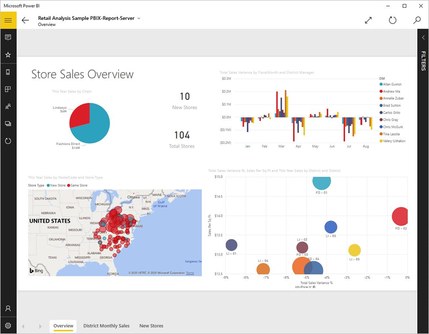
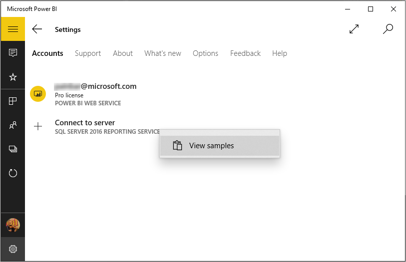

# View Reporting Services (SSRS) mobile reports and KPIs in the Windows 10 Power BI mobile app
The Power BI mobile app for Windows 10 offers live, touch-enabled mobile access to your important on-premises business information in SQL Server 2016 Reporting Services. 

## First things first
[Create Reporting Services mobile reports](https://msdn.microsoft.com/library/mt652547.aspx) with SQL Server 2016 Enterprise Edition Mobile Report Publisher and publish them to the [Reporting Services web portal](https://msdn.microsoft.com/library/mt637133.aspx). Create KPIs right in the web portal. Organize them in folders and mark your favorites, so you can find them easily. 

Then in the Power BI mobile app for Windows 10, view the mobile reports and KPIs, organized in folders or collected as favorites. 

> [!NOTE]
> Your device needs to be running Windows 10. The app works best on devices with at least 1 GB RAM and 8 GB internal storage.
> 
> 

## Explore samples without a SQL Server 2016 Reporting Services server
Even if you don't have access to a Reporting Services web portal, you can still explore the features of Reporting Services mobile reports.

1. In your Windows 10 device, open the Power BI app.
2. Tap the global navigation button  in the upper-left corner.
3. Tap **Settings** icon , right-click or tap and hold **Connect to server**, then tap **View samples**.
   
   
4. Open the Retail Reports or Sales Reports folder to explore their KPIs and mobile reports.
   
   

Browse the samples to interact with KPIs and mobile reports.

## Connect to a Reporting Services report server
1. At the bottom of the left navigation bar, tap **Settings** 
2. Tap **Connect to server**.
3. Fill in the server address and your user name and password. Use this format for the server address:
   
     `http://<servername>/reports`
     OR
     `https://<servername>/reports`
   
   > [!NOTE]
   > Include **http** or **https** at the beginning of the connection string.
   > 
   > 
   
    Tap **Advanced option** to give the server a name, if you'd like.
4. Tap the check mark to connect. 
   
   Now you see the server in the left navigation bar.
   
   
   
   >[!TIP]
   >Tap the global navigation button  anytime to go between your Reporting Services mobile reports and your dashboards in the Power BI service. 
   > 

## View Reporting Services KPIs and mobile reports in the Power BI app
Reporting Services KPIs and mobile reports are displayed in the same folders they're in on the Reporting Services web portal.

* Tap a KPI to see it in focus mode.
  
    
* Tap a mobile report to open and interact with it in the Power BI app.
  
    

## View your favorite KPIs and reports
You can mark KPIs and mobile reports as favorites on your Reporting Services web portal, and then view them in one convenient folder on your Windows 10 device, along with your Power BI favorite dashboards and reports.

* Tap **Favorites**.
  
   
  
   Your favorites from the web portal are all on this page.
  
   

Read more about [favorites in the Power BI mobile apps](mobile-apps-favorites.md).

## Remove a connection to a report server
You can only be connected to one report server at a time from your Power BI mobile app. If you want to connect to a different server, you need to disconnect from the current one.

1. At the bottom of the left navigation bar, tap **Settings** .
2. Tap and hold the server name you don't want to be connected to.
3. Tap **Remove server**.
   
    

## Create Reporting Services mobile reports and KPIs
You don't create Reporting Services KPIs and mobile reports in the Power BI mobile app. You create them in SQL Server Mobile Report Publisher and a SQL Server 2016 Reporting Services web portal.

* [Create your own Reporting Services mobile reports](https://msdn.microsoft.com/library/mt652547.aspx), and publish them to a Reporting Services web portal.
* Create [KPIs on a Reporting Services web portal](https://msdn.microsoft.com/library/mt683632.aspx)

## Next steps
* [Get started with the Power BI mobile app for Windows 10](mobile-windows-10-phone-app-get-started.md)  
* [What is Power BI?](../../power-bi-overview.md)  
* Questions? [Try asking the Power BI Community](http://community.powerbi.com/)

