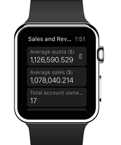
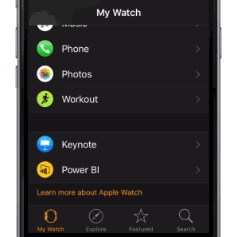

# Explore your data in the Power BI mobile app on your Apple Watch
With the Power BI Apple Watch app, you can view KPIs and card tiles from your Power BI dashboards, right on your watch. KPIs and card tiles are best suited to providing a heartbeat measure on the small screen. You can refresh a dashboard from your iPhone or from the Watch itself.

## Install the Apple Watch app
The Power BI Apple Watch app is bundled with the Power BI for iOS app, so when you [download the Power BI app to your iPhone](http://go.microsoft.com/fwlink/?LinkId=522062 "Download the iPhone app") from the Apple App Store, you're automatically also downloading the Power BI Watch app. The Apple guide explains how to [install Apple Watch applications](https://support.apple.com/HT204784).

## Use the Power BI app on the Apple Watch
Get to the Power BI Apple Watch app either from the watch's springboard, or by clicking the Power BI widget (if configured) directly from the watch face.

The Power BI Apple Watch app consists of two parts.

* The **index screen** allows a quick overview of all KPI and card tiles from the synced dashboard.
  
  
* The **in-focus tile**: Click a tile on the index screen for an in-depth view of a specific tile.
  
  

## Refresh a dashboard from your Apple Watch
You can refresh a synced dashboard directly from your watch.

* While in the dashboard view on the watch app, deep press your screen and select **refresh**.

Your watch app will now sync your dashboard with data from the Power BI service.

> [!NOTE]
> The watch app communicates with Power BI via Power BI mobile app on the iPhone. Therefore, the Power BI app must be running on your iPhone, at least in the background, for the dashboard on the watch app to refresh.
> 
> 

## Refresh a dashboard on your Apple Watch from your iPhone
You can also refresh a dashboard that's on your Apple Watch from your iPhone.

1. In Power BI on your iPhone, open the dashboard you want to sync with the Apple Watch. 
2. Select the ellipsis (...) > **Sync with Watch**.

Power BI shows an indicator that the dashboard is synced with the watch.

You can only sync one dashboard at a time with the watch.

> [!TIP]
> To view tiles from multiple dashboards on your watch, create a new dashboard in the Power BI service, and pin all the relevant tiles to it.
> 
> 

## Set a custom Power BI widget
You can also display a specific Power BI tile directly on the Apple Watch face, so it's visible and accessible at all times.

The Power BI Apple Watch widget updates close to the time your data updates, keeping your needed information always up to date.

### Add a Power BI widget to your watch face
See [Customize your Apple Watch face](https://support.apple.com/HT205536) in the Apple Guide.

### Change the text on the widget
Given the small space on the Apple Watch face, the Power BI Apple Watch app lets you change the title of the widget to fit the small space.

* On your iPhone, go to the Apple Watch control app, select Power BI, navigate to the widget name field, and type a new name.
  
  

> [!NOTE]
> If you don't change the name, the Power BI widget will shorten the name to the number of characters that fit the small space on the watch face. 
> 
> 

## Next steps
Your feedback will help us decide what to implement in the future, so please don’t forget to vote for other features that you would like to see in Power BI mobile apps. 

* Download the [Power BI iPhone mobile app](http://go.microsoft.com/fwlink/?LinkId=522062)
* Follow [@MSPowerBI on Twitter](https://twitter.com/MSPowerBI)
* Join the conversation at the [Power BI Community](http://community.powerbi.com/)

