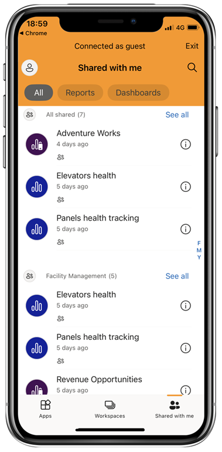

# View Power BI content shared with you from an external organization

Power BI integrates with Azure Active Directory business-to-business (Azure AD B2B) to allow secure distribution of Power BI content to guest users outside your organization. And external guest users can use the Power BI mobile app to access that Power BI content shared with them. 

Applies to:

|  |  |  |  |
|:--- |:--- |:--- |:--- |
| iPhones |iPads |Android phones |Android tablets |

## Accessing shared content

**First, you need someone from an external organization to share an item with you.** When someone [shares an item with you](../../collaborate-share/service-share-dashboards.md), either from the same organization or from an external organization, you receive an email with a link to that shared item. Following that link in your mobile device opens the Power BI mobile app. If the app recognizes that the item was shared from an external organization, the app reconnects to that organization with your identity. The app then loads all items that were shared with you from that organization.

> [!NOTE]
> If this is the first item shared with you as an external guest user, you must claim the invitation in a browser. You can cannot claim the invitation in the Power BI app.

As long as you are connected to an external organization, a black header appears in the app. This header indicates that you are not connected to your home organization. To connect back to your home organization, exit from guest mode.

Even though you need to have a Power BI artifact link to connect to an external organization, once your app switches, you can access all items shared with you (not only the item you opened from the email). To view all items you can access in the external organization, go to the app menu and select **Shared with me**. Under **Apps**, you find apps that you can use as well.

## Considerations and limitations

- Users must have an active Power BI account and Home tenant.
- Users must be signed in to their Power BI home tenant, before they can access the content shared with them from an external tenant.
- Conditional access and other Intune policies are not supported in Azure AD B2B and in Power BI mobile. That means that the app enforces only the home organization's policies, if they exist.
- Push notifications are received from the home organization site only (even when the user is connected as a guest to an external organization). Opening the notification reconnects the app to the user's home organization site.
- If the user shuts down the app, when reopened the app connects automatically to the user's home organization.
- When connected to an external organization, some actions are disabled: favorite items, data alerts, commenting, and sharing.
- Offline data is not available while connected to an external organization.
- If you have the Company Portal app installed on your device, then your device must be enrolled.
