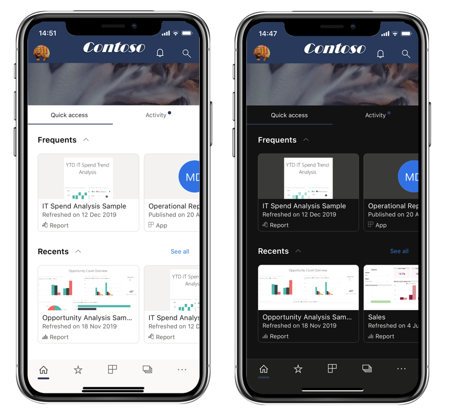
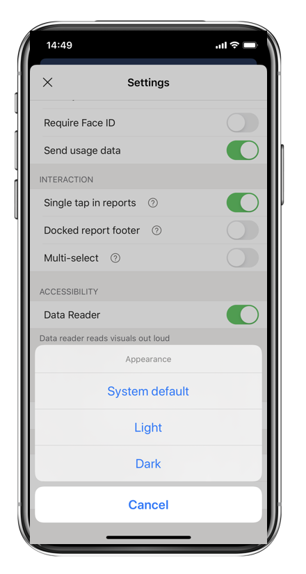
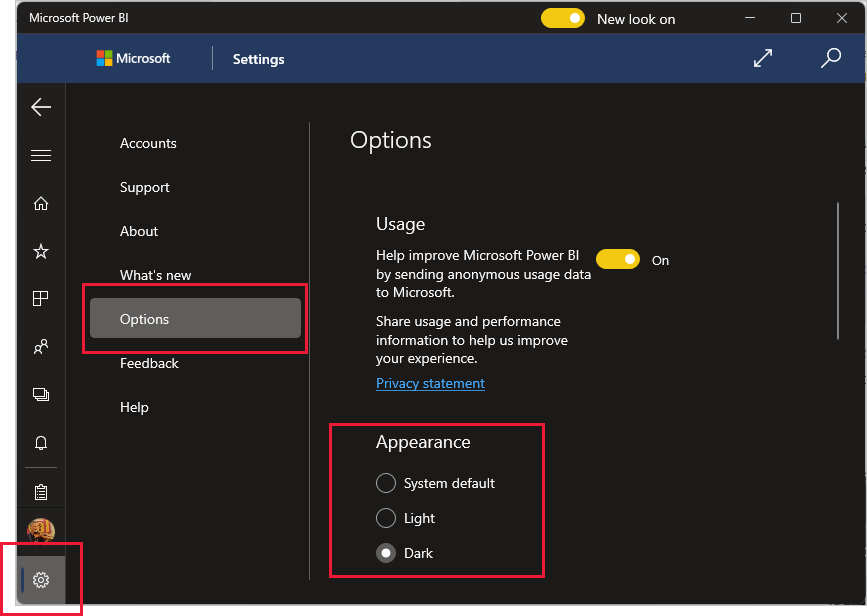

# Dark mode

To accommodate your individual viewing preferences, the Power BI mobile apps support both light and dark screen modes. Dark mode reduces the brightness of the screen, making it easier to see your content.

 In dark mode, all app experiences appear with a dark background. Power BI content, however, isn't affected. Your reports, dashboards, and apps, are always displayed as the designers intended.

 By default, your Power BI mobile app uses your device's settings to determine which screen appearance to display. If your device is configured for dark mode, the app will appear in dark mode.

>[!NOTE]
>Device-level support for dark mode on Android devices is officially available from Android 10. On devices running earlier Android versions, dark mode in the Power BI mobile app can be controlled by the app's appearance settings.

On iOS and Android devices, to switch between light and dark mode, or to let device settings determine the mode, go to the **Settings** page, scroll down to **Appearance**, tap it, and choose your desired mode.

On Windows devices, open the **Settings** page, select **Options**, and then set the appearance as desired.

## Related content

* [Dark mode in Power BI Desktop](../../create-reports/power-bi-dark-mode.md)
