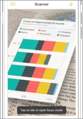

# Get data from the real world with the Power BI mobile apps
Power BI mobile apps can connect the real world directly to related BI information, in a number of different ways. 

## QR codes for tiles
Create a QR code for a report, or a tile in a dashboard, and put the QR code anywhere you want. When your colleagues scan the code with their iPhones, Android phones, or the Power BI for Mixed Reality app, they see the tile you've associated with that QR code. On an iPhone, they see the tile in augmented reality.

More about:

* [Creating a QR code for a tile in Power BI](../../service-create-qr-code-for-tile.md)
* [Scanning a Power BI QR code from your mobile device](mobile-apps-qr-code.md)
* [Scanning a QR code with the Power BI for Mixed Reality app](mobile-mixed-reality-app.md#scan-a-report-qr-code-in-holographic-view).

## QR codes for reports
Create a QR code for a report.  When your colleagues scan the code with their iPhones (Android phones are coming soon), they see the report you've associated with that QR code. 

More about [creating a QR code for a report in Power BI](../../service-create-qr-code-for-report.md)

## Barcodes
Tag barcode data in your report so your colleagues can scan a barcode on a product and go straight to that report, filtered for that product.

More about:

* [Tagging barcode data in a report](../../desktop-mobile-barcodes.md)
* [Scanning a barcode from the Power BI app on your iPhone](mobile-apps-scan-barcode-iphone.md)

## Filter by location
Categorize geographical data in a report in Power BI Desktop. Then your colleagues view that report in the Power BI mobile app for iOS, Power BI automatically provides geographical filters that match where they are.

More about [filtering by location](mobile-apps-geographic-filtering.md).

## Next steps
* [Create a QR code for a tile in Power BI](../../service-create-qr-code-for-tile.md)
* [Create a QR code for a report in Power BI](../../service-create-qr-code-for-report.md)

