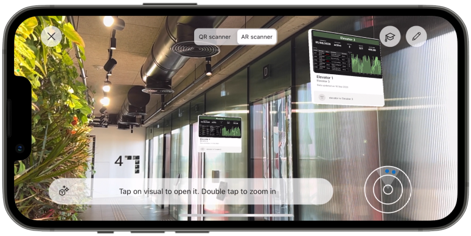

# Get data from the real world with the Power BI mobile apps
The Power BI mobile apps can connect the real world directly to related BI information. The features described below make this possible. 

## Data in space (preview)

**Data in space** is a feature that enables you to connect your digital business data to real-world places, putting real-time data at the fingertips of employees where they need it and enabling them to make better, faster, and more informed decisions.

Data in space uses augmented reality technology to enable you to create spatial anchors in the real world and attach Power BI data to them, so that data can be connected to the physical environment it is relevant to.

Data in space is currently supported for iPhones and iPads.

For more information, see:

* [Data in space overview](mobile-apps-data-in-space-overview.md)
* [Pin Power BI reports to locations in the real world](mobile-apps-data-in-space-pin-reports.md)
* [Find and access Power BI reports pinned to locations in the real world](mobile-apps-data-in-space-find-pinned-reports.md)
* [Admin: Set up Data in space in your organization](mobile-apps-data-in-space-set-up.md)

## Barcode scanning

Power BI data can be tagged with barcodes in Power BI Desktop. These barcodes can then be attached to objects in the real world, such as machines on a shop floor or items on the shelf in a store. When you scan such a barcode using the Power BI app’s camera, the reports that contain barcode data can be opened, filtered to the specific barcoded data.

For more information, see:
* [Scanning a barcode from the Power BI app on your mobile device](mobile-apps-scan-barcode.md)
* [Tagging barcode data in a report](../../transform-model/desktop-mobile-barcodes.md)

## QR code scanning

QR codes can be generated for reports and tiles in your organization. When you scan such a QR code, using either the Power BI app’s camera or any other scanning app you have on your mobile device, the report or tile that the QR code links to will open.

For more information see:
* [Scanning a Power BI QR code from your mobile device](mobile-apps-qr-code.md)
* [Scanning a QR code with the Power BI for Mixed Reality app](./mobile-hololens2-app.md#open-reports-with-qr-codes)
* [Creating a QR code for a report in Power BI](../../create-reports/service-create-qr-code-for-report.md)
* [Creating a QR code for a tile in Power BI](../../create-reports/service-create-qr-code-for-tile.md)

## Location-based report filtering

Some data in Power BI may be categorized as geographical data. When you view that report in the Power BI mobile app, Power BI automatically will filter the data according to your geographical location.

For more information, see:
* [Filtering by location](mobile-apps-geographic-filtering.md)
* [Set geographic filters in Power BI Desktop for use in the mobile app](../../transform-model/desktop-mobile-geofiltering.md)
* [Create URLs with query parameters to filter Power BI reports](../../collaborate-share/service-url-filters.md)