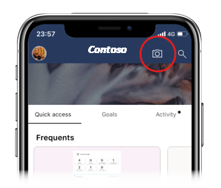
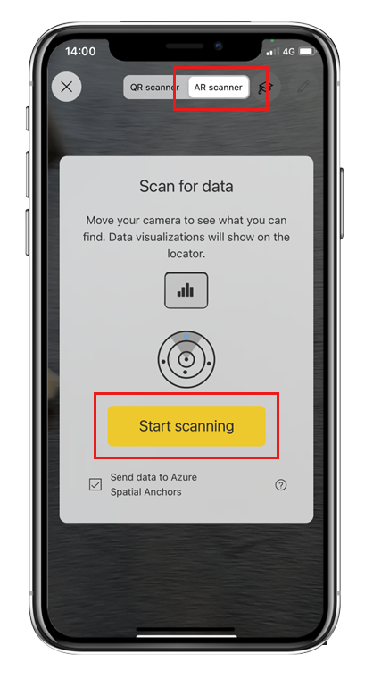

# Find and access pinned reports using Data in space (preview)

Applies to:

|  |  |
|:--- |:--- |
|iPhones |iPads |

This article describes how to find and access Power BI data that has been pinned to locations in the real world using the Power BI mobile app's Data in space feature. See [Next steps](#next-steps) if you're looking for a general overview of the Data in space feature or for information about pinning reports in space or setting up Data in space in an organization (administrators).

To perform the actions described in this article, you need be a [Data in space **Viewer** or **Writer**](./mobile-apps-data-in-space-overview.md#what-data-in-space-role-do-i-have).

Data is space is currently supported on iPhones and iPads.

## Find and access pinned reports

1. To discover reports pinned around you, tap the mobile app’s camera icon to open the scanner.

    

2. Choose **AR scanner** and tap **Start scanning**.

    

    >[!NOTE]
    > If you don't see the AR scanner option, it means either that you're not allowed to find pinned reports, or that your organization isn't using the Data in space functionality.

1. Scan the area around you by moving your camera slowly from side to side. It may take a few moments for the scanner to find the pinned reports. When the scanner detects pinned reports, they'll show up as cards suspended in three dimensional space at the locations they've been pinned to. The cards show an up-to-date, current view of the report. The data you see depends on your Power BI permissions.

    

    At the bottom of your view, there is the report locator. Each dot there shows the reports approximate position in relation to the direction you're facing. Note that there might be reports located behind you!

    Reports that you don't have access to will appear in the camera view, but instead of thumbnails with data, you'll see a message explaining that you don't have access. You can tap such cards to request access.
    
1. Tap a card to open the report, or double tap it bring it to the center of the screen for a better look at the thumbnail.

    

    Since the report image on the thumbnail shows an up-to-date view of the report, double-tapping is convenient if all you need is a quick glance at the report, to check KPIs, for example - there's no need to actually open the report itself. If you decide you do want to open the report, just tap the card.

    Double tap the card again to send it back to its original location.

## Next steps

* [Data in space overview](mobile-apps-data-in-space-overview.md)
* [Pin Power BI reports to locations in the real world](mobile-apps-data-in-space-pin-reports.md)
* [Admin: Set up Data in space in your organization](mobile-apps-data-in-space-set-up.md)