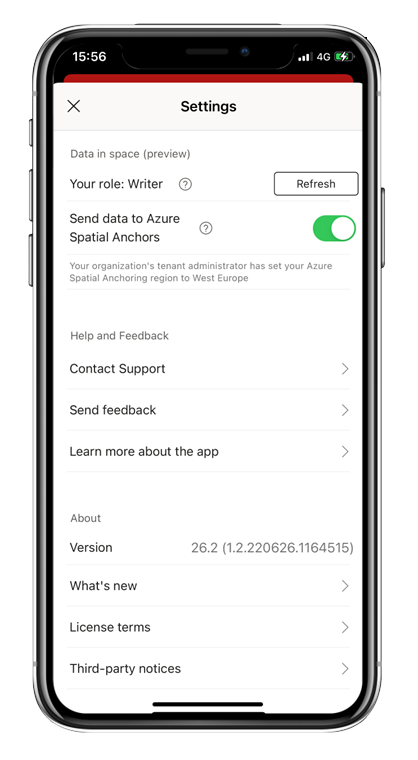

# Data in space overview (preview)

**Data in space** is a new Power BI Mobile feature that uses augmented reality technology to create spatial anchors in the real world and attach Power BI data to them, so that data can be connected to the physical environment it is relevant to.

Data in space is currently supported on ARKit-compatible iPhones and iPads. See Apple's documentation to check whether your iPhone or iPad is ARKit compatible.

This article provides a general overview of the Data in space feature. For more information, see also:
* [Pin Power BI reports to locations in the real world](mobile-apps-data-in-space-pin-reports.md)
* [Find and access Power BI reports pinned to locations in the real world](mobile-apps-data-in-space-find-pinned-reports.md)
* [Administrators: Set up Data in space in your organization](mobile-apps-data-in-space-set-up.md)

## How can Data in space benefit me?

With Data in Space you can connect your digital business data to your real-world places in facility management, manufacturing, retail, and many other use cases. You can put real-time data at the fingertips of employees where they need it, enabling them to make better, faster, and more informed decisions.

Think about a facility management scenario, where you, as a building manager, can pin reports showing the status of various areas in the building as collected from multiple sensors and data sources for such things as air quality, temperature, floor occupancy, etc. Later, when building operations staff visit these areas, they can discover and access these reports simply by using their Power BI Mobile app.

## How does it work?

Data in space is powered by an integration of the Azure Spatial Anchors service and the Power BI Mobile app. This integration makes it possible to map real-world spaces in three dimensions, to create fixed, persistent spatial anchors in those spaces, and to attach digital content (Power BI reports) to these anchors. It also allows the app on any other device to search a space and look for anchors created in that space.

Data in space is set up in an organization by administrators (see below). As part of setup, administrators assign users in the organization to one of two Data in space roles: **writer** and **viewer**. Data in space writers can pin reports to locations as well as edit and delete pins. Viewers can scan to find and access pinned reports in a space.

**Here's how it works:**

A data in space writer goes to the location where it would be useful to have reports available in context on location. They open the report they want to pin in their mobile app, apply filters and slicers to configure the view they want the report to open to, and then they scan the space with their mobile app's camera in order to map the space and pin the report to the desired location. When they pin the report, a spatial anchor is created and saved so that the report can later be found by others. They can do this multiple times in the same space, pinning different reports, or even different views of the same report.

Later, a data in space viewer who needs to access the report on location can enter the space and find and access the pinned reports just by scanning the space with their mobile app’s camera.

## Requirements

Data in space must be set up and enabled by Power BI administrators. They need to create an Azure spatial anchors resource in the organization's Azure account and connect it to their Power BI tenant. They also need to assign users to the roles that will allow them either to create or modify anchors or to search for saved anchors. For more information, see [Set up Data in space for your organization](./mobile-apps-data-in-space-set-up.md).

Users in the organization who need to pin reports to real-world locations or access pinned reports need to be assigned to one of the two Data in space roles. Users are assigned to these roles by administrators as part of the Data in space setup. The role that a user is assigned to determines what the user can do and see in the data in space experience.

* **Data in space writer**: Data in space writers can pin reports, change the position, size, and rotation of pinned reports, and delete pins. To pin a report, a writer must have at least read permissions on the report. To be able to edit or delete a pin, a writer needs to be either the person who created the pin or the report owner.

* **Data in space viewer**: Data in space viewers can find and access pinned reports. To be able to access a report, a viewer must have at least read permissions on the report. If they don't have access to a report, they can request access right there in the data in space experience.

## What Data in space role do I have?

To see what Data in space role you have, tap your profile picture, choose **Settings**, and scroll down to **Data in space (preview)**.

IF you see **None**, this means that your administrator has not given you a Data in space role, and you won't be able to pin reports or access pinned reports. Contact your administrator to request a Data in space role.

If you do not see the Data in space section in your settings, it means that Data in space has not been set up in your organization.

## Next steps

* [Pin Power BI reports to locations in the real world](mobile-apps-data-in-space-pin-reports.md)
* [Find and access Power BI reports pinned to locations in the real world](mobile-apps-data-in-space-find-pinned-reports.md)
* [Admin: Set up Data in space in your organization](mobile-apps-data-in-space-set-up.md)