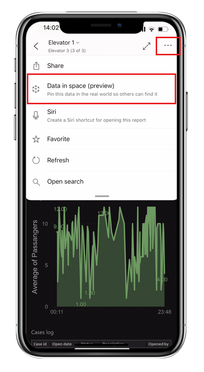
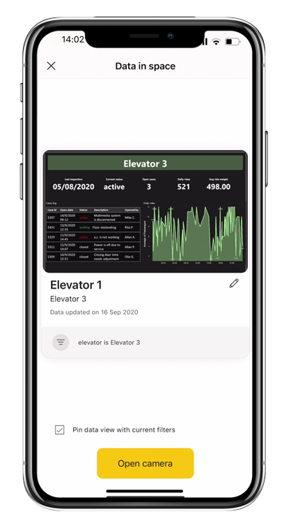
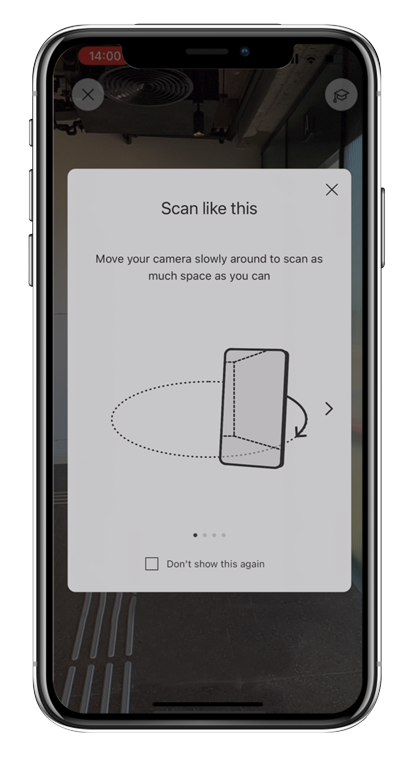
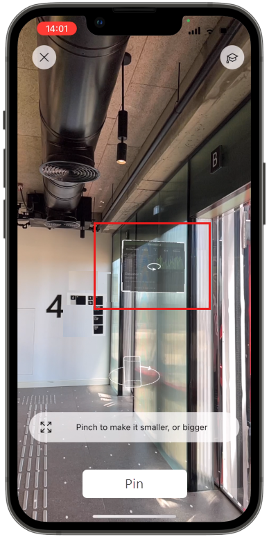
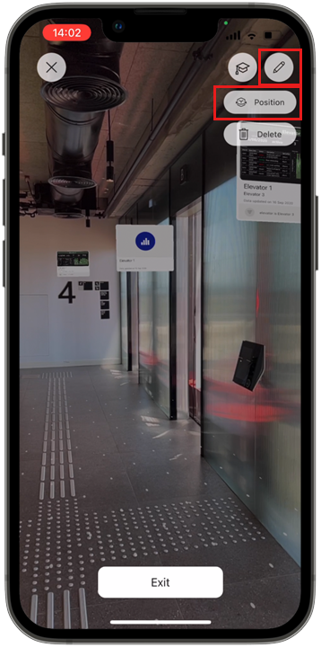
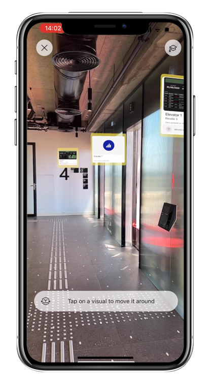
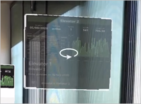
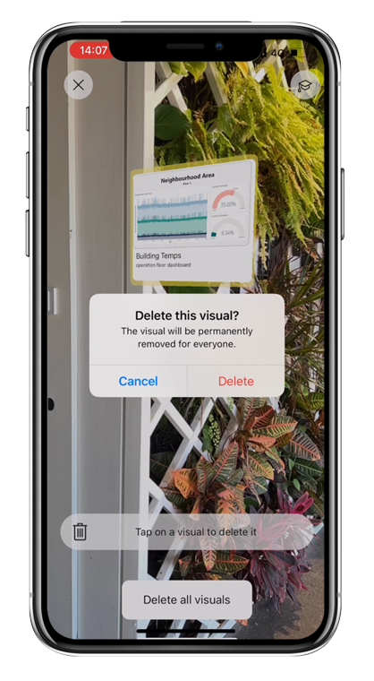

# Pin Power BI reports to locations in the real world (preview)

Applies to:

|  |  |
|:--- |:--- |
|iPhones |iPads |

With the Power BI app’s Data in space feature, you can pin reports in augmented reality to real-world locations where those who need them can find and access them - in context, on location.

When you pin a report to a location, a spatial anchor is created. The spatial anchor is a representation of the point you selected and its orientation in a space. Thus, when you pin a report, you need to use your mobile app's camera to scan the space to capture as much information about it as possible, so that the anchor will have enough data.

This article describes how to:

* Pin data to locations in the real world
* Change the position, size, and rotation of pinned data
* Unpin data from a location

See [Next steps](#next-steps) if you're looking for an overview of the Data in space feature, or for information about finding and accessing pinned reports or setting up Data in space in an organization (administrators).

To be able to perform the tasks described in this article, you must be a [Data in space writer](./mobile-apps-data-in-space-overview.md#what-data-in-space-role-do-i-have). In addition:

* To be able to pin reports, you must have at least read permissions on the report.
* To be able to change a pin's position, size, or rotation, or to unpin data from a location, you must be either the one who pinned the report or the report owner.

## Pin a report to a real-world location

1. Go to the location where you want to pin a report.
1. Open the report. You can pin the report with currently applied filters, so apply any filters, if desired.
1. Tap **More options (…)** and choose **Data in space (preview)**.

    
    
    >[!NOTE]
    > If you don't see the Data in space (preview) option, it means either that you are not a [Data in space Writer](./mobile-apps-data-in-space-overview.md#what-data-in-space-role-do-i-have) or that your organization is not using the Data in space feature.
    
    The **Data in space** page opens. It shows you the card that viewers will see when they scan an area looking for reports. The card shows the state of the report with the current filters applied. This can be useful for people who just need to check things such as KPIs and don’t really need to see the whole report. The card always shows the report in regular web layout, even if the report has a mobile-optimized view.

    

1. Tap **Open camera**.

    If you want to pin the report with the currently applied filters, make sure the **Pin data view with current filters** checkbox is selected before opening the camera. When the box is checked, the current filter will be applied when other users, discovering the report, view the card and open the report.

1. Scan all of the space around you by slowly moving the camera from side to side, as illustrated in the on-screen instructions. This allows the app to learn the space and map it in order to be able to create and save a spatial anchor. The spatial anchor provides a fixed location and orientation for your report in the mapped three dimensional space.

    

1. At some point the report's card will appear in augmented reality on the screen. When the card appears you can position it, size it, and rotate it as desired.

    * To position the card: Either tap the screen where you want to pin the report, or tap the card and drag it to the desired position.
    * To adjust the size of the card: Pinch in and out on the card to adjust its size.
    * To rotate the card: Place two fingers on the card and rotate them clockwise or counter-clockwise to rotate the card from side to side.

    Continue to scan the space until the **Pin** button lights up.

    

    When the location has been successfully mapped and you’re done positioning the card, tap **Pin** to pin the card to the location.

Once the pinning has been saved, press **Exit** to return to the report.

## Change card positioning and size 

1. Scan the area to find the pinned card you wish to edit, as described in [Find and access pinned reports](./mobile-apps-data-in-space-find-pinned-reports.md).

1. Once the pinned cards show up on your screen, tap the pencil icon and choose **Position**.

    
 
1. The edges of all visible cards will turn yellow. Cards that you can't modify will appear slightly transparent.

    
 
1. Tap a card to start editing it.

    
 
    * To reposition the card: Either tap the screen where you want to pin the report, or tap the card and drag it to the desired position.
    * To adjust the size of the card: Pinch in and out on the card to adjust its size.
    * To rotate the card: Place two fingers on the card and rotate them clockwise or counter-clockwise to rotate the card from side to side.
  

1. When the location has been successfully mapped and you’re done positioning the card, tap **Pin** to save the changes.

## Delete pinned cards

1. Scan the area to find the pinned card you wish to delete, as described in [Find and access pinned reports](./mobile-apps-data-in-space-find-pinned-reports.md).

1. Once the pinned cards show up on your screen, tap the pencil icon and choose **Delete**.

    
 
1. The edges of all visible cards will turn yellow. Cards that you can't delete will appear slightly transparent. Tap a card to delete it, or tap **Delete all visuals** to delete all the pinned items that have been found.

    >[!NOTE]
    >Deleting a card unpins the report for everyone. It doesn't delete the report in the Power BI service.

    

## Next steps

* [Data in space overview](mobile-apps-data-in-space-overview.md)
* [Find and access Power BI reports pinned to locations in the real world](mobile-apps-data-in-space-find-pinned-reports.md)
* [Admin: Set up Data in space in your organization](mobile-apps-data-in-space-set-up.md)