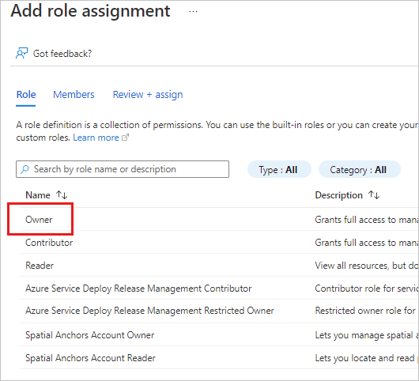
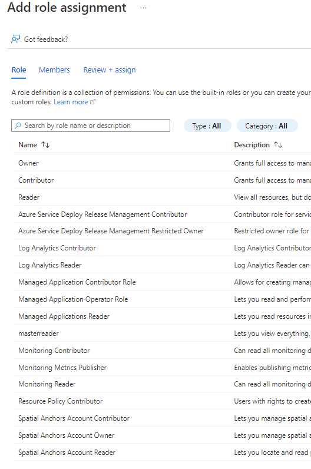

# Set up Data in space for your organization (preview)

Data in space is a feature of the Power BI mobile apps that enables Power BI reports to be pinned in augmented reality to real-world locations, where the people who need to access those reports on location can find them.

When Data in space is set up, specified people in the organization can pin reports to locations in the real world. Using the Power BI mobile app's camera, they scan and map a location and pin a report there. Afterwards, the people who need to access the report can scan the area with their mobile app's camera and find the pinned reports in augmented reality at the place they were pinned. They can then tap the report to open it. For more information about Data in space, see the [Data in space overview](./mobile-apps-data-in-space-overview.md).

This article explains how to set up Data in space in your organization. Data in space uses Azure Spatial Anchors for storing location-mapping data, so the article includes references and notes concerning creating and configuring the required Azure Spatial Anchors resource.

See [Next steps](#next-steps) for a general overview of the Data in space feature, or for information about pinning, finding, and accessing data in space.

## Setup overview

Setting up Data in space for your organization involves three steps:

1. [Creating an Azure Spatial Anchors resource](#create-an-azure-spatial-anchors-resource).
1. [Connecting Power BI to the Azure Spatial Anchors resource](#connect-power-bi-to-the-azure-spatial-anchors-resource).
1. [Assigning users in the organization to roles so that they can use the Data in space feature](#assign-users-to-spatial-anchors-account-roles-in-the-azure-spatial-anchors-resource).

Step 1 must be performed first. Steps 2 and 3 can be performed in any order.

## Supported operating systems

Data in space is currently supported for iOS.

## Create an Azure Spatial Anchors resource

This step requires that you have a role that gives you `Microsoft.Authorization/roleAssignments/write` permissions, such as **User Access Administrator** or **Owner**. For more information, see [Assign Azure roles using the Azure portal](/azure/role-based-access-control/role-assignments-portal?tabs=current).

In the Azure portal, create an Azure Spatial Anchor resource for Power BI. See [Create an Azure Spatial Anchors account](/azure/spatial-anchors/how-tos/create-asa-account?tabs=azure-portal) for detail.

When configuring the resource:

* Be sure to assign the **Owner** role to the Power BI admin who, in [step 2](#connect-power-bi-to-the-azure-spatial-anchors-resource), is going to connect Power BI to the Azure Spatial Anchors resource you're creating.

    

* Be sure that the person who is going to assign users roles in [step 3](#assign-users-to-spatial-anchors-account-roles-in-the-azure-spatial-anchors-resource) has a role in the Azure Spatial Anchors resource that gives them `Microsoft.Authorization/roleAssignments/write` permissions, such as **User Access Administrator** or **Owner**. For more information, see [Assign Azure roles using the Azure portal](/azure/role-based-access-control/role-assignments-portal?tabs=current).

## Connect Power BI to the Azure Spatial Anchors resource

This step requires that you have both of the following:

* A Power BI administrator role in Power BI.

* An Owner role in the Azure Spatial Anchors resource.

Go to **Admin portal > Azure Connections > Data in space (preview)** and add the connection details.

:::image type="content" source="./media/mobile-apps-data-in-space-set-up/power-bi-mobile-app-data-in-space-azure-connection.png" alt-text="Screenshot of the Power BI Data in space admin setting where you connect to the Azure Spatial Anchors resource.":::

>[!NOTE]
> You can connect Power BI to only one Azure Spatial Anchors service.

## Assign users to Spatial Anchors Account roles in the Azure Spatial Anchors resource

In this step, you assign users in the organization to roles that will enable them to use the data in space feature.

To perform this step, you must have a role in the Azure Spatial Anchors resource that gives you `Microsoft.Authorization/roleAssignments/write` permissions, such as **User Access Administrator** or **Owner**. For more information, see [Assign Azure roles using the Azure portal](/azure/role-based-access-control/role-assignments-portal?tabs=current).

After the Azure Spatial Anchors resource has been created, assign users to Spatial Anchors Account roles in the Azure Spatial Anchors resource:

* If you want a user to be able to create, edit, scan and delete anchors in Power BI mobile app, assign them the **Spatial Anchors Account Owner** role. Users with this role will get the "Data in Space Writer" role in the mobile app.

    >[!IMPORTANT]
    > Do not confuse the **Spatial Anchors Account Owner** that you assign users to in this step with the **Owner** role in the Azure Spatial Anchors resource that gives you the write permissions you need to perform this step.

* If you want a user only to be able to scan/search for anchors created by others. assign them the **Spatial Anchors Account Reader** role. Users with this role will get the "Data in Space Reader" role in the mobile app.

The image below shows where to find **Spatial Anchors Account Owner** and **Spatial Anchors Account Reader** roles in the Azure Spatial Anchors resource configuration in the Azure portal.

>[!NOTE]
> Only role-assignable groups can be assigned to Spatial Anchors Account roles. For more information about role-assignable groups, see [Create a role-assignable group in Azure Active Directory](/azure/active-directory/roles/groups-create-eligible).

## Next steps

* [Data in space overview](mobile-apps-data-in-space-overview.md)
* [Pin Power BI reports to locations in the real world](mobile-apps-data-in-space-pin-reports.md)
* [Find and access Power BI reports pinned to locations in the real world](mobile-apps-data-in-space-find-pinned-reports.md)