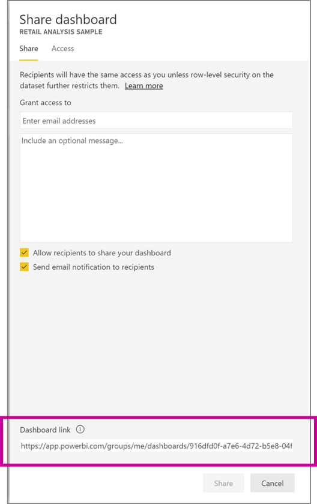

# Create a link to a specific location in the Power BI mobile apps
Use can use links to directly access specific items in Power BI: Report, Dashboard and Tile. Links can be used from outside of Power BI, or from inside Power BI, for example from report or dashboard tile.

## How to get the right link formart

### Using Power BI item URL

The easiest way to get a link to an item, is to copy it from the "Sharing pane" opened when you share an items with others.

For reports, you can also use a link that will apply filter when openning the report. Read more about .  

> [!IMPORTANT]
> When you use standart Power BI item URI in your mobile device, the link might be opeded by the browser. In the first time you will  
> try to open that link, the operating system will ask you if you want to use Power BI app to open the link, or the browser. Your 
> selection will determinate how links from Power BI opened outside of the app will be opened. 

Another option is to create Power BI Mobile app specific URI. Using this URI format, will always open Power BI Mobile app. But, you cannot use this URI on devices that do not have Power BI mobile app installed.

### Using mobile specific format

#### Open the Power BI mobile app
Use this URI to open the Power BI mobile app on any device:

    mspbi://app/

#### Open to a specific dashboard
This URI opens the Power BI mobile app to a specific dashboard:

    mspbi://app/OpenDashboard?DashboardObjectId=<36-character-dashboard-id>

To find the 36-character dashboard object id, navigate to the specific dashboard in the Power BI service (https://powerbi.com). For example, see the highlighted section of this URL:

`https://powerbi.com/groups/me/dashboards/**61b7e871-cb98-48ed-bddc-6572c921e270**`

If the dashboard is in a group other than My Workspace, add `&GroupObjectId=<36-character-group-id>` either before or after the dashboard ID. For example, 

mspbi://app/OpenDashboard?DashboardObjectId=e684af3a-9e7f-44ee-b679-b9a1c59b5d60**&GroupObjectId=8cc900cc-7339-467f-8900-fec82d748248**

Note the ampersand (&) between the two.

#### Open to a specific tile in focus
This URI opens a specific tile in focus in the Power BI mobile app:

    mspbi://app/OpenTile?DashboardObjectId=<36-character-dashboard-id>&TileObjectId=<36-character-tile-id>

To find the 36-character dashboard and tile object IDs, navigate to the specific dashboard in the Power BI service (https://powerbi.com) and open the tile in focus mode. For example, see the highlighted sections of this URL:

`https://powerbi.com/groups/me/dashboards/**3784f99f-b460-4d5e-b86c-b6d8f7ec54b7**/tiles/**565f9740-5131-4648-87f2-f79c4cf9c5f5**/infocus`

For this tile, the URI would be:

    mspbi://app/OpenTile?DashboardObjectId=3784f99f-b460-4d5e-b86c-b6d8f7ec54b7&TileObjectId=565f9740-5131-4648-87f2-f79c4cf9c5f5

Note the ampersand (&) between the two.

If the dashboard is in a group other than My Workspace, add `&GroupObjectId=<36-character-group-id>`

#### Open to a specific report
This URI opens a specific report in the Power BI mobile app:

    mspbi://app/OpenReport?ReportObjectId=<36-character-report-id>

To find the 36-character report object id, navigate to the specific report in the Power BI service (https://powerbi.com). For example, see the highlighted section of this URL:

`https://powerbi.com/groups/me/reports/df9f0e94-31df-450b-b97f-4461a7e4d300`

If the report is in a group other than My Workspace, add `&GroupObjectId=<36-character-group-id>` either before or after the report ID. For example, 

mspbi://app/OpenReport?ReportObjectId=e684af3a-9e7f-44ee-b679-b9a1c59b5d60**&GroupObjectId=8cc900cc-7339-467f-8900-fec82d748248**

Note the ampersand (&) between the two.

#### Open to a specific report page
This URI opens a specific report page in the Power BI mobile app:

    mspbi://app/OpenReport?ReportObjectId=<36-character-report-id>&reportPage=ReportSection<number>

The report page is called "ReportSection" followed by a number. Again, open the report in the Power BI service (https://powerbi.com) and navigate to the specific report page. 

For example, see the highlighted section of this URL:

`https://powerbi.com/groups/me/reports/df9f0e94-31df-450b-b97f-4461a7e4d300/ReportSection11`

#### Open in full-screen mode
Add the parameter in bold to open to a specific report in full-screen mode:

    mspbi://app/OpenReport?ReportObjectId=<36-character-report-id>**&openFullScreen=true**

For example: 

mspbi://app/OpenReport?ReportObjectId=500217de-50f0-4af1-b345-b81027224033&openFullScreen=true

#### Add context (optional)
You can also add context in the string. Then if you need to contact us, we can use that context to filter our data to your app. Add `&context=<app-name>` to the link

For example, see the highlighted section of this URL: 

`https://powerbi.com/groups/me/reports/df9f0e94-31df-450b-b97f-4461a7e4d300/&context=SlackDeepLink`

## Next steps
Your feedback helps us decide what to implement in the future, so don’t forget to vote for other features you'd like to see in Power BI mobile apps. 

* [Power BI apps for mobile devices](mobile-apps-for-mobile-devices.md)
* Follow @MSPowerBI on Twitter
* Join the conversation at the [Power BI Community](http://community.powerbi.com/)
* [What is Power BI?](../../power-bi-overview.md)

