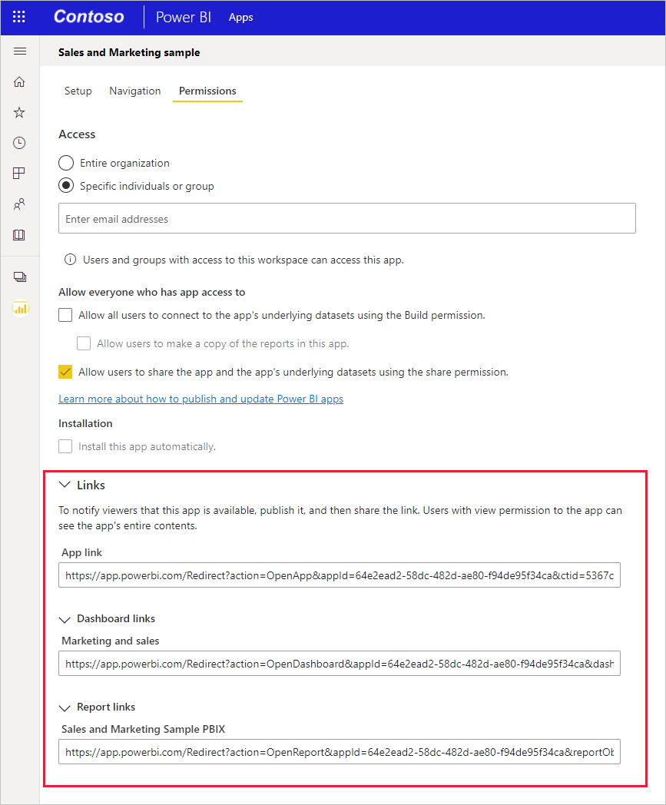

# Create a link to a specific location in the Power BI mobile apps

You can use links to directly access specific Power BI content, such as a specific report, report page, dashboard, tile, etc.

There are two main scenarios for using links to access content in the Power BI mobile apps:

* To open Power BI from **outside of the mobile app**, and land on specific content. This is usually an integration scenario, where you're opening the Power BI mobile app from another app.

* To **navigate** inside Power BI. This is typically done when you want to create custom navigation in Power BI.

This article covers the following cases:

* Using links to open specific Power BI content from outside the mobile app. Two link formats are described. One uses a redirect method and can be used no matter where Power BI will open. The other opens directly in the Power BI mobile app and will work only on mobile devices that have the mobile app installed.

* Using links inside Power BI to navigate to specific Power BI content.

The mobile apps support report links that include query-string parameters. Such links open in the mobile app pre-filtered according to the conditions defined in the query string. For more information about creating report URLs with query string parameters, see [Filter a report query string parameters in the URL](../../collaborate-share/service-url-filters.md).

The mobile apps also support passing parameters to paginated reports via URLs. For more information, see [Pass a report parameter in a URL for a paginated report](../../paginated-reports/parameters/pass-report-parameter-url.md) for details.

## Use links from outside the mobile app

When you want to link to a specific item in Power BI from outside the mobile app, there are two options, depending on where the link is going to be opened:

* If you want the link to open correctly regardless of whether it's clicked in a computer browser or on a mobile device, you can create a link that ensures it will open correctly no matter where it's clicked. This link has a special redirect syntax to enable this smart behavior.

* If you know the link is only going to be opened on a mobile device that has the Power BI mobile app installed, you can avoid the redirect overhead of the above method and use another link syntax that opens the link directly in the Power BI mobile app on the mobile device. It's important to note however that while this link avoids the redirect overhead of the first method, it will not work if opened anywhere other than on a mobile device that has the Power BI mobile app installed.

### Create a link that works anywhere

The link format described in this section uses redirection to make sure the link works no matter where it's clicked.

* If the link is clicked on a mobile device, it makes sure that the device uses the Power BI mobile app to open the link. If the mobile app isn't installed on the device, it suggests to the user to go to the store to get it.

* If the link is clicked on a PC, it will open the relevant item in the Power BI web portal.

The link must start with a special prefix, followed by query parameters:

http:\//app.powerbi.com/Redirect?**[QUERYPARAMETERS]**

> [!IMPORTANT]
> If your content is hosted in special datacenter such as Government, China, etc., the link should start with the appropriate Power BI address, such as **app.powerbigov.us** or **app.powerbi.cn**.

The query parameters are:

|Parameter  | Value  | Description |
|---------|---------|---------|
|**action** (mandatory)    | OpenApp OpenReport OpenDashboard OpenTile | |
|**appId**| 36 character guid | Must be specified if you want to open a report or dashboard that is part of an app. Example: **appId=baf4b16d-b5bd-4360-8a3a-51d11242c09b** |
|**groupObjectId**| 36 character guid | Specifies the workspace when you want to open a report or dashboard that isn't part of My Workspace. Example: **groupObjectId=9a3841c6-74b3-46f1-85fd-bdd78f27b30e** |
| **dashboardObjectId** | 36 character guid | Dashboard object ID (if action is OpenDashboard or OpenTile) Example: **dashboardObjectId=033bb049-5b68-4392-b3ef-ae9a43738a4a** |
| **reportObjectId** | 36 character guid | Report object ID (if action is OpenReport) Example: **reportObjectId=6114cec7-78e1-4926-88ff-0bc5338452cf** |
| **tileObjectId** | 36 character guid | Tile object ID (if action is OpenTile) Example: **tileObjectId=a845dcb8-a289-43a8-94ea-67a8c0a068f9** |
| **reportPage** | ReportSection&lt;num&gt; | Page name if you want to open a specific report page. (if action is OpenReport) Example: **reportPage=ReportSection6**  |
| **bookmarkGuid** | 36 character guid | Bookmark ID, if you want to open a specific bookmarked view. (if action is OpenReport) Example: **bookmarkGuid=18e8872f-6db8-4cf8-8298-3b2ab254cc7f** **Note**: Values of the format *BookmarkXXXXXXXXXXXXXXXXXXX* aren't supported. |
| **ctid** | 36 character guid | Item organization ID (relevant for B2B scenarios. This can be omitted if the item belongs to the user's organization) Example: **ctid=5367c770-09d0-4110-bf6a-d760cb5ef681** |
| **fullScreen** | Boolean | When true, opens the item in full screen mode. Supported for reports, scorecards, dashboards, and apps (if the app landing item is one of the supported items). Example: **fullScreen=1** |
||||

>[!NOTE]
> Report-level bookmarks do not have a bookmarkGUID format and currently cannot be passed as a parameter of a deep link.

**Examples:**

In the following examples, placeholders for the parameter values are highlighted in bold. To get the actual values, go to the Power BI service, open the item you want to link to, and extract the values you need from the item's URL.

* **Open an app**

    https\://app.powerbi.com/Redirect?action=OpenApp&appId=**&lt;appid-guid&gt;**&ctid=**&lt;ctid-guid&gt;**

* **Open a dashboard that is part of an app**

    https\://app.powerbi.com/Redirect?action=OpenDashboard&appId=**&lt;appid-guid&gt;**&dashboardObjectId=**&lt;dashboardid-guid&gt;**&ctid=**&lt;ctid-guid&gt;**

* **Open a report that is part of a workspace other than My Workspace**

    https\://app.powerbi.com/Redirect?Action=OpenReport&reportObjectId=**&lt;reportid-guid&gt;**&groupObjectId=**&lt;groupobjectid-guid&gt;**&reportPage=**ReportSection&lt;num&gt;**

### How to get the correct link format

#### Links to apps and items in apps

For **apps, and for reports and dashboards that are part of an app**, the easiest way to get the link is to go to the app workspace and choose **Update app**. This opens the "publish app" experience. Open the permissions tab and expand the links section to see the links to the app and all its contents. You can use these links from outside Power BI to access the app and its contents directly.

#### Links to items that aren't in an app

For reports and dashboards that aren't part of an app, you need to extract the object IDs you need from the item's URL. To do this, go to the Power BI service, navigate to the item you want to link to, and look for the values you need in the URL you see in the browser's address bar.

The examples show where you can find the IDs you need in the URLs of the items you want to link to.

* To find a 36-character dashboard object ID, navigate to the specific dashboard you want to link to in the Power BI service and find the dashboard object ID and any other required IDs in the places indicated:

    https\://app.powerbi.com/groups/me/dashboards/**&lt;dashboard-object-id&gt;**?ctid=**&lt;org-object-id&gt;**

* To find a 36-character report object ID, navigate to the specific report you want to link to in the Power BI service and find the necessary IDs as illustrated. This example contains a reference to a specific report page and a specific bookmark.

    https\://app.powerbi.com/groups/me/reports/**&lt;report-object-id&gt;**/**ReportSection&lt;num&gt;**?bookmarkGuid=**&lt;bookmark-id&gt;**

* To link to an item in a workspace other than My Workspace, you need to extract the group object ID. This example shows a report from a workspace other than My Workspace.

    https\://app.powerbi.com/groups/**&lt;group-object-id&gt;**/reports/**&lt;report-object-id&gt;**/**ReportSection&lt;report-section-num&gt;**?ctid=**&lt;org-object-id&gt;**

### Create a link that opens only on a device that has the Power BI mobile app installed

The link format described in this section links to a specific location within the Power BI mobile apps on all the mobile platforms: iOS, Android devices, and Windows. This link format opens the location directly, without any of the redirection involved in the method described in the previous section. **This format can only be opened on mobile devices that have the Power BI mobile app installed**.

Links of this format can point directly to dashboards, tiles, and reports. The destination of the deep link determines its format. Follow these steps to create deep links to different locations. 

* **Open the Power BI mobile app**

    Use this link to open the Power BI mobile app on any device:

    mspbi://app/

* **Open to a specific dashboard**

    This link opens the Power BI mobile app to a specific dashboard:

    mspbi://app/OpenDashboard?DashboardObjectId=**<36-character-dashboard-id>**

    To get the 36-character dashboard object ID, navigate to the specific dashboard in the Power BI service and extract it from the URL. For example, the dashboard object ID is highlighted in the following URL from the Power BI service:

    https\://app.powerbi.com/groups/me/dashboards/**&lt;61b7e871-cb98-48ed-bddc-6572c921e270&gt;**

    If the dashboard isn't in My Workspace, you need to add the group object ID as well, either before or after the dashboard ID. The deep link shown has the group object ID parameter added after the dashboard object ID:

    mspbi://app/OpenDashboard?DashboardObjectId=**e684af3a-9e7f-44ee-b679-b9a1c59b5d60**&GroupObjectId=**8cc900cc-7339-467f-8900-fec82d748248**</code>

    Note the ampersand (&) between the two parameters.

* **Open to a specific tile in focus**

    This link opens a specific tile in focus mode in the Power BI mobile app:

    mspbi://app/OpenTile?DashboardObjectId=**<36-character-dashboard-id>**&TileObjectId=**<36-character-tile-id>**

    To find the 36-character dashboard and tile object IDs, navigate to the specific dashboard in the Power BI service and open the tile in focus mode. In the example, the dashboard and tile IDs are highlighted.

    https\://app.powerbi.com/groups/me/dashboards/**3784f99f-b460-4d5e-b86c-b6d8f7ec54b7**/tiles/**565f9740-5131-4648-87f2-f79c4cf9c5f5**/infocus

    To open to this tile directly then, the link would be:

    mspbi://app/OpenTile?DashboardObjectId=3784f99f-b460-4d5e-b86c-b6d8f7ec54b7&TileObjectId=565f9740-5131-4648-87f2-f79c4cf9c5f5

    Note the ampersand (&) between the two parameters.

    If the dashboard isn't in My Workspace, add the GroupObjectId parameter, for example, &GroupObjectId=<36-character-group-id>

* **Open to a specific report**

    This link opens a specific report in the Power BI mobile app:

    mspbi://app/OpenReport?ReportObjectId=**<36-character-report-id>**

    To find the 36-character report object ID, navigate to the specific report in the Power BI service. The following URL from the Power BI service illustrates the report ID you would need to extract.

    https\://app.powerbi.com/groups/me/reports/**df9f0e94-31df-450b-b97f-4461a7e4d300**

    If the report isn't in My Workspace, you need to add **&GroupObjectId=<36-character-group-id>** as well, either before or after the report ID. For example, in this case the deep link would be:

    mspbi://app/OpenReport?ReportObjectId=**e684af3a-9e7f-44ee-b679-b9a1c59b5d60**&GroupObjectId=**8cc900cc-7339-467f-8900-fec82d748248**

    Note the ampersand (&) between the two parameters.

* **Open a specific report page**

    This link opens a specific report page in the Power BI mobile app:

    mspbi://app/OpenReport?ReportObjectId=**<36-character-report-id>**&reportPage=**ReportSection&lt;number&gt;**

    The report page is called **ReportSection**, followed by a number. Again, to find the values you need, open the report in the Power BI service, navigate to the specific report page, and extract the values you need from the URL. For example, the highlighted sections of this URL represent the values you would need to open to a specific report page:

    https\://app.powerbi.com/groups/me/reports/**df9f0e94-31df-450b-b97f-4461a7e4d300**/**ReportSection11**

* **Open in full-screen mode (for Windows devices only)**

    For Windows devices, you can also add the **openFullScreen** parameter to open specific report in full-screen mode. The following example opens a report page in full screen mode:

    mspbi://app/OpenReport?ReportObjectId=500217de-50f0-4af1-b345-b81027224033&**openFullScreen=true**

* **Add context** (optional)

    You can also add context to the string. Then, if you need to contact us, we can use that context to filter our data to find what is relevant to your app. To add context, add the parameter **context=&lt;app-name&gt;** to the link:

    For example, the following example shows a link that includes a context parameter:

    mspbi://app/OpenReport?ReportObjectId=**e684af3a-9e7f-44ee-b679-b9a1c59b5d60**&GroupObjectId=**8cc900cc-7339-467f-8900-fec82d748248**&**context=SlackDeepLink**

## Use links inside Power BI

In the Power BI mobile apps, links inside Power BI work just as they work in the Power BI service.

If you want to add link to your report that points to another Power BI item, you can just copy that item's URL from the browser address bar. For more information, see [Add a hyperlink to a text box in a report](../../create-reports/service-add-hyperlink-to-text-box.md).

## Considerations and limitations

Deep links to reports with a bookmarkGuid param are supported in the Mobile apps only when the value of the bookmarkGuid parameter has the standard 36-character GUID format. Links where the bookmarkGuid parameter value has the format *BookmarkXXXXXXXXXXXXXXXXXXX* aren't supported.

## Related content

Your feedback helps us decide what to implement in the future, so don’t forget to vote for other features you'd like to see in Power BI mobile apps.

* [What are the Power BI mobile apps?](mobile-apps-for-mobile-devices.md)
* Follow @MSPowerBI on Twitter
* Join the conversation at the [Power BI Community](https://community.powerbi.com/)
* [What is Power BI?](../../fundamentals/power-bi-overview.md)
