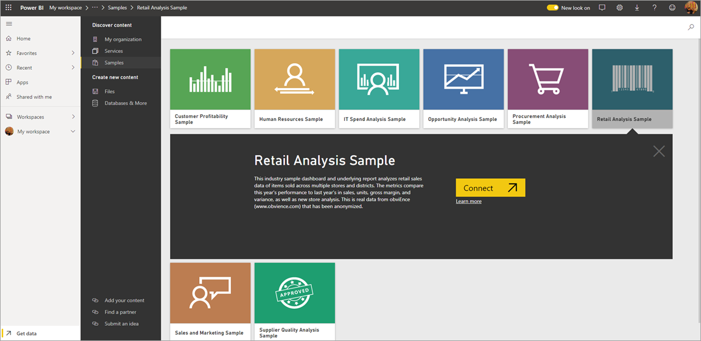
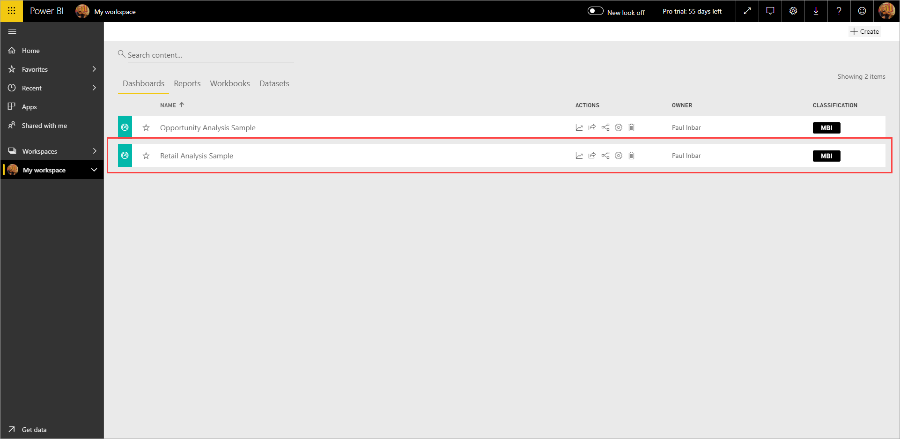

# Downloading samples to My workspace in the Power BI service

Some of the Mobile app documentation available here uses sample data for the purposes of illustration. To follow along on your device, you can download the sample data to your Power BI service account, where you can then view it from the Power BI Mobile app on your device. This article describes how to download the sample data to your Power BI service account. 

## Prerequisites

You must have a Power BI service account to be able to download data. If you're not yet signed up for Power BI, [sign up for a free trial](https://app.powerbi.com/signupredirect?pbi_source=web) before you begin.

## Download a sample

1. Open the Power BI service in your browser (app.powerbi.com) and sign in.

2. Select **Get data** in the lower-left corner of the navigation pane. If the navigation pane is hidden and you can't see the Get data link, display the pane by clicking the show/hide navigation pane icon .  
   
    

3. On the Get Data page, select the **Samples** link.
   
   

4. Select a sample to download.
 
      
    
8. Select **Connect**.  
  
   
   
5. Power BI imports the sample, adding a new dashboard, report, and dataset to your My Workspace.
   
   

  
You are now ready to view the samples on your mobile device.

## Next steps
* [Quickstart](mobile-apps-quickstart-view-dashboard-report.md)
* Questions? Check the [Mobile apps section of the Power BI Community](https://go.microsoft.com/fwlink/?linkid=839277)
