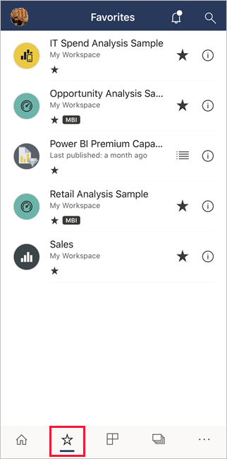
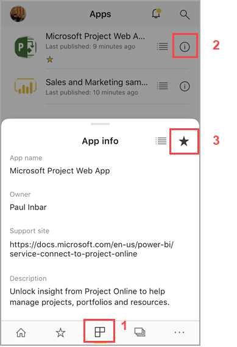
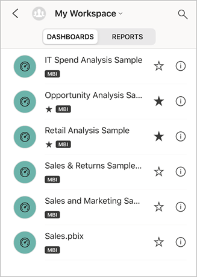
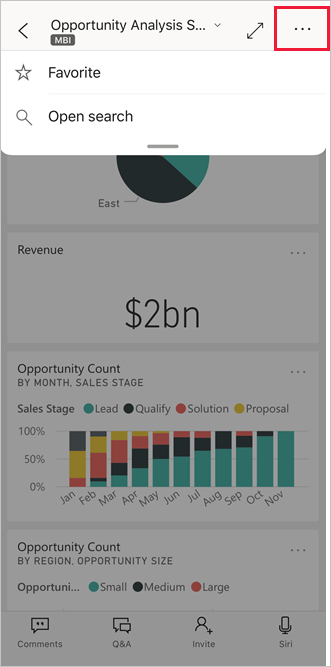
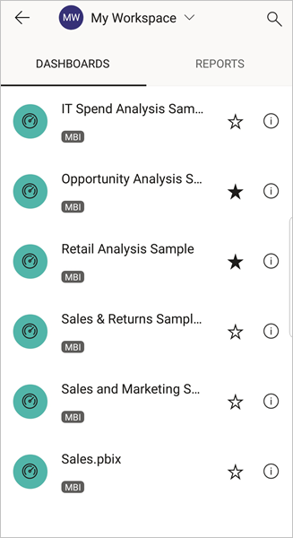
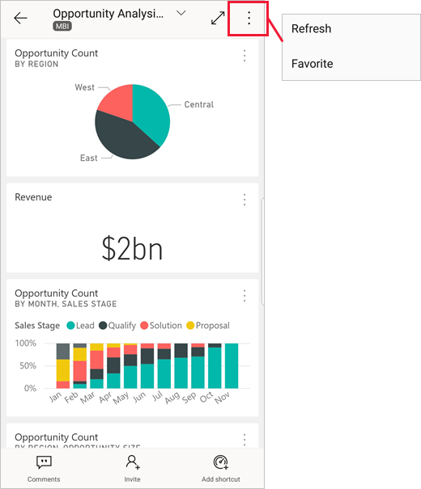

# Make and view favorites in the Power BI mobile apps
Applies to:

|  |  |  |  |
|:--- |:--- |:--- |:--- |
| iPhones |iPads |Android phones |Android tablets |

>[!NOTE]
>Power BI mobile app support for **phones using Windows 10 Mobile** has been discontinued as of March 16, 2021. [Learn more](/legal/powerbi/powerbi-mobile/power-bi-mobile-app-end-of-support-for-windows-phones)

Read about making and viewing your favorite Power BI dashboards, reports, and apps, together with your favorite on-premises Power BI Report Server and Reporting Services KPIs and reports, in the mobile apps.

When you make a favorite in the Power BI mobile apps, you see it on your Favorites page in the [Power BI service](https://powerbi.com) and on all of your mobile devices.

To see your Favorites page, tap the Favorites icon on the navigation bar:

You can also [make Power BI dashboards and apps favorites in the Power BI service](../end-user-favorite.md). Then you see them on the Favorites page in the mobile app.

You can mark KPIs and reports as favorites on a Power BI Report Server or Reporting Services web portal, and then view them in one convenient folder on your mobile device, along with your Power BI favorite dashboards.

## Make an app a favorite
1. Tap the Apps icon on the bottom navigation bar to display your apps page.

2. On an iOS device, tap the info button to the right of the name of the app you want to make a favorite. On Android devices, More options (...) appears rather than the info button. 

3. In the App info section that opens, tap the star.
   
    
   
    The app will now be listed on your Favorites page, along with your other favorite dashboards, reports, and apps.
   
## Make a dashboard or report a favorite in the iOS mobile app
You can make a Power BI dashboard or report a favorite from the list of dashboards or reports, or from the dashboard or report itself.

* In the list of dashboards or reports in the mobile app, tap the empty star next to the name . The star turns black .
  
    
* If you're in a dashboard or report, tap **More options** (...) in the header and then tap the empty star  in the menu that displays. The star will turn black .
  
    

## Make a dashboard or report a favorite in the Android mobile apps
You can make a dashboard or report a favorite from the list of dashboards or reports, or from the dashboard or report itself.

* In the list of dashboards or reports in the mobile app, tap the star next to the name of the report or dashboard to favorite or un-favorite the item.
  
    

* When you're in a dashboard or report, tap **More options (...)** and then select **Favorite**.
  
    

## Make favorite Power BI Report Server and Reporting Services reports and KPIs
You can view your favorite Power BI Report Server and Reporting Services reports and KPIs in the Power BI mobile apps, but you can't make them favorites in the mobile apps. You tag them as favorites in the web portal.

## Related content

* [Favorite dashboards in the Power BI service](../end-user-favorite.md) 
* Questions? [Try asking the Power BI Community](https://community.powerbi.com/)