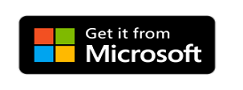

# What are the Power BI mobile apps?
Power BI offers a set of mobile apps for iOS, Android, and Windows 10 mobile devices. In the mobile apps, you connect to and interact with your cloud and on-premises data. 

You create reports in Power BI Desktop. You create dashboards, and view dashboards and reports in the Power BI report service ([https://powerbi.com](https://powerbi.com)). You view on-premises Power BI reports on [Power BI Report Server](../../report-server/get-started.md). All these reports and dashboards are available in the Power BI mobile apps, whether they're on premises or in the cloud. Try viewing and interacting with them on your mobile device, be it iOS (iPad, iPhone, iPod Touch, or Apple Watch), Android phone or tablet, or Windows 10 device.

### Get the app from the application store 

  

## Mobile apps for different devices

| **Device** | **Highlights** |
| --- | --- |
|  |**iPhones** go everywhere, and the [Power BI mobile app for the iPhone](mobile-iphone-app-get-started.md) goes, too. Besides viewing your Power BI [reports in a special mobile layout view](mobile-apps-view-phone-report.md), you can [add Power BI to your Apple Watch](mobile-apple-watch.md), and [ask questions with the Q&A virtual analyst](mobile-apps-ios-qna.md).  Get started with the [Power BI mobile app for iOS](mobile-iphone-app-get-started.md). |
|  |On the **iPad**, the Power BI mobile app displays dashboards and reports the way they were formatted for the Power BI service. Plus you can view your [Power BI Report Server and Reporting Services KPIs and reports](mobile-app-ssrs-kpis-mobile-on-premises-reports.md) right on your iPad. You can [set data alerts in the Power BI mobile app](mobile-set-data-alerts-in-the-mobile-apps.md) to notify you when data in a dashboard changes beyond limits you set.  Get started with the [Power BI mobile app for iOS](mobile-iphone-app-get-started.md). |
|  |The Power BI mobile app for the **Android phone** brings Power BI to your pocket, with up-to-date, touch-enabled mobile access to your business information. You can [filter a report by your geographic location](mobile-apps-geographic-filtering.md). You can [scan QR codes with your Android phone](mobile-apps-qr-code.md) and go straight to a Power BI dashboard or report.  Get started with the [Power BI mobile app for Android](mobile-android-app-get-started.md). |
|  |This mobile app runs on a number of different **Android tablets**, bringing you up-to-date, touch-enabled mobile access to your business information. On the Android tablet, the Power BI mobile app displays dashboards and reports the way they were formatted for the Power BI service. You can [mark your favorite dashboards and reports](mobile-apps-favorites.md), so you can get to them quickly, along with your favorite Power BI Report Server and Reporting Services KPIs and reports.  Get started with the [Power BI mobile app for Android](mobile-android-app-get-started.md). |
|  |The Power BI mobile app for Windows 10 runs on any Windows 10 device, including Windows 10 phones. Along with many of the features of the other mobile apps, the Power BI mobile app for Windows 10 offers special functionality. For example, you can [pin a Power BI dashboard to the Windows 10 Start screen](mobile-pin-dashboard-start-screen-windows-10-phone-app.md) from the Power BI mobile app. Plus you can [run Power BI in presentation mode on Surface Hub](mobile-windows-10-app-presentation-mode.md) and in the Power BI mobile app for Windows 10.  Get started with the [Power BI mobile app for Windows 10 devices](mobile-windows-10-phone-app-get-started.md). |

>[!NOTE]
>Power BI mobile app support for **phones using Windows 10 Mobile** has been discontinued as of March 16, 2021. [Learn more](/legal/powerbi/powerbi-mobile/power-bi-mobile-app-end-of-support-for-windows-phones)

## Enterprise support for the Power BI mobile apps
Organizations can use Microsoft Intune to manage devices and applications, including Power BI mobile apps for Android and iOS.

Microsoft Intune lets organizations control items like requiring an access pin, controlling how data is handled by the application, and even encrypting application data when the app isn't in use.

Read more about [configuring Power BI mobile apps for Android and iOS with Microsoft Intune](../../admin/service-admin-mobile-intune.md). 

## Next steps
[View a dashboard in the mobile apps](mobile-apps-quickstart-view-dashboard-report.md)
