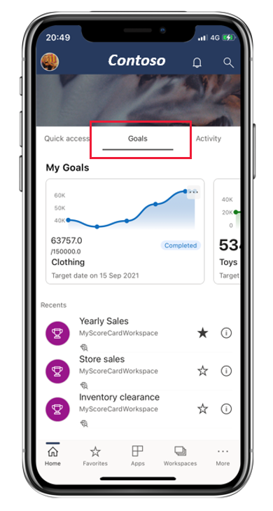
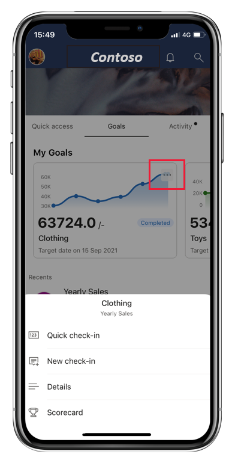
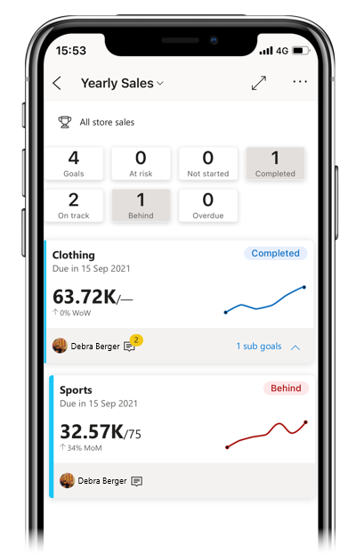
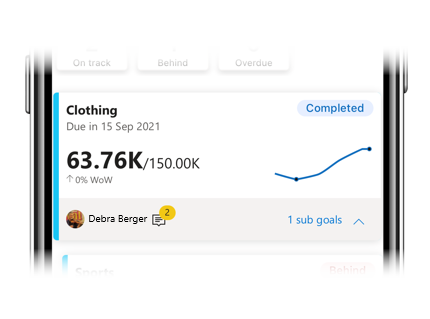
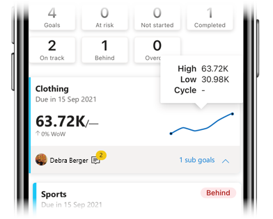
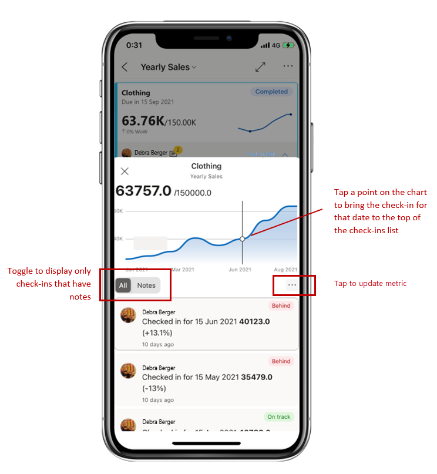
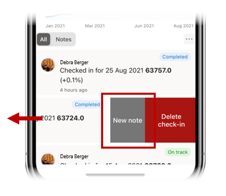
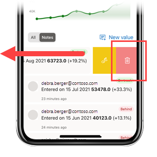

# Goals

Applies to
|  |  |  |  |
|:--- |:--- |:--- |:--- |
|iPhones |iPads |Android phones |Android tablets |

The Power BI mobile apps make it easy for you to keep on top of your goals while on the go. In the app you can monitor progress on your goals, make check-ins to update progress, add notes, and, when a goal is connected to a report, easily open the associated report to dig deeper into the data.

This article explains how to monitor your goals on the mobile app and shows you how to update progress and to dig deeper into the data when the goal is connected to a report.

To read more about Goals, see [Get started with goals in Power BI](../../create-reports/service-goals-introduction.md)

## Goals hub
The goals hub is a centralized place where you can see and update your important goals as well as navigate to scorecards you have access to.

Tap the Goals tab on the app’s home page to display the goals hub.

  
The top section of the goals hub, **My Goals**, displays all the goals that matter most to you. Power BI automatically chooses which goals to display here based on the goals you are assigned to, have edited, or performed a recent check-in on. Tap a goal to open the scorecard that the goal belongs to.

The My Goals section is followed by a list of the scorecards you have access to, grouped as Recents, Favorites, Shared with me, etc. Tap a scorecard to open it.

### Update a goal

You can easily update a goal by tapping the ellipsis at the upper right corner of a goal’s tile.

You'll get a number of options:
* **Quick check-in**: Allows you to check in a value for the current date and to update goal status. Quick check-in is not available for goals with connected reports.
* **New check-in**: Allows you to check in a value for a date you choose, update goal status, and also add a note if you want to. 
* **Connected report (current)**: Opens the report that is connected to the goal’s “current” value. The goal’s “target” value may be connected to a different report. This option is only available if the goal is connected to a report.

## Scorecards

Goals are created in scorecards. A scorecard is where colleagues can can keep track of a set of goals. 

A scorecard has a summary that shows the number of goals in the scorecard and the number of goals in each status followed by a list of all the goals.

 
Tap the status buttons in the summary to filter for the goals with the selected status. You can select multiple filters. Tap the Goals button to clear the filters. The image above shows the scorecard filtered by Completed and Behind status.

In the scorecard, goals are represented by cards.

 
The card for a goal shows
* The name of the goal
* Goal due date
* Goal status
* Last check-in value over the target value
* A spark line illustrating progress towards the goal
* Goal owner
* An indication of whether there are any notes attached to the goal
* An expandable menu to display subgoals, if any

Tap anywhere else on the card to open the goal’s [details pane](#goals-detail-pane).

You can also tap and hold on the sparkline on a goal to see the the high-low value range and cycle (if any) of check-in values.

## Goals detail pane

A goal’s detail pane has a chart of the goal’s progress and lists all the activity on the goal – all the check-ins and notes.

 
Tap the ellipsis to see update goal or to open a connected report, if any.
 
You will have several options:
* **Quick check-in**: Allows you to check in a value for the current date and to update goal status. Quick check-in is not available for goals with connected reports.
* **New check-in**: Allows you to check in a value for a date you choose, update goal status, and also add a note if you want to. 
* **Connected report (current)**: Opens the report that is connected to the goal’s “current” value. The goal’s “target” value may be connected to a different report. This option is only available if the goal is connected to a report.

### Add a note to an existing check-in

Generally, you add note as part of a new check-in, but you can also add a note to an existing check-in as well. Just slide the relevant check-in to the left and choose **New note**.

### Delete a check-in
To delete a check-in, slide the check-in to the left and tap **Delete check-in**.

## Next steps
 
* [Introducing Goals in Power BI](https://powerbi.microsoft.com/en-us/blog/introducing-goals-in-power-bi/)
* [Get started with goals in Power BI](../../create-reports/service-goals-introduction.md)