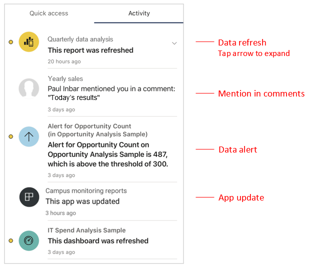
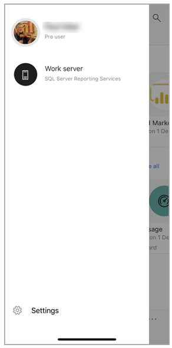
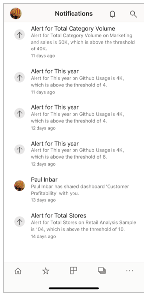

# A quick tour of the Mobile app home page
In this tour, you become acquainted with the home page of the Power BI mobile app and the navigation aids it provides you to get to what you need quickly.

Applies to:

|  |  |  |
|:--- |:--- |:--- |
| iPhone | iPad | Android | 

When you open Power BI Mobile app, you land on the home page, where you have **quick access** to your most frequently or recently visited reports, dashboards, apps, and scorecards. In addition, there is the **goals hub** that enables you to keep on top of your goals, and an **activity feed** that keeps you up-to-date about what's happening with your Power BI content. Finally, there are also convenient navigation aids to get you quickly to the content you need.

## Quick Access tab

The quick access tab shows you your frequently and recently viewed reports, dashboards, apps, and scorecards grouped into collapsible sections. To see a longer list of your recently viewed items, tap **See all** to the right of Recents.

## Goals hub

The goals hub shows you your relevant goals and lists all the scorecards you've got access to. On the goals hub you can can monitor progress on your goals, and even make check-ins to update progress, add notes, or get to connected reports.

[Learn more about working with goals in the Power BI mobile app](mobile-apps-goals.md).

## Activity feed

The activity feed helps you keep track of what's happening with your Power BI content. It shows you all your latest notifications, alerts, comments, and @mentions.

The updates in the feed include:
* **Refreshed data**: when the underlying data in one of the reports or dashboards in your favorites or recents is refreshed.
* **New comments**: when people create a comment in a report or a dashboard that is in your favorites or recents, or when someone mentions you in a comment.
* **Data alerts**: when data reaches a threshold you previously set in a [data alert](mobile-set-data-alerts-in-the-mobile-apps.md).
* **App updates**: when an app creator publishes an update to an app you are using.

 Tap on an activity item to jump to the relevant place in order to explore further.

Activity items are aggregated, so all data updates coming from the same app or workspace will be grouped together. Use the  arrow to expand and see the aggregated items. The most recent item will always be at the top of the list.

## Navigation bar

At the bottom of the page you find the navigation bar.

The navigation bar provides quick access to:

*  **Home** - returns you to the home page.
*  **Favorites** - the reports, dashboards and apps you have marked as [favorites](mobile-apps-favorites.md).
*  **Apps** - the apps you have installed in your account.
*  **Workspaces** - the working folders that keep together reports and dashboards that content creators are building.
*  **Recents** - the items you have recently viewed.
*  **Shared with me** - the items other people have shared with you.
*  **Explore** - content from your organization that has been chosen especially for you.
   
    

*  **Scanner** - the device camera that you can use as a scanner to scan [barcodes](mobile-apps-scan-barcode-iphone.md) and [QR codes](mobile-apps-qr-code.md).

## Header

The header provides the following navigation items:
* **Profile picture or avatar** - opens the side panel where you can [switch between your Power BI service and Report Server accounts](mobile-app-ssrs-kpis-mobile-on-premises-reports.md), as well as access Power BI mobile app settings.

    

* **Notifications** - opens the [notifications page](mobile-apps-notification-center.md) where you can view and access your notifications. A dot on the notifications bell indicates that you have new notifications.

    

* **Search** - search for Power BI content in your subscription.

    

## Next steps
In this tour, you explored the Power BI mobile app home page. Read more about using the Power BI mobile app. 
* [Explore dashboards and reports](mobile-apps-quickstart-view-dashboard-report.md)
* [Explore reports in the Power BI mobile apps](mobile-reports-in-the-mobile-apps.md)
