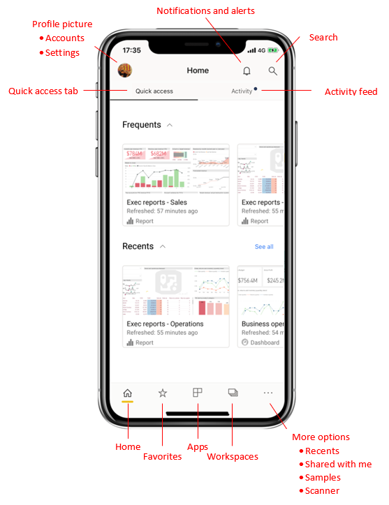

# A quick tour of the Mobile app home page
In this quickstart, you become acquainted with the home page of the Power BI mobile app and the navigation aids it provides you to get to what you need quickly.

Applies to:

|  |  |  |  |
|:--- |:--- |:--- |:--- |
| iPhone | iPad | Android | Windows 10 |

When you open Power BI Mobile app, you land on the home page, where you have quick access to your most frequently or recently visited reports, dashboards, apps, etc, an activity feed that keeps you up-to-date with real-time info about what's happening with your Power BI content, and convenient navigation aids to get you quickly to the content you need.

 
## Quick Access tab

The quick access tab shows you your frequently and recently viewed reports, dashboards, and apps, grouped into two collapsible sections. To see a longer list of your recently viewed items, tap **See all** to the right of Recents. 

## Activity tab

The activity tab helps you keep track of what's happening with your Power BI content, in real-time. The activity feed shows you all your latest notifications, alerts, comments, @mentions, etc. The updates in the feed include:
* **Refreshed data**: when the underlying data in your reports and dashboards is refreshed.
* **New comments**: when people create a comment in a report or a dashboard, or when someone mentions you in a comment.
* **Data alerts**: when data reaches a threshold you previously set in a data alert.
* **App updates**: when an app creator publishes an update to an app you are using.

Tap on an activity item to jump to the relevant place in order to explore further. 

Activity items are aggregated, so all data updates coming from the same app or workspace will be grouped together. Use the arrow to expand and see the aggregated items. The most recent will always be at the top of the list.

## Navigation bar

At the bottom of the page you find the navigation bar from which you easily get to your:
* Favorites: – a list of the reports, dashboards and apps you have marked as favorites . 
* Apps: a list of the apps you have installed in your accoundcollection of relate dashboards and reports packaged together into app.
* Workspaces: are working folders that keep together reports and dashboards that content creators are building.
* Recents:  here you can access items you recently accessed
* Shared with me: access items other people shared with you.
* Samples: browser Power BI samples to learn about Power BI capabilities.
* Scanner: use device camera as a scanner, to scan barcodes and QR codes. Read more here.

## Header

In the top of the page, there is the XXXX header, where you can
* Access you account and switch between Power BI service and Report server accounts
* View your notifications
* Search for Power BI content in your subscription

## Next steps

In this tour, you explored the Power BI mobile app home page. Read more about working in the Power BI service. 

