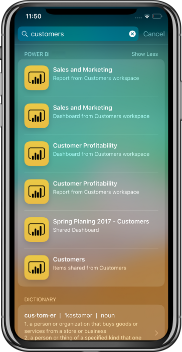

# Device Search (Spotlight) integration with Power BI Mobile iOS App 
### Use device search to find and access the content you need

You can search your item using device level search (spotlight) to find what you looked for and easily open it in Power BI app.

To find items
1. Swipe down from the middle of the ‘Home’ screen to get into the device search
2. Tap the ‘Search‘ field and enter a word relevant for the item you’re looking for.

    The search results will include Power BI 
    * Dashboards
    * Reports
    * Apps
    * Workspaces
   * Items shared by the contact you search for 
   
     
 3. Once you find the item you want, tap on it and the Power BI app land you on the item you wanted. 

Search, powered by Siri will provide you suggestion to frequent actions that are being done in Power BI app. Siri suggestion will be shown the search and lock screen

To disable device search and Siri suggestion, go to device settings->Power BI settings->Siri & Search, and disable the Siri & suggestions setting
    
## 
> [!NOTE]
>- This feature is currently a preview version
>- Spotlight search integration is available available from iOS9  
> 
## 
### Next steps
Your feedback will help us decide what to implement in the future, so don’t forget to vote for other features that you would like to see in Power BI mobile apps. 

* Download the [Power BI iPhone mobile app](http://go.microsoft.com/fwlink/?LinkId=522062)
* Follow [@MSPowerBI on Twitter](https://twitter.com/MSPowerBI)
* Join the conversation at the [Power BI Community](http://community.powerbi.com/)

