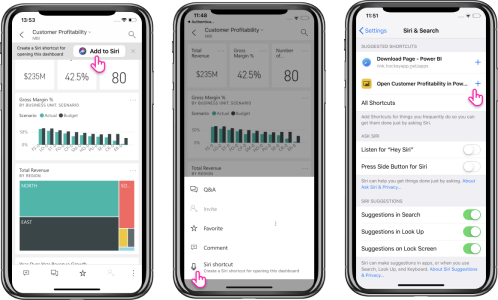
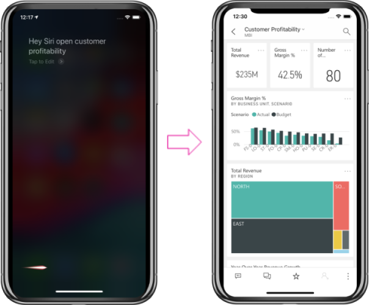

# Using Siri Shortcuts in Power BI Mobile iOS App (preview)

Use Siri Shortcuts to directly access the Power BI content you need.

To get easy and quick access to your frequently used reports or dashboards, use the Siri Shortcuts integration. Create a shortcut to your item. And then you can ask Siri to launch it when even you need to have a look on the data.

## Create Siri shortcut for a report or dashboard

There are three ways to create Siri shortcut to your reports and dashboards.

1. A banner with a ***'Add to Siri’*** option will be added to your frequently used reports and dashboards. Tap the action to open the 'Add to Siri' page.
    
2. Use the 'Siri shortcut' action from the {...} Report/Dashboard menu.
    
3. Use the 'Suggested shortcuts' in the device settings (Device Setting -> Siri & Search). You can add a shortcut to the item in the suggestion list by pressing the '+' button.
     
     

For Power BI report, the shortcut will cupture the current page you are viewing when creating the shortcut. 

All the options above will open the 'Add to Siri' page. In this page you will need to record a phrase, that you will use later with Siri  to open the report or dashboard. 
   

    

## Use Siri Shortcuts to view report or dashboard

Once you created a shortcut, every time you’d like to access the dashboard or the report you created a shortcut for, just ask Siri.
Activate Siri and provide the phrase you recorded for the shortcut. Siri will launch Power BI and land on the requested report or dashboard. 

For Power BI report you will land on the page captured when you created the shortcut.

  
  

## Edit Siri shortcut phrase 
You can edit your shortcut phrase by pressing 'Siri shortcut' button in the report or dashboard {...} Actions menu. The Siri shortcut page will be opened with an option to 'Re-Record phrase'. 

## Delete Siri shortcut 
To delete a shortcut, go to the item, and from the {...} Actions menu, tap Siri shortcut action. Siri shortcut page will open. Choose 'Delete Shortcut.

> [!NOTE]
>- Siri Shortcuts integration with Power BI app is available for iPhone and iPad running on iOS12 and higher.
> 

## Next steps
Your feedback will help us decide what to implement in the future, so don’t forget to vote for other features that you would like to see in Power BI mobile apps. 

* Download the [Power BI iPhone mobile app](http://go.microsoft.com/fwlink/?LinkId=522062)
* Follow [@MSPowerBI on Twitter](https://twitter.com/MSPowerBI)
* Join the conversation at the [Power BI Community](http://community.powerbi.com/)

