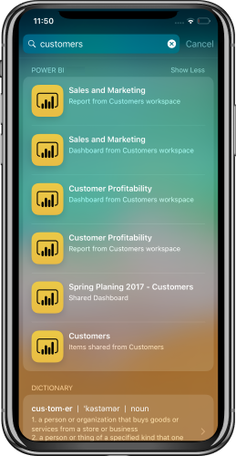

# iOS Device Search (Spotlight) integration with Power BI Mobile iOS App (preview)
Use iOS device search to find and access the content you need.

When you use iOS device search (spotlight) to look for specific content, Power BI items are included in the result list. Tapping on a Power BI item from the result list takes you directly to that item inside the Power BI app.

## Find items using device search

To find items using device search:

1. Swipe down from the middle of the **Home** screen to get into the device search.

2. Tap the **Search** field and type the text you're looking for.
 
   The search results will include Power BI items of the following types:

    * Dashboards
    * Reports
    * Apps
    * Workspaces
    * Items shared by the contact you search for

    

 3. Once you find the item you want, tap on it. The Power BI app will open directly on the selected item. 

Device search, powered by Siri, will also include suggestions based on your frequent actions in the Power BI app. Siri suggestions will be shown in the search and lock screen.

>[!NOTE]
>
>To disable device search and Siri suggestions, go to **Device settings** > **Power BI settings** > **Siri & Search**,
>and disable the **Siri & suggestions** setting.
>

## Next steps
Learn more about the Power BI mobile app by doing the following: 

* Downloading the [Power BI iPhone mobile app](http://go.microsoft.com/fwlink/?LinkId=522062)
* Following [@MSPowerBI on Twitter](https://twitter.com/MSPowerBI)
* Joining the conversation at the [Power BI Community](http://community.powerbi.com/)

