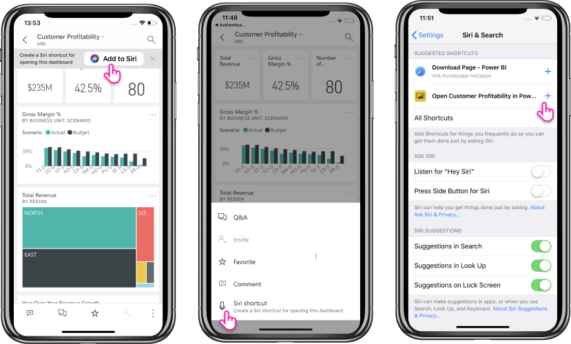
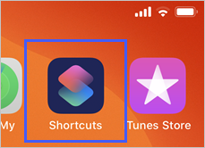
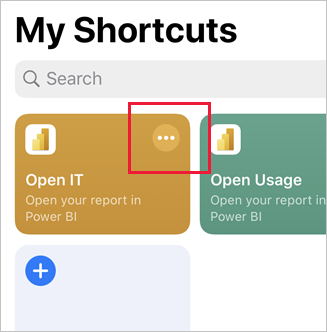
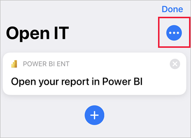
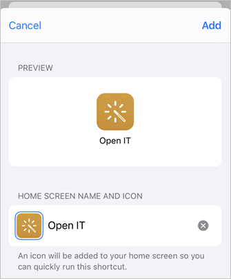

# Using Siri Shortcuts in Power BI Mobile iOS App

Use Siri Shortcuts to directly access the Power BI content you need.

To get easy and quick access to your frequently used reports or dashboards, you can create a Siri Shortcut for direct access to the Power BI content you need. With a Siri Shortcut, you just need to ask Siri to open it whenever you need look at the data.

> [!NOTE]
> The Siri Shortcuts integration with the Power BI mobile app is available for iPhones and iPads running iOS12 and later.

## Create Siri shortcut for a report or dashboard

There are three ways to create Siri shortcuts to your reports and dashboards:

- A banner with an **Add to Siri** option will be added to your frequently used reports and dashboards. Tap the action to open the **Add to Siri** page.
    
- Use the **Siri shortcut** action on the **Report** or **Dashboard** actions menu (...).
    
- Use the **Suggested shortcuts** in the device settings (**Device Setting** > **Siri & Search**). You can add a shortcut to the item in the suggestion by using the plus (+) button.
     
     

For a Power BI report, the shortcut will capture the current page that you're viewing when creating the shortcut. 

All options will open the **Add to Siri** page. In this page, you will need to record a phrase that you will use later with Siri to open the report or dashboard. 
   

    

## Use Siri Shortcuts to view report or dashboard

Once you create a shortcut, every time you’d like to access the dashboard or report that you created a shortcut for, just ask Siri.
Activate Siri and provide the phrase you recorded for the shortcut. Siri will launch Power BI and land on the requested report or dashboard. 

For a Power BI report, you will land on the page captured when you created the shortcut.

  
  

## Edit Siri shortcut phrase 
You can edit your shortcut phrase by using the **Siri shortcut** button on the **Report** or **Dashboard** actions menu (...). The Siri shortcut page will be opened with an option to **Re-Record phrase**. 

## Create a home screen shortcut from your Siri shortcut 
You can easily create a home screen shortcut for any Siri shortcut you've created. 
1. Open the **Shortcuts** app on your iOS device.

   

1. In the Shortcuts app, find your Siri shortcut and tap on **More options (...)** to edit it.

    

1. When the shortcut opens for editing, tap the three dots.

    

1. Choose **Add to Home Screen**.

    

1. Edit the shortcut name, if desired, and tap **Add**.

    

## Delete Siri shortcut 
To delete a shortcut, go to the item, and from the actions menu (...), tap the **Siri shortcut** action. The **Siri shortcut** page will open. Choose **Delete Shortcut**.

## Next steps
Learn more about the Power BI mobile app by doing the following: 

* Downloading the [Power BI iPhone mobile app](https://go.microsoft.com/fwlink/?LinkId=522062)
* Following [@MSPowerBI on Twitter](https://twitter.com/MSPowerBI)
* Joining the conversation at the [Power BI Community](https://community.powerbi.com/)

