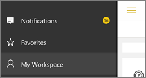
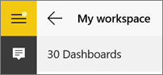
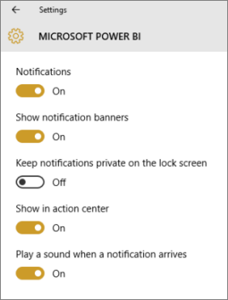

# Get notifications in the Power BI mobile apps
Applies to:

|  |  |  |  |  |
|:--- |:--- |:--- |:--- |:--- |
| iPhones |iPads |Android phones |Android tablets |Windows 10 devices |

Notifications bring information related to your Power BI experience right to you, in the Power BI service or on your mobile device. When you open Notifications, you see a sequential feed of messages about [alerts you've set](mobile-set-data-alerts-in-the-mobile-apps.md), new dashboards that have been shared with you, changes to your group workspace, information about Power BI events and meetings, and more.

> [!NOTE]
> On an iOS device, the first time you sign in to the [updated version of the Power BI apps](https://powerbi.microsoft.com/mobile/), you see a message asking if you'd like Power BI to send notifications. You can also configure how Power BI notifies you in **Settings** for your device. 
> 
> 

## View notifications on your mobile device
1. When you receive notifications on your mobile device, by default Power BI makes a sound and shows a notification banner.
   
   
   
   Or on an iPad:
   
   
   
   You can [change how Power BI notifies you](mobile-apps-notification-center.md#change-or-turn-off-notifications-on-your-mobile-device).
2. If you've received notifications, when you sign in to Power BI on your mobile device you see a yellow dot on global navigation button  (Android) or on the **Notifications** icon. 
   
   
3. Select the Notifications icon  (Windows 10).
   
    Notifications are displayed with the most recent on top and unread messages highlighted. Notifications are retained for 90 days unless you delete them or reach the maximum limit of 100.
   
   
4. To dismiss a notification, tap and hold it and select **Dismiss**.

## Change or turn off notifications on your mobile device
You can change how Power BI notifies you.

1. On an iOS device, go to **Settings** > **Notifications**. 
   
    On an Android phone, go to **Notification Settings**.
   
    On a Windows device, in **Settings** go to **System** > **Notifications & actions**.
2. In the list of apps, select **Power BI**. 
3. Here you can turn notifications off completely or choose which notifications you want.
   
    **On an iPhone**
   
    
   
    **On an Android phone**
   
    

    **On a Windows 10 device**

    

## Next steps
* [Data alerts in Power BI service](../../service-set-data-alerts.md)
* [Set data alerts in the iPhone app (Power BI for iOS)](mobile-set-data-alerts-in-the-mobile-apps.md)
* [Set data alerts in the Power BI mobile app for Windows 10](mobile-set-data-alerts-in-the-mobile-apps.md)
* [Download the latest version of the Power BI apps](https://powerbi.microsoft.com/mobile/) for mobile devices

