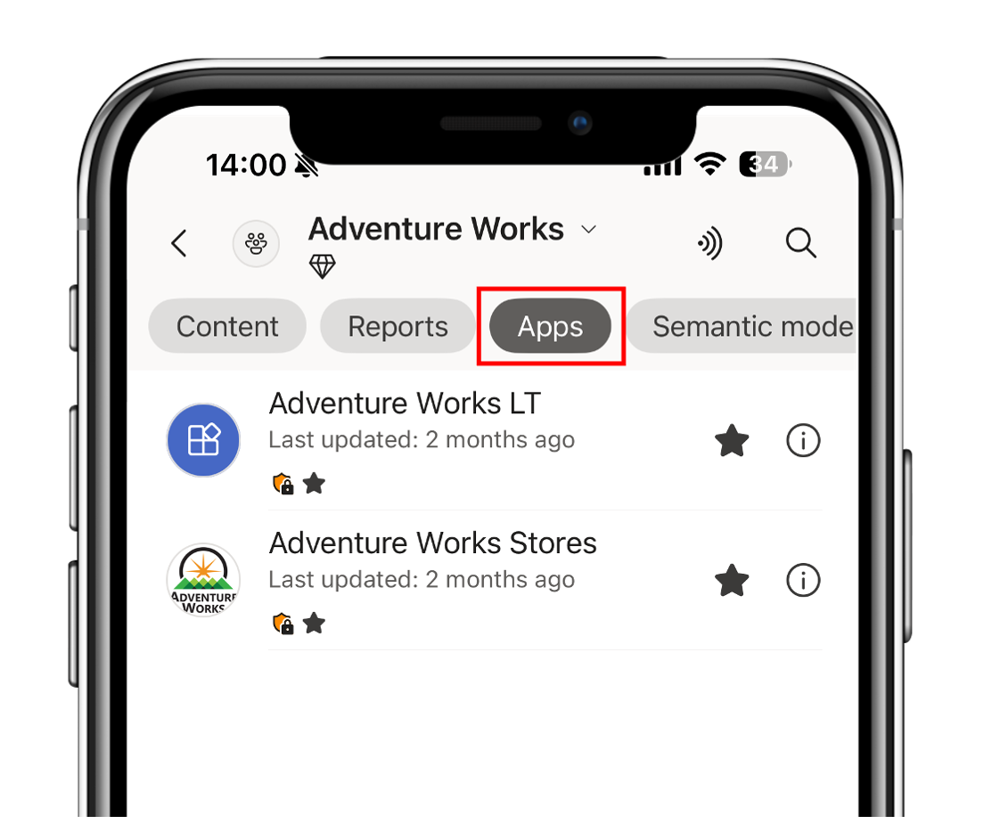
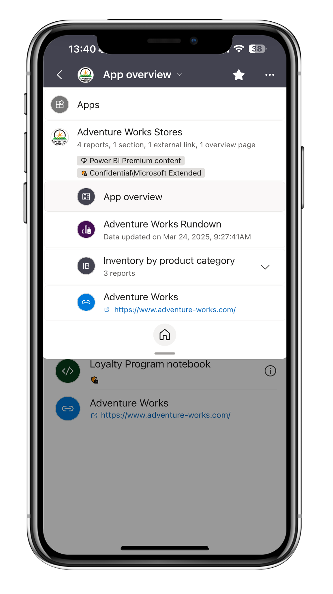
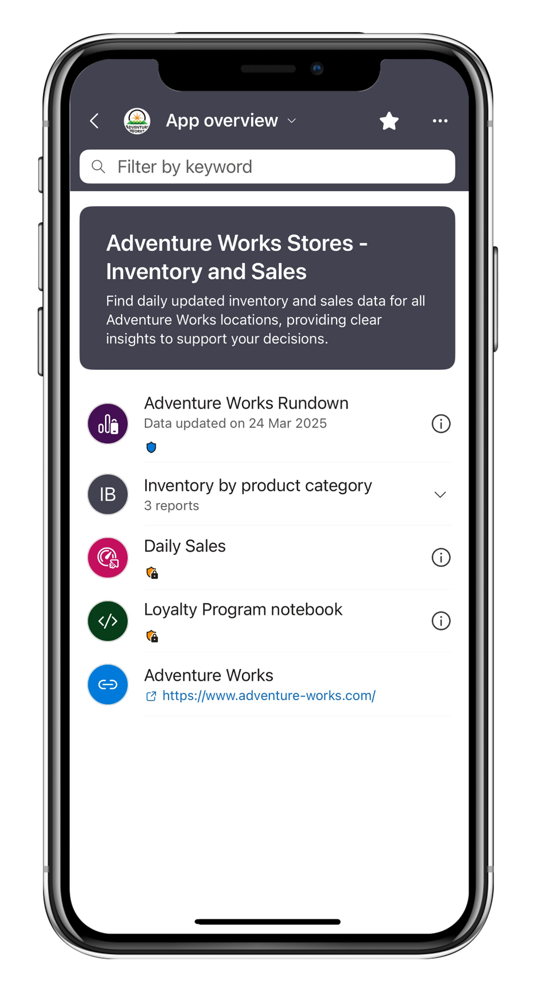

# Using org apps (preview)
<!-- approved for use -->
Applies to:

|  |  |  |  |
|:--- |:--- |:--- |:--- |
|iPhones |iPads |Android phones |Android tablets |

Org apps are the next generation of Power BI apps, designed to simplify access to Power BI and Fabric items. In the Power BI mobile apps, users can view org apps and interact with supported content. 

To read more about org apps, see [Get started with org apps (preview)](../org-app-items/org-app-items.md)

## Discover and access org apps 
Org apps appear in the apps section alongside workspace apps, and in workspace content lists. You can filter a workspace by apps to view all available ones.  

  
Since org apps are considered items, you can favorite them to make them easier to find. Additionally, they also appear on the Power BI mobile apps homepage under the recents and frequents sections, based on the items you have viewed.

## Navigation and layout 
* Like any other item you view in the Power BI mobile apps, when you open an org app, you can access its navigation tree via the header. The navigation tree includes only supported items (excluding Fabric items), and tapping any of them will load the item in the main view page. 

* When you open the app, you'll land on the first supported item based on the defined order during app authoring. This means the landing item will be either a Power BI report or, if an overview page has been included and is listed first, the overview page. 

## Supported item types in Power BI mobile  

Supported items are item types you can view directly in the Power BI mobile apps. They appear in the app's content and navigation tree and include: 

* Power BI reports
* Paginated reports 
* Overview page 
* Sections
* Links

## Theme and customization 

* Creators can configure themes for their org apps. That configuration is respected by the Power BI mobile apps, including light/dark mode compatibility. 
* If an overview page was configured, then a mobile version of this page suitable for mobile devices will be available as well.

## Limitations

* While org apps can contain real-time dashboards and notebooks, only Power BI items are supported by the Power BI mobile apps. Therefore, other Fabric items will be listed in the app's overview page and content list, but will open in the browser. 

* Sharing org apps or items within org apps from Power BI mobile is currently not supported. 