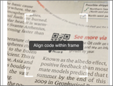

# Scan a Power BI QR code from your mobile device
Applies to:

|  |  |  |  |
|:--- |:--- |:--- |:--- |
|iPhones |iPads |Android phones |Android tablets |

QR codes can be used to connect items in the real world directly to relevant BI information. When you scan a QR code that has been created for a Power BI report or dashboard tile, that report or tile will open directly - you won't have to navigate to it or search for it.

Say a colleague has created a QR code for a report or for a tile in a dashboard (using either [the Power BI service's built-in QR generator](../../create-reports/service-create-qr-code-for-tile.md) or an external generator) and placed it in a key location, such as in an email, a PowerPoint presentation, or even next to the door of a conference room. Then, using either the camera in the Power BI app, or any other scanner installed on your mobile device, you can scan the QR code for immediate access to the relevant report or tile. If you don't have permissions to view the report or dashboard, you'll be able to request access directly from the app.

The Power BI mobile app supports QR codes with URLs parameters, so if the QR code for a report includes such parameters, the report will open filtered according to those parameters. 

> [!NOTE]
> You can also [scan a report QR code with the Power BI for Mixed Reality app](./mobile-hololens2-app.md#open-reports-with-qr-codes).

## Scan a Power BI QR code on your mobile device with the Power BI scanner

1. On the app header, tap the camera icon.

    

2. If your camera is not enabled, you'll need to allow the Power BI app to use the camera. This is a one-time operation.
 
3. When the scanner opens, point it at the Power BI QR code.
   
    
4. The report or tile will open directly. If you have an iOS device and are scanning a QR code for a tile, the tile won't open directly, but rather will appear to float over the background in augmented reality. Tap the floating tile to open it in focus mode.
   
    

### Scan a QR code from an external scanner on your mobile device
1. From any scanner installed on your mobile device, point the scanner at the relevant Power BI QR code to immediately open the associated report or tile.
2. If the Power BI app isn't installed on your device, you'll be redirected to the [Apple App Store (iOS)](https://go.microsoft.com/fwlink/?LinkId=522062) or to [Google Play (Android)](https://go.microsoft.com/fwlink/?LinkID=544867) to download and install the app on your mobile device.

## Next steps
* [Connect to Power BI data from the real world](mobile-apps-data-in-real-world-context.md) with the mobile apps
* [Create a QR code for a tile in the Power BI service](../../create-reports/service-create-qr-code-for-tile.md)
* [Create a QR code for a report in the Power BI service](../../create-reports/service-create-qr-code-for-report.md)
* You can also [scan a QR code with the Power BI for Mixed Reality app](./mobile-hololens2-app.md)
* Questions? [Try asking the Power BI Community](https://community.powerbi.com/)
