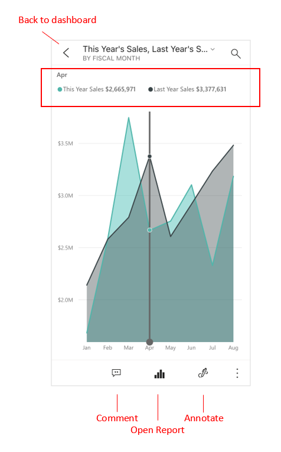
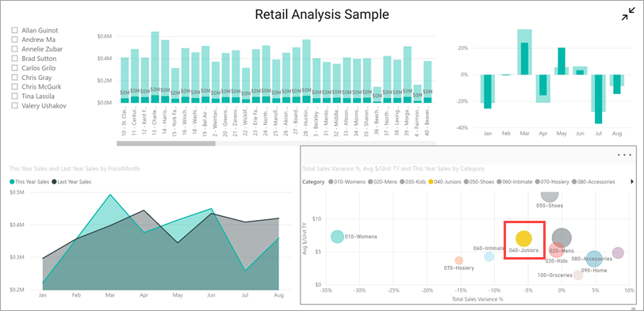
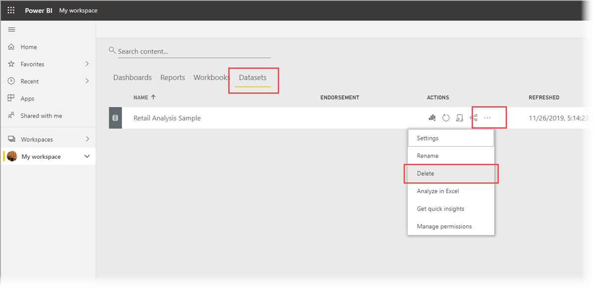

# Quickstart: Explore dashboards and reports in the Power BI mobile apps
In this quickstart, you take a quick tour of the Power BI Mobile app and explore a sample dashboard and report. The Power BI app for iOS is shown, but you can easily follow along on other devices.

Applies to:

|  |  |  |
|:--- |:--- |:--- |
| iPhone | iPad | Android |

>[!NOTE]
>Power BI mobile app support for **phones using Windows 10 Mobile** has been discontinued as of March 16, 2021. [Learn more](/legal/powerbi/powerbi-mobile/power-bi-mobile-app-end-of-support-for-windows-phones)

A dashboard is a portal to your company's life cycle and processes. It is an overview, a single place to monitor the current state of the business. Reports are interactive views of your data, with visuals representing different findings and insights from that data. 

## Prerequisites

* **Sign up for Power BI**: If you're not signed up for Power BI, [sign up for a free trial](https://app.powerbi.com/signupredirect?pbi_source=web) before you begin.
* **Install the Power BI app for your device**: Download the Power BI mobile app** from the [App store](https://apps.apple.com/app/microsoft-power-bi/id929738808) (iOS) or [Google play](https://play.google.com/store/apps/details?id=com.microsoft.powerbim&amp;amp;clcid=0x409) (Android).
* **Download the Retail Analysis Sample**: The first step in this quickstart is to download the Retail Analysis Sample in the Power BI service. [Learn how to download a sample](./mobile-apps-download-samples.md) into your Power BI account to get started. Be sure to choose the Retail Analysis Sample.

Once you've completed the prerequisites and downloaded the Retail Analysis Sample to your Power BI account, you are ready to begin this quick tour.

## View a dashboard on your mobile device
1. On your device, open the Power BI app and sign in with your Power BI account credentials, the same ones you used in the Power BI service in the browser.
 
1. Now, tap the **Workspaces** icon , choose **My Workspaces**, and then tap the Retail Analysis Sample to open it.

    
   
    Power BI dashboards look a little different on your mobile device than they do on the Power BI service. All the tiles appear the same width, and they're arranged one after another from top to bottom.

6. Scroll down and tap the "This Year's Sales, Last Year's Sales" filled line chart.

    

    It opens in focus mode.

7. In focus mode, tap **Apr** in the chart. The values for April appear at the top of the chart.

    

8. Tap the Report icon  at the bottom of the screen (on Android devices this may be at the top of the screen). The report related to this tile opens in landscape mode.

    

9. Tap the yellow "040 - Juniors" bubble in the bubble chart. Note how it highlights related values in the other charts. 

    

10. Swipe up to see a toolbar across the bottom, and tap **More options (...)**.

    

11. Scroll down the list and select **Annotate**.

    

12. On the annotate toolbar, tap the smiley-face icon and then tap the report page where you'd like to add some smiley faces.
 
    

13. Now tap **Share** in the upper-right corner.

14. Choose the way you'd like to share the report.  

    

    You can share this snapshot with anyone, in or out of your organization. If they're in your organization and have their own Power BI account, they'll be able to open the Retail Analysis Sample report, too.

## Clean up resources

After you finish this quickstart, you can delete the Retail Analysis Sample dashboard, report, and semantic model, if you wish.

1. Open the Power BI service ([Power BI service](https://app.powerbi.com)) and sign in.

2. In the navigation pane, select **My Workspace**.

3. Select the dashboards tab and then click the trash can.

    

    Now click the reports tab and do the same.

4. Now select the semantic models tab, click **More options** (...), and choose **Delete**. 

    

## Related content

In this quickstart, you explored a sample dashboard and report on your mobile device. Read more about working in the Power BI service. 

> [!div class="nextstepaction"]
> [Quickstart: Getting around in the Power BI service](../end-user-experience.md)
