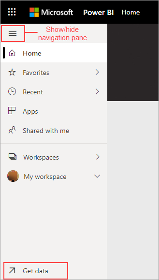
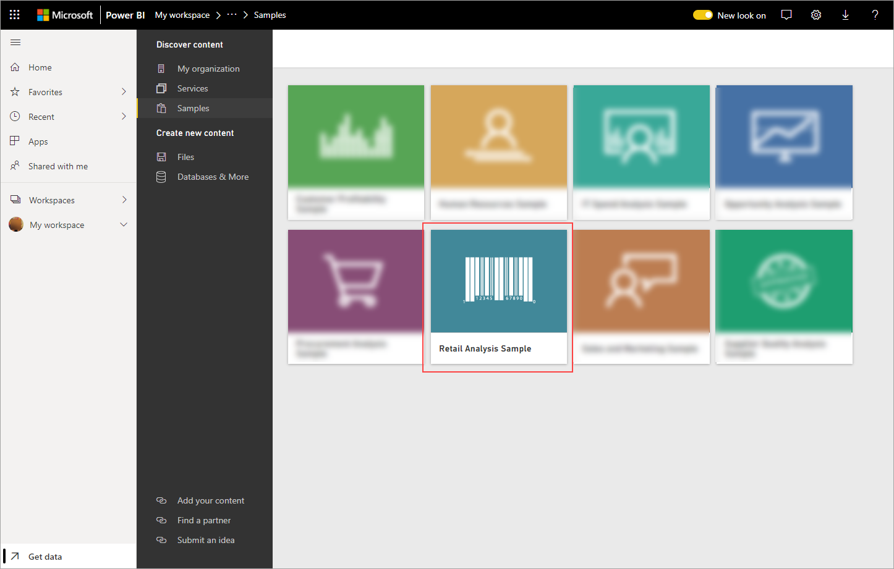
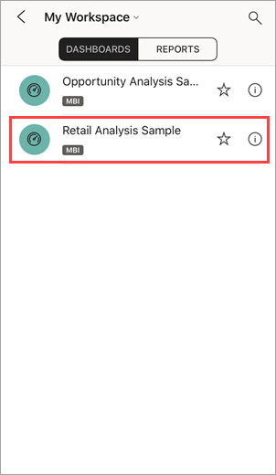
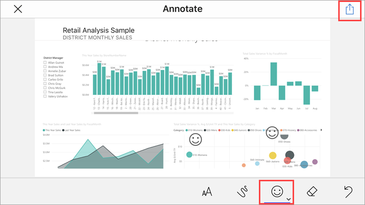
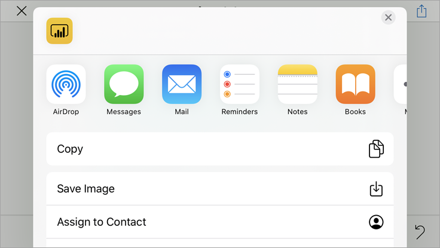

# Quickstart: Explore dashboards and reports in the Power BI mobile apps
In this quickstart, you explore a sample dashboard and report in the Power BI mobile app on an Android phone. You can also follow along in the other mobile apps. 

Applies to:

|  |  |  |  |
|:--- |:--- |:--- |:--- |
| iPhone | iPad | Android | Windows 10 |

Dashboards are a portal to your company's life cycle and processes. A dashboard is an overview, a single place to monitor the current state of the business. Reports are an interactive view of your data, with visuals representing different findings and insights from that data. 

## Prerequisites

### Sign up for Power BI
If you're not signed up for Power BI, [sign up for a free trial](https://app.powerbi.com/signupredirect?pbi_source=web) before you begin.

### Install the Power BI for Android app
[Download the Power BI for Android app](http://go.microsoft.com/fwlink/?LinkID=544867) from Google Play.

Power BI works on Android devices running the Android 5.0 operating system or later. To check your device, go to **Settings** > **About device** > **Android version**.

### Download the Retail Analysis sample
The first step in the quickstart is to download the Retail Analysis sample in the Power BI service.

1. Open the Power BI service in your browser (app.powerbi.com) and sign in.

1. Select the global navigation icon to open the left navigation.

    

2. In the left navigation pane, select **Workspaces** > **My Workspace**.

    

3. In the lower-left corner select **Get data**.
   
    

3. On the Get Data page, select the **Samples** icon.
   
   

4. Select the **Retail Analysis sample**.
 
    
 
8. Select **Connect**.  
  
   
   
5. Power BI imports the sample, adding a new dashboard, report, and dataset to your My Workspace.
   
   

OK, you're ready to view the sample on your Android device.

## View a dashboard on your Android device
1. On your Android device, open the Power BI app and sign in with your Power BI account credentials, the same ones you used in the Power BI service in the browser.

1.  Tap the global navigation button .

2.  Tap **Workspaces** > **My Workspace**

    

3. Tap the Retail Analysis Sample dashboard to open it.
 
    
   
    A notation below the dashboard name (in this case, the letter "C") shows how the data in each dashboard is classified. Read more about [data classification in Power BI](../../service-data-classification.md).

    Power BI dashboards look a little different on your Android phone. All the tiles appear the same width, and they're arranged one after another from top to bottom.

4. Tap the star icon  in the title bar to make this a favorite dashboard.

    When you make a favorite in the mobile app, it's a favorite in the Power BI service, and vice versa.

4. Scroll down and tap the "This Year's Sales, Last Year's Sales" filled line chart.

    

    It opens in focus mode.

7. In focus mode, tap Apr in the chart. You see the values for April displayed at the top of the chart.

    

8. Tap the Report icon  in the upper-right corner. The report related to this tile opens in landscape mode.

    

9. Tap the yellow "040 - Juniors" bubble in the bubble chart. See how it highlights related values in the other charts? 

    

10. Swipe up to see toolbar across the bottom, and tap the pencil icon.

    

11. Tap the smiley-face icon in the Annotate toolbar, and add some smiley faces to your report page.
 
    

12. Tap **Share** in the upper-right corner.

1. Fill in their email addresses and add a message, if you so desire.  

    

    You can share this snapshot with anyone, in or out of your organization. If they're in your organization and have their own Power BI account, they'll be able to open the Retail Analysis sample report, too.

## Clean up resources

After you finish this quickstart, you can delete the Retail Analysis sample dashboard, report, and dataset, if you wish.

1. Open the Power BI service (app.powerbi.com) and sign in.

2. In the left navigation pane, select **Workspaces** > **My Workspace**.

    Notice the yellow star indicating it's a favorite?

3. On the **Dashboards** tab, select the garbage can **Delete** icon next to the Retail Analysis dashboard.

    

4. Select the **Reports** tab and do the same for the Retail Analysis report.

5. Select the **Datasets** tab and do the same for the Retail Analysis dataset.

## Next steps

In this quickstart, you explored a sample dashboard and report on your Android device. Read more about working in the Power BI service. 

> [!div class="nextstepaction"]
> [Quickstart: Getting around in the Power BI service](../end-user-experience.md)

