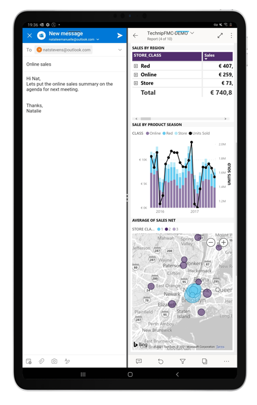

# Use the Power BI mobile app in split-screen mode

Applies to:

|  |
|:--- |
| Android tablets |

If your Android tablet has multi-window support, you can view and interact with your data side by side with another app using split-screen mode.

### Using split-screen mode

Check your tablet's documentation to see how to open apps in split-screen mode on your device.

Once your apps are open in split screen mode, you can adjust the size of the screens by dragging the dividing line between the apps to the right or left.

Split-screen mode works best with reports that have been optimized for viewing on mobile devices. If you are a report creator, consider creating a mobile-optimized layout for your report. See [Optimize Power BI reports for the mobile app](../../create-reports/desktop-create-phone-report.md) for details.

>[!IMPORTANT]
>Split screen mode only works on supported Android tablets. See your device's documentation to see if it supports split-screen mode.