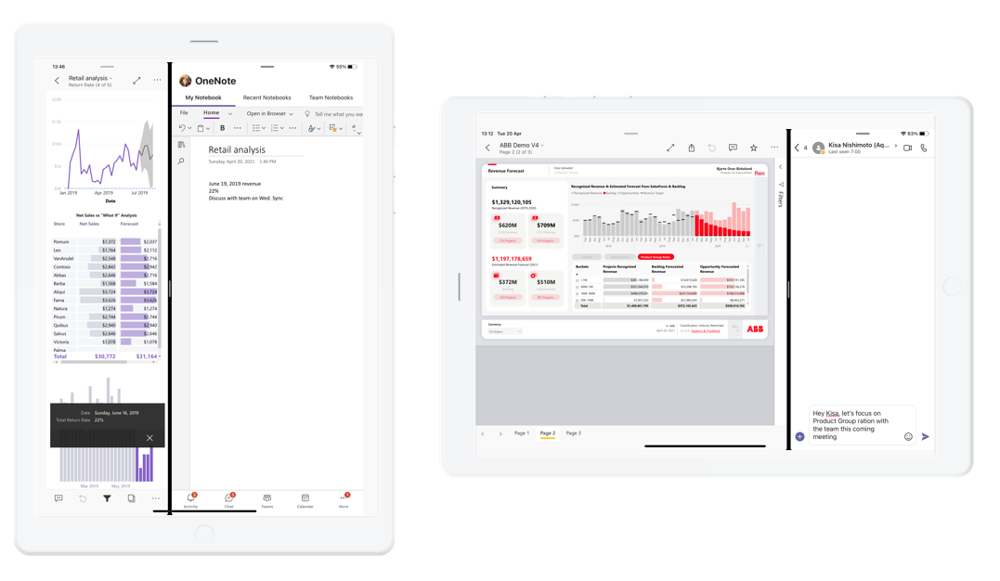

# Work side by side with other apps

Applies to:

| |  |
|:--- |:--- |
|iPads |Android tablets |

On [supported](#device-requirements) iPads and Android tablets, you can view and interact with your Power BI data while working side by side with another app.

With the two apps open side by side, you can adjust the size of the screens by dragging the dividing line between the apps to the right or left.

Working side by side with another app works best with reports that have been optimized for viewing on mobile devices. If you are a report creator, consider creating a mobile-optimized layout for your report. See [Optimize Power BI reports for the mobile app](../../create-reports/desktop-create-phone-report.md) for details.

## Opening two apps side by side

* **Android tablets**: Open the two apps in **split-screen** mode. To see how, check your tablet's documentation, or [search "Open apps in split screen on Android tablets" on Bing](https://www.bing.com/videos/search?q=open+apps+in+split+screen+android+tablets).
* **iPads**: Open the two apps in **Split View**. See [support.apple.com](https://support.apple.com/guide/ipad/ipad08c9970c/ipados) for instructions.

## Device requirements

* **Android tablets**: Split-screen mode requires that your device have multi-window support. Check your device's documentation to see if it has the necessary support. 
* **iPads**: Split View is supported on iPads running iPadOS 13 and above.