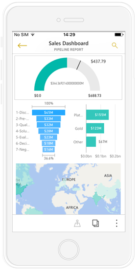
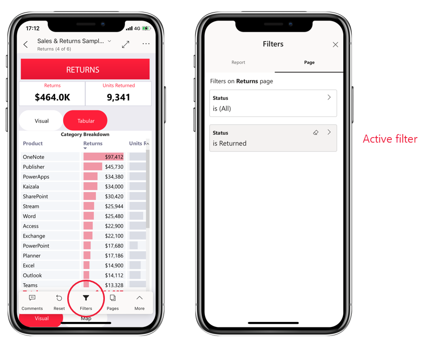

# View Power BI reports optimized for your phone

Applies to:

|  |  |
|:--- |:--- |
| iPhones |Android phones |

When you view a Power BI report on your phone, Power BI checks to see if the report has been optimized for phones. If it has, Power BI automatically opens the report in the optimized view.

If the report doesn't have an optimized view, in portrait orientation you'll see small regular version of the report page. For a closer look, you can either tip the phone to landscape orientation, or, if all you need is a quick look at the numbers, you can quite easily stay in portrait orientation and just use pinch and zoom.

All the other features of Power BI reports still work in phone-optimized reports. Read more about what you can do in:

* [Reports on iPhones](mobile-reports-in-the-mobile-apps.md). 
* [Reports on Android phones](mobile-reports-in-the-mobile-apps.md).

## Filter the report page on a phone
If a report has filters defined, when you view the report on a phone you can use those filters. The report opens on your phone, filtered to the values being filtered in the report on the web.

A filled in filter icon indicates there are active filters on the page. You can change the filters on your phone.

1. Tap the filter icon in the report footer. The filters appear in panels on the filter pane. Active filters are highlighted.
   
    

2. Tap a filter to open it. You can then change the filter, choose between basic and advanced filtering, etc.
    
    

The filters pane supports filter customizations done by the report creator.

## Cross-highlight visuals
Cross highlighting visuals in portrait view works the way it does in the Power BI service, and on phones in landscape view: When you select data in one visual, it highlights related data in the other visuals on that page.

Read more about [filtering and highlighting in Power BI](../../create-reports/power-bi-reports-filters-and-highlighting.md).

## Select visuals
In phone reports when you select a visual, the phone report highlights that visual and focuses on it, neutralizing canvas gestures.

With the visual selected, you can do things like scroll within the visual. To de-select a visual, just touch anywhere outside the visual area.

## Open visuals in focus mode
Phone reports also offer a focus mode: You get a bigger view of a single visual and explore it more easily.

* In a phone report, tap the ellipsis (**...**) in the upper-right corner of a visual  > **Expand to focus mode**.
  
    

What you do in focus mode carries over to the report canvas and vice versa. For example, if you highlight a value in a visual, then return to the whole report, the report is filtered to the value you highlighted in the visual.

Some actions are only possible in focus mode, due to screen size constraints:

* **Drill down** into the information displayed in a visual. Read more about [drilling down and up](mobile-apps-view-phone-report.md#drill-down-in-a-visual) in a phone report, below.
* **Sort** the values in the visual.
* **Revert**: Clear exploration steps you've taken on a visual and revert to the definition set when the report was created.
  
    To clear all exploration from a visual, tap the ellipsis (**...**) > **Revert**.
  
    
  
    Revert is available at the report level, clearing exploration from all visuals, or at the visual level, clearing exploration from the selected visual.   

## Drill down in a visual
If hierarchy levels are defined in a visual, you can drill down into the detailed information displayed in a visual, then back up. You [add drill-down to a visual](../end-user-drill.md) either in the Power BI service or in Power BI Desktop.

There are few ways to drill down:

### Drill down on a value
1. Long tap (tap and hold) on a data point in a visual.
2. Tooltip will show up, and if hierarchy is defined, then the tooltip footer will show drill-down and up arrow.
3. Tap on the down arrow to drill down

    :::image type="content" source="./media/mobile-apps-view-phone-report/report-drill-down.png" alt-text="Screenshot of a drill-down on a visual as seen in the Power BI mobile app." border="false":::
    
4. Tap on the up arrow to drill up.

### Drill to next level
1. In a report on a phone, tap the ellipsis (**...**) in the upper-right corner > **Expand to focus mode**.
   
    
   
    In this example, the bars show the values for states.
2. Tap the explore icon  in the lower left.
   
    
3. Tap **Show next level** or **Expand to next level**. *Show next level* shows the next level down. *Expand to next level* shows both the current level and the next level down.
   
    
   
    Now the bars show the values for cities.
   
    
4. If you tap the arrow in the upper-left corner, you return to the phone report with the values still expanded to the lower level.
   
    
5. To go back up to the original level, tap the ellipsis (**...**) again > **Revert**.
   
    

## Drill through from a value
Drilling through connects values in one report page, with other report pages. When you drill through from a data point to another report page, the data point values are used to filter the drilled through page, or it will be in the context of the selected data.
Report authors can [define drillthrough](../../create-reports/desktop-drillthrough.md) when they create the report.

1. Long tap (tap and hold) on a data point in a visual.
2. Tooltip will show up, and if drillthrough is defined, then the tooltip footer will show the drillthrough arrow.
3. Tap on the arrow to drill through

    :::image type="content" source="./media/mobile-apps-view-phone-report/report-drill-through1.png" alt-text="Screenshot of drill-through button on mobile app visual tooltip." border="false":::

4. Choose which report page to drill through

    :::image type="content" source="./media/mobile-apps-view-phone-report/report-drill-through2.png" alt-text="Screenshot of drill-through options in the mobile app.":::

5. Use the back arrow on the app header to go back to the page you started from.

## Related content

* [Create reports optimized for the Power BI mobile apps](../../create-reports/power-bi-create-mobile-optimized-report-about.md)
* [Create a phone view of a dashboard in Power BI](../../create-reports/service-create-dashboard-mobile-phone-view.md)
* [Create responsive visuals optimized for any size](../../visuals/power-bi-report-visualizations.md)
* More questions? [Try asking the Power BI Community](https://community.powerbi.com/)