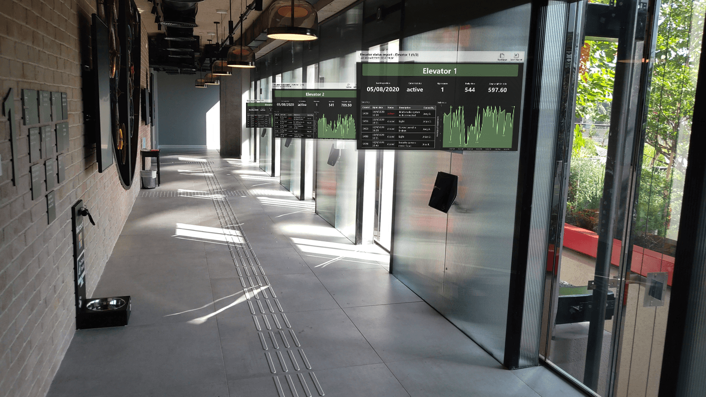
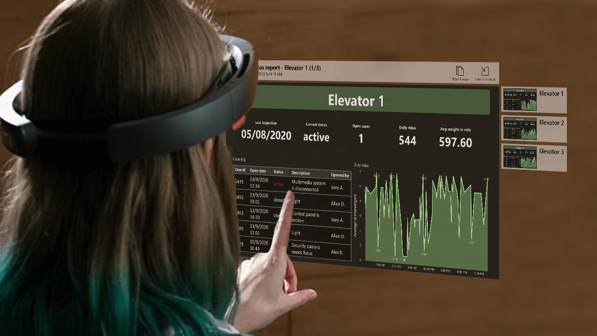

# Power BI for HoloLens 2 (preview)

> [!NOTE]
> The Power BI for HoloLens 2 app (preview) will be discontinued on **April 24, 2023**. From that date onwards, the app will no longer be available for download from the store, and no further updates or bug fixes for the app will be released.  

The Power BI app for HoloLens 2 blends your Power BI reports and dashboards with your physical environment to create a 3D, immersive, hands-free experience where you can move through the physical world and get your relevant data when and where you need it.

## Get the Power BI app for HoloLens 2 

The Power BI app for HoloLens 2 is available from the [Microsoft Store](https://go.microsoft.com/fwlink/?linkid=526478).

The app works with single sign on, meaning that the app uses the identity of the user currently signed in to the HoloLens 2 device to authenticate against the Power BI service.

[Learn more](/hololens/holographic-store-apps) about installing apps on your HoloLens 2 device.

## Open the Power BI app on your HoloLens 2

Open the **Start** menu and select the Power BI app. The app will open with all your favorited reports and dashboards loaded into your virtual toolbelt, where you can select them for viewing.

## Using the Power BI app for HoloLens 2

You use the HoloLens 2 hand gestures and eye tracking to resize, place, and interact with your Power BI content. [Learn more](/hololens/hololens2-basic-usage) about interacting with objects in the HoloLens 2 world.

### Access reports and dashboards

To access a report or dashboard, grab it out of your virtual toolbelt and position it where you want. [Learn more](/hololens/hololens2-basic-usage#moving-holograms) about grabbing and positioning app windows.

To be in your virtual toolbelt, a report or dashboard must be marked as a favorite. If you don’t have any reports or dashboards in your toolbelt, or if you want to add additional reports and dashboards, simply mark those items as favorites in either the [Power BI service](../end-user-favorite.md) or the [Power BI mobile apps](mobile-apps-favorites.md). They will then be available in your Power BI virtual toolbelt in HoloLens 2.

### Resize reports and dashboards

To resize a report or dashboard, grab it by the resize handles that appear on the corners of the app window and adjust the size as desired. [Learn more](/hololens/hololens2-basic-usage#resizing-holograms) about resizing app windows.

### Position reports and dashboards in space

To position your report or dashboard in space, grab it by pinching your index finger and thumb on its title bar and then, without letting go, move your hand to the desired position. Release your fingers when you’ve got it to the desired place. [Learn more](/hololens/hololens2-basic-usage#moving-holograms) about moving app windows.

Once you’ve placed your report or dashboard where you want it, your HoloLens 2 device remembers its location in the environment. When you next visit the same place, you’ll find the item you placed in exactly the same location.

### Browse report pages

Each report has a page index that you can display in order to get from page to page. Select the **Page Index** button in the upper right corner of the report window to display or hide the page index.

### Open reports with QR codes

If a QR code has been created for a report and attached to an item, such as a piece of equipment whose data is contained in that report, you can open the report merely by looking at the QR code on the item.

[Learn more](../../create-reports/service-create-qr-code-for-report.md) about creating QR codes for reports.

### Data refresh

Reports and dashboards update while you’re using the app, so if data changes in Power BI while you’re using the app, you’ll see those changes reflected in the reports and dashboards you’re viewing.

## Considerations and limitations

The Power BI app for HoloLens 2 does not currently support the following items:
* All interactions with reports (filters, slicers, bookmarks, etc.)
* Power Apps visuals
* Zebra visuals
* Access through a proxy

## Related content

* [Getting around HoloLens 2](/hololens/hololens2-basic-usage)