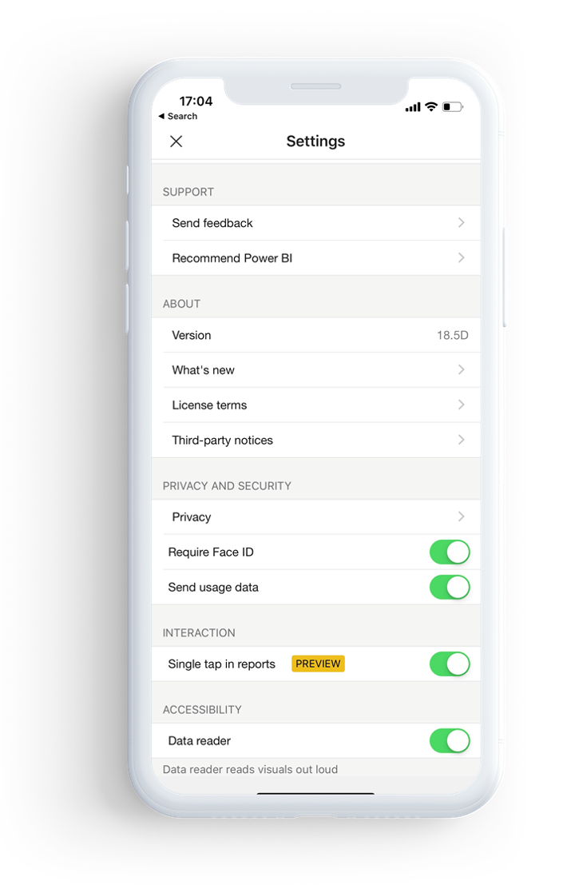

# Protect Power BI app with Face ID, Touch ID, or Passcode 

In many cases, the data managed in Power BI is sensitive and needs to be protected and accessed by authorized users only. 

Power BI iOS app lets you configure additional identification, so your Face ID, Touch ID, or passcode will be required every time you launch the app or bring it from the background to the foreground.

|  |  |
|:--- |:--- |
| iPhones |iPads |

## Turn on Face ID, Touch ID, or passcode in Power BI app setting

To use Face ID, Touch ID, or passcode in Power BI, go to the app setting, under the "Privacy and Security" section you will have the option to turn on Face, Touch ID, or passcode, based on your device capabilities.

Once this setting is turned on, every time you launch Power BI or bring it from the background, you will be asked to provide your ID before you will be able to access the app. 

It is iOS decision, based on the device capability, if to ask for Face ID, Touch ID, or passcode.

## Use MDM tool to enforce Face ID, Touch ID, or passcode in Power BI iOS app

Some organizations have security policies and compliance requirements to have additional identification before accessing business sensitive data. 
Power BI mobile iOS app allows admins to control that setting by pushing App configuration setting from Microsoft Intune and other device management solutions. Admins can use app prtection policy to turn on this setting for all or group of users.

|Key  |Type  |Description  |
|---------|---------|---------|
| com.microsoft.powerbi.mobile.ForceDeviceAuthentication | Boolean | Default value is False  When set to “True”, the app will force the users to identify themselves with Face ID, Touch ID, or passcode before they will be able to view any Power BI data in the app. USers that do not have Face ID, Touch ID, or passcode configured on their device, will be required to configure it before being able to access Power BI  |

## Next steps

