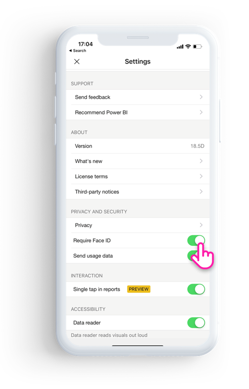

# Protect Power BI app with Face ID, Touch ID, or Passcode 

In many cases, the data managed in Power BI is confidential and needs to be protected and accessed by authorized users only. 

Power BI iOS app lets you protect your data by configuring additional identification. You'll need to provide Face ID, Touch ID, or a Passcode everytime you launch the app or bring it from the background to the foreground

|  |  |
|:--- |:--- |
| iPhones |iPads |

## Turn on Face ID, Touch ID, or passcode in Power BI app setting

To use additional identification in Power BI, go to the app setting, under the "Privacy and Security" section you'll see the option to turn on Face, Touch ID, or passcode, based on your device capabilities.

Once this setting is turned on, every time you launch Power BI or bring it from the background, it will ask you to provide your ID before you could access the app. 

The decision to ask for Face ID, Touch ID, or passcode is done by iOS, based on device capability. So, if your device supports Face ID, you'll need to use Face ID, and if it supports Touch ID, you'll need to use Touch ID. If neither are supported, then you'll need to provide a passcode.

## Use an mobile device management (MDM) tool to enforce Face ID, Touch ID, or passcode protection

Some organizations have security policies and compliance requirements enforcing additional identification before accessing business sensitive data. 

Power BI mobile iOS app allows admins to control that setting by pushing app configuration setting from Microsoft Intune and other mobile device management (MDM) solutions. Admins can use app protection policy to turn on this setting for all users or for a group of users.

|Key  |Type  |Description  |
|---------|---------|---------|
| com.microsoft.powerbi.mobile.ForceDeviceAuthentication | Boolean | Default value is False  When set to “True”, the app will force the users to identify themselves with Face ID, Touch ID, or passcode before they're be able to view any Power BI data in the app. USers who don't have Face ID, Touch ID, or a passcode configured on their device, will be required to configure it before being able to access Power BI  |

## Next steps

