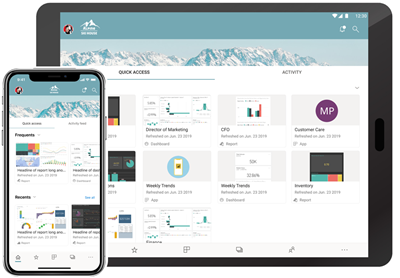
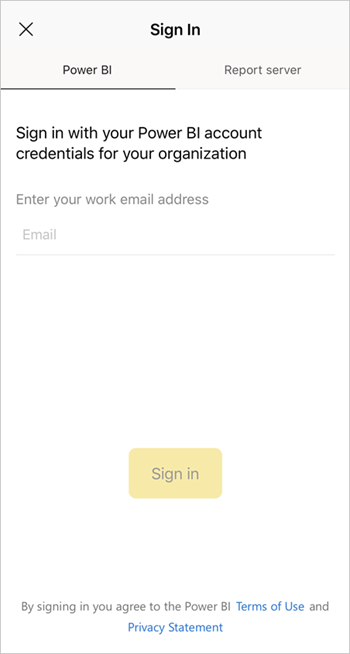
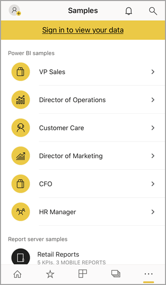
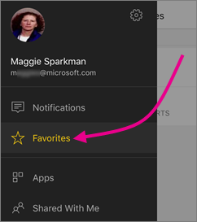
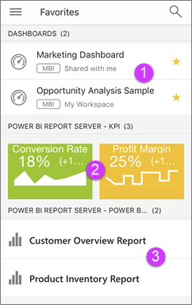

# Get started with the Power BI mobile app on iOS devices
The Microsoft Power BI for iOS app on the iPhone, iPad, or iPod Touch delivers the mobile BI experience for Power BI, Power BI Report Server, and Reporting Services. View and interact with your company dashboards on premises and in the cloud from anywhere, with live, touch-enabled mobile access. Explore the data in dashboards, and share with your colleagues in email or text messages. And keep up to date with your most timely data on your [Apple Watch](mobile-apple-watch.md).  

You create Power BI reports in Power BI Desktop, and publish them:

* [Publish them to the Power BI service](../../service-get-started.md), and create dashboards.
* [Publish them on premises to Power BI Report Server](../../report-server/quickstart-create-powerbi-report.md).

Then in the Power BI mobile app for iOS, you interact with your dashboards and reports, whether on premises or in the cloud.

Find out [what's new in the Power Bi mobile apps](mobile-whats-new-in-the-mobile-apps.md).

## Download the app
[Download the iOS app](http://go.microsoft.com/fwlink/?LinkId=522062 "Download the iOS app")  from the Apple App Store to your iPhone, iPad, or iPod Touch.

You can run the Power BI for iOS app on any device running iOS 11 or later. 

## Sign up for the Power BI service
If you haven't already signed up, go to [powerbi.com](https://powerbi.microsoft.com/get-started/), and under **Power BI - Cloud collaboration and sharing**, select **Try free**.

## Get started with the Power BI app
1. In your iOS device, open the Power BI app.
2. To view your Power BI dashboards, tap **Power BI**.  
   To view your Reporting Services mobile reports and KPIs, tap **SQL Server Reporting Services**.
   
   
   
   When you're in the app, just tap the global navigation button  in the upper-left corner to go between the two. 

## Try the Power BI and Reporting Services samples
Even without signing up, you can play with the Power BI and Reporting Services samples. After you download the app, you can view the samples or get started. Go back to the samples whenever you want from the global navigation.

### Power BI samples
You can view and interact with the Power BI dashboard samples, but there are a few things you can't do with them. You can't open the reports behind the dashboards, share the samples with others, or make them your favorites.

1. Tap the global navigation button  in the upper-left corner.
2. Tap the gear icon in the upper-right , then tap **Power BI samples**.
3. Pick a role and explore the sample dashboard for that role.  
   
   
   
   > [!NOTE]
   > Not all features are available in the samples. For example, you can't view the sample reports that underlie the dashboards. 
   > 
   > 

### Reporting Services mobile report samples
1. Tap the global navigation button  in the upper-left corner.
2. Tap the gear icon in the upper-right , then tap **Reporting Services samples**.
3. Open either the Retail Reports or the Sales Reports folder to explore their KPIs and mobile reports.
   
   

## Find your content in the Power BI mobile apps
Your dashboards and reports are stored in different locations in the Power BI mobile apps, depending on where they came from. Read  about [finding your content in the mobile apps](mobile-apps-quickstart-view-dashboard-report.md). Plus you can always search for anything you have in the Power BI mobile apps. 

Read more about [finding your content in the mobile apps](mobile-apps-quickstart-view-dashboard-report.md).

## View your favorite dashboards, KPIs, and reports
On the Favorites page in the mobile apps, you see all of your favorite Power BI dashboards, together with Power BI Report Server and Reporting Services KPIs and reports. When you make a dashboard a *favorite* in the Power BI mobile app, you can access it from all of your devices, including the Power BI service in your browser. 

* Tap **Favorites**.
  
   
  
   You see all your favorites together on this page:
  
   
  
  1. Dashboards on the Power BI service
  2. KPIs on Power BI Report Server
  3. Power BI reports on Power BI Report Server

Read more about [favorites in the Power BI mobile apps](mobile-apps-favorites.md).

## Enterprise support for the Power BI mobile apps
Organizations can use Microsoft Intune to manage devices and applications, including the Power BI mobile apps for Android and iOS.

Microsoft Intune lets organizations control items like requiring an access pin, controlling how data is handled by the application, and even encrypting application data when the app isn't in use.

> [!NOTE]
> If you use the Power BI mobile app on your iOS device and your organization has configured Microsoft Intune MAM, then background data refresh is turned off. The next time you enter the app, Power BI refreshes the data from the Power BI service on the web.
> 

Read more about [configuring Power BI mobile apps with Microsoft Intune](../../service-admin-mobile-intune.md). 

## Next steps

* [What is Power BI?](../../power-bi-overview.md)
* Questions? [Try asking the Power BI Community](http://community.powerbi.com/)

