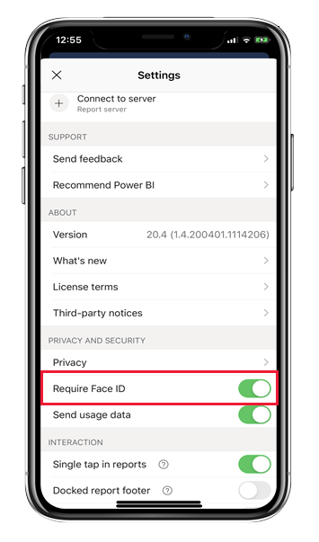
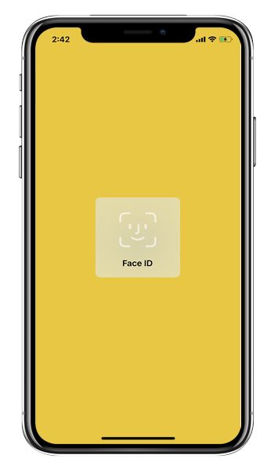
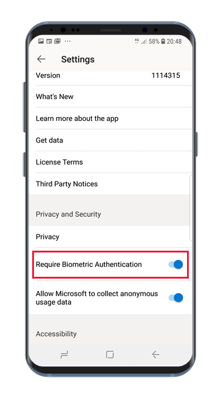
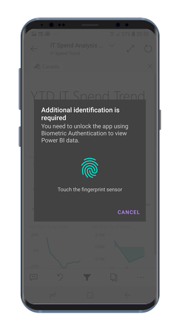

# Protect Power BI app with Face ID, Touch ID, passcode, or biometric data 

In many cases, the data managed in Power BI is confidential and needs to be protected and accessed by authorized users only. 

The Power BI apps for iOS and Android let you protect your data by configuring additional identification. Then, every time the app is launched or brought to the foreground, identification will be required. On iOS, this means providing Face ID, Touch ID, or a passcode. On Android, it means providing biometric data (Fingerprint ID).

Applies to:

|  |  |  |  |
|:--- |:--- |:--- |:--- |
|iPhones |iPads |Android phones |Android tablets |

## Turn on Face ID, Touch ID, or passcode on iOS

To use additional identification in the Power BI mobile app for iOS, go to the app setting under **Privacy and Security**. You'll see the option to turn on Face ID, Touch ID, or passcode. The options you see depend on the capabilities of your device.

When this setting is turned on, every time you launch the app or bring it to the foreground, it will ask you to provide your ID before you can access the app.

The type of ID you will be asked to provide depends on your device's capabilities. If your device supports Face ID, you'll need to use Face ID. If it supports Touch ID, you'll need to use Touch ID. If neither are supported, then you'll need to provide a passcode. The image below shows the Face ID authentication screen.

## Turn on biometric data (Fingerprint ID) on Android

To use additional identification in the Power BI mobile app for Android, go to the app setting under **Privacy and Security**. You'll see the option to turn on biometric data.

When this setting is turned on, every time you launch the app or bring it to the foreground, it will ask you to provide your biometric data (Fingerprint ID) before you can access the app.

The image below shows the fingerprint authentication screen.

>[!NOTE]
>To be able to use mobile app's  Require Biometric Authentification setting, you must first set up biometrics on your Android device. If your device doesn't support biometrics, you will not be able to secure access to your Power BI data using this mobile app setting.
>
>If your administrator has [remotely turned on secure access](#mdm-enforcement-of-secure-access-to-your-power-bi-mobile-app) for the mobile app, you must set up biometrics on your device in order to access the app, if you haven't already done so. If your device doesn't support biometrics, the remote setting will not affect you. Access to your mobile app will remain unsecured.

## MDM enforcement of secure access to your Power BI mobile app.

Some organizations have security policies and compliance requirements that enforce additional identification before you can access business sensitive data.

To support this, the Power BI mobile app allows admins to control the mobile app secure access setting by pushing the app configuration settings from Microsoft Intune and other mobile device management (MDM) solutions. Admins can use the app protection policy to turn on this setting for all users or for a group of users. See [Use MDM to remotely configure the Power BI mobile app](mobile-app-configuration.md#data-protection-settings-ios-and-android) for detail.

## Related content

* [Use MDM to remotely configure Power BI mobile app](mobile-app-configuration.md)
