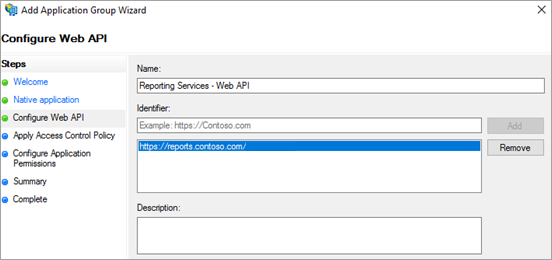

# Using OAuth to connect to Power BI Report Server and SSRS

Learn how to configure your environment to support OAuth authentication with the Power BI mobile app to connect to Power BI Report Server and SQL Server Reporting Services 2016 or later.


You can use OAuth to connect to Power BI Report Server and Reporting Services to display mobile reports or KPIs. Windows Server 2016 provides some improvements to the Web Application Proxy (WAP) role to allow this type of authentication.

   > [!NOTE]
   > Viewing Power BI Reports hosted in Power BI Report Server using WAP to authenticate is currently supported only in iOS app. Android  app is not officially supported at this time.

## Requirements

Windows Server 2016 is required for the Web Application Proxy (WAP) and Active Directory Federation Services (ADFS) servers. You do not need to have a Windows 2016 functional level domain.

## Domain Name Services (DNS) configuration

You will need to determine what the public URL will be that the Power BI mobile app will connect to. For example, it may look similar to the following.

```https
https://reports.contoso.com
```

You will need to point your DNS record for **reports** to the public IP address of the Web Application Proxy (WAP) server. You will also need to configure a public DNS record for your ADFS server. For example, you may have configured the ADFS server with the following URL.

```https
https://fs.contoso.com
```

You will need to point your DNS record for **fs** to the public IP address of the Web Application Proxy (WAP) server as it will be published as part of the WAP application.

## Certificates

You will need to configure certificates for both the WAP application and the ADFS server. Both of these certificates must be part of a valid certificate authority that your mobile devices recognize.

## Reporting Services configuration

There isn’t much to configure on the Reporting Services side. We just need to make sure that we have a valid Service Principal Name (SPN) to enable the proper Kerberos authentication to occur and that the Reporting Services server is enabled for negotiate authentication.

### Service Principal Name (SPN)

The SPN is a unique identifier for a service that uses Kerberos authentication. You will need to make sure you have a proper HTTP SPN present for your report server.

For information on how to configure the proper Service Principal Name (SPN) for your report server, see [Register a Service Principal Name (SPN) for a Report Server](https://msdn.microsoft.com/library/cc281382.aspx).

### Enabling negotiate authentication

To enable a report server to use Kerberos authentication, you will need to configure the Authentication Type of the report server to be RSWindowsNegotiate. This is done within the rsreportserver.config file.

```xml
<AuthenticationTypes>  
    <RSWindowsNegotiate />  
    <RSWindowsKerberos />  
    <RSWindowsNTLM />  
</AuthenticationTypes>
```

For more information, see [Modify a Reporting Services Configuration File](https://msdn.microsoft.com/library/bb630448.aspx) and [Configure Windows Authentication on a Report Server](https://msdn.microsoft.com/library/cc281253.aspx).

## Active Directory Federation Services (ADFS) Configuration

You will need to configure ADFS on a Windows 2016 server within your environment. This can be done through the Server Manager and selecting Add Roles and Features under Manage. For more information, see [Active Directory Federation Services](https://technet.microsoft.com/windows-server-docs/identity/active-directory-federation-services).

### Create an application group

Within the AD FS Management screen, you will want to create an application group for Reporting Services which will include information for the Power BI Mobile apps.

You can create the application group with the following steps.

1. Within the AD FS Management app, right click **Application Groups** and select **Add Application Group…**

   

2. Within the Add Application Group Wizard, provide a **name** for the application group and select **Native application accessing a web API**.

   

3. Select **Next**.

4. Provide a **name** for the application you are adding. 

5. While the **Client ID** will be auto generated for your, enter in *484d54fc-b481-4eee-9505-0258a1913020* for both iOS and Android.

6. You will want to add the following **Redirect URLs**:

   **Entries for Power BI Mobile – iOS:**  
   msauth://code/mspbi-adal://com.microsoft.powerbimobile  
   msauth://code/mspbi-adalms://com.microsoft.powerbimobilems  
   mspbi-adal://com.microsoft.powerbimobile  
   mspbi-adalms://com.microsoft.powerbimobilems

   **Android Apps only need the following:**  
   urn:ietf:wg:oauth:2.0:oob

   
7. Select **Next**.

8. Supply the URL for your Report Server. This is the external URL that will hit your Web Application Proxy. It should be in the following format.

   > [!NOTE]
   > This URL is case sensitive!

   *https://<report server url>/reports*

   
9. Select **Next**.

10. Choose the **Access Control Policy** that fits your organization’s needs.

    

11. Select **Next**.

12. Select **Next**.

13. Select **Next**.

14. Select **Close**.

When completed, you should see the properties of your application group look similar to the following.


## Web Application Proxy (WAP) Configuration

You will want to enable the Web Application Proxy (Role) Windows role on a server in your environment. This must be on a Windows 2016 server. For more information, see [Web Application Proxy in Windows Server 2016](https://technet.microsoft.com/windows-server-docs/identity/web-application-proxy/web-application-proxy-windows-server) and [Publishing Applications using AD FS Preauthentication](https://technet.microsoft.com/windows-server-docs/identity/web-application-proxy/publishing-applications-using-ad-fs-preauthentication#a-namebkmk14apublish-an-application-that-uses-oauth2-such-as-a-windows-store-app).

### Constrained delegation configuration

In order to transition from OAuth authentication to Windows authentication, we need to use constrained delegation with protocol transitioning. This is part of the Kerberos configuration. We already defined the Reporting Services SPN within the Reporting Services configuration.

We need to configure constrained delegation on the WAP Server machine account within Active Directory. You may need to work with a domain administrator if you don’t have rights to Active Directory.

To configure constrained delegation, you will want to do the following.

1. On a machine that has the Active Directory tools installed, launch **Active Directory Users and Computers**.

2. Find the machine account for your WAP server. By default, this will be in the computers container.

3. Right click the WAP server and go to **Properties**.

4. Select the **Delegation** tab.

5. Select **Trust this computer for delegation to specified services only** and then **Use any authentication protocol**.

   

   This sets up constrained delegation for this WAP Server machine account. We then need to specify the services that this machine is allowed to delegate to.

6. Select **Add…** under the services box.

   

7. Select **Users or Computers…**

8. Enter the service account that you are using for Reporting Services. This is the account you added the SPN to within the Reporting Services configuration.

9. Select the SPN for Reporting Services and then select **OK**.

   > [!NOTE]
   > You may only see the NetBIOS SPN. It will actually select both the NetBIOS and FQDN SPNs if they both exist.

   

10. The result should look similar to the following when the **Expanded** checkbox is checked.

    

11. Select **OK**.

### Add WAP Application

While you can publish applications within the Report Access Management Console, we will want to create the application via PowerShell. Here is the command to add the application.

```powershell
Add-WebApplicationProxyApplication -Name "Contoso Reports" -ExternalPreauthentication ADFS -ExternalUrl https://reports.contoso.com/ -ExternalCertificateThumbprint "0ff79c75a725e6f67e3e2db55bdb103efc9acb12" -BackendServerUrl http://ContosoSSRS/ -ADFSRelyingPartyName "Reporting Services - Web API" -BackendServerAuthenticationSPN "http/ContosoSSRS.contoso.com" -UseOAuthAuthentication
```

| Parameter | Comments |
| --- | --- |
| **ADFSRelyingPartyName** |This is the Web API name that you created as part of the Application Group within ADFS. |
| **ExternalCertificateThumbprint** |This is the certificate to use for the external users. It is important that this certificate be valid on mobile devices and come from a trusted certificate authority. |
| **BackendServerUrl** |This is the URL to the Report Server from the WAP server. If the WAP server is in a DMZ, you may need to use a fully qualified domain name. Make sure you can hit this URL from the web browser on the WAP server. |
| **BackendServerAuthenticationSPN** |This is the SPN you created as part of the Reporting Services configuration. |

### Setting Integrated Authentication for the WAP Application

After you add the WAP Application, you will need to set the BackendServerAuthenticationMode to use IntegratedWindowsAuthentication. In order to set this, you need the ID from the WAP Application.

```powershell
Get-WebApplicationProxyApplication “Contoso Reports” | fl
```


Run the following command to set the BackendServerAuthenticationMode using the ID of the WAP Application.

```powershell
Set-WebApplicationProxyApplication -id 30198C7F-DDE4-0D82-E654-D369A47B1EE5 -BackendServerAuthenticationMode IntegratedWindowsAuthentication
```


## Connecting with the Power BI Mobile App

Within the Power BI mobile app, you will want to connect to your Reporting Services instance. To do that, supply the **External URL** for your WAP Application.


When you select **Connect**, you will be directed to your ADFS login page. Enter valid credentials for your domain.


After you select **Sign in**, you will see the elements from your Reporting Services server.


## Multi-factor authentication

You can enable multi-factor authentication to enable additional security for your environment. To learn more, see [Configure AD FS 2016 and Azure MFA](https://technet.microsoft.com/windows-server-docs/identity/ad-fs/operations/configure-ad-fs-2016-and-azure-mfa).

## Troubleshooting

### You receive the error Failed to login to SSRS server. Please verify server configuration.


You can set up [Fiddler](http://www.telerik.com/fiddler) to act as a proxy for your mobile devices to see how far the request made it. To enable a Fiddler proxy for your phone device, you will need to setup the [CertMaker for iOS and Android](http://www.telerik.com/fiddler/add-ons) on the machine running Fiddler. This is an add-on from Telerik for Fiddler.

If the sign in works successfully when using Fiddler, you may have a certificate issue with either the WAP application or the ADFS server. You can use a tool such as [Microsoft Message Analyzer](https://www.microsoft.com/download/details.aspx?id=44226) to verify if the certificates are valid.

## Next steps

[Register a Service Principal Name (SPN) for a Report Server](https://msdn.microsoft.com/library/cc281382.aspx)  
[Modify a Reporting Services Configuration File](https://msdn.microsoft.com/library/bb630448.aspx)  
[Configure Windows Authentication on a Report Server](https://msdn.microsoft.com/library/cc281253.aspx)  
[Active Directory Federation Services](https://technet.microsoft.com/windows-server-docs/identity/active-directory-federation-services)  
[Web Application Proxy in Windows Server 2016](https://technet.microsoft.com/windows-server-docs/identity/web-application-proxy/web-application-proxy-windows-server)  
[Publishing Applications using AD FS Preauthentication](https://technet.microsoft.com/windows-server-docs/identity/web-application-proxy/publishing-applications-using-ad-fs-preauthentication#a-namebkmk14apublish-an-application-that-uses-oauth2-such-as-a-windows-store-app)  
[Configure AD FS 2016 and Azure MFA](https://technet.microsoft.com/windows-server-docs/identity/ad-fs/operations/configure-ad-fs-2016-and-azure-mfa)  
More questions? [Try the Power BI Community](http://community.powerbi.com/)
