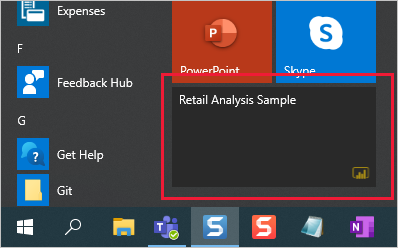
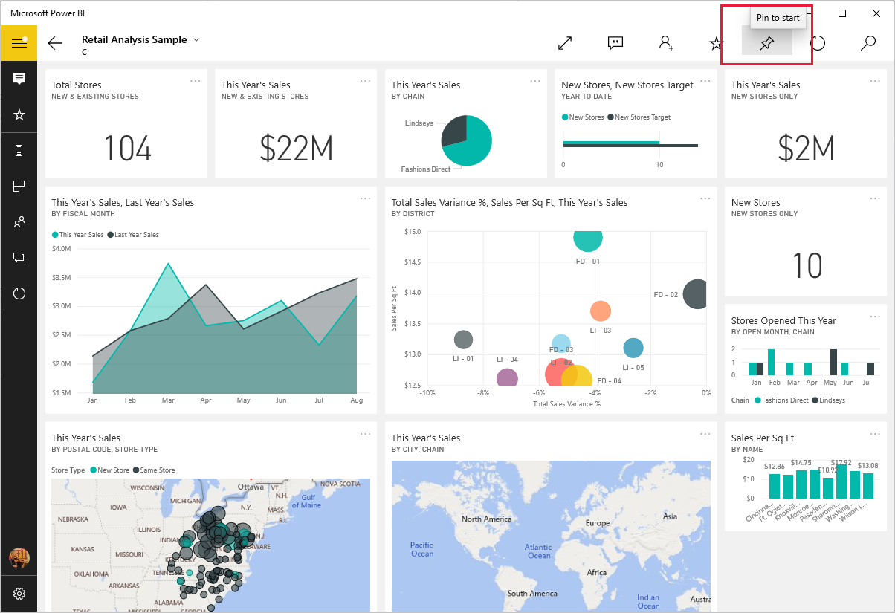

# Pin a dashboard to your Windows Start screen from the Power BI mobile app

>[!NOTE]
> The Power BI Windows app was retired on December 31st, 2023, and is no longer supported. It's been removed from the Microsoft apps store, and no further product updates for it will be released. Please use [the Power BI service](https://app.powerbi.com/) to view your Power BI content on Windows devices.
>
> This notice only applies to the Power BI Windows app. It does not affect the Power BI Desktop app.

You can pin Power BI dashboards to the Windows Start screen from the Power BI mobile app for Windows. When you tap the tile on the Start screen, the dashboard opens in the Power BI mobile app for Windows.

## Pin a dashboard to your Start screen as a tile
1. Open a dashboard.
2. Tap the **Pin to Start** icon.
   
   
   
   Go to your device's Start screen to see the tile.
   
   

## Related content

* [Download the Power BI mobile app for Windows](https://go.microsoft.com/fwlink/?LinkID=526478) from the Windows Store  
* [Get started with the Power BI mobile app for Windows](mobile-windows-10-phone-app-get-started.md)  
* [What is Power BI?](../../fundamentals/power-bi-overview.md)
* Questions? [Try asking the Power BI Community](https://community.powerbi.com/)