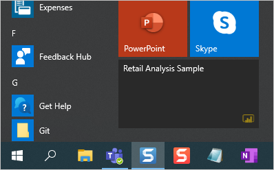

# Pin a dashboard to your Windows 10 Start screen from the Power BI mobile app
You can pin Power BI dashboards to the Windows Start screen from the Power BI mobile app for Windows 10. They become *live tiles*. When you tap the tile on the Start screen, the dashboard opens in the Power BI mobile app for Windows 10.

## Pin a dashboard to your Start screen as a live tile
1. Open a dashboard.
2. Tap **Pin to Start** .
   
   
   
   Go to your device Start screen to see the live tile.
   
   

## Next steps
* [Download the Power BI mobile app for Windows 10](http://go.microsoft.com/fwlink/?LinkID=526478) from the Windows Store  
* [Get started with the Power BI mobile app for Windows 10](mobile-windows-10-phone-app-get-started.md)  
* [What is Power BI?](../../power-bi-overview.md)
* Questions? [Try asking the Power BI Community](http://community.powerbi.com/)

