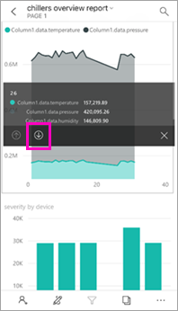
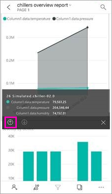
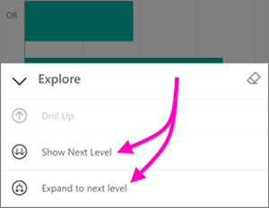
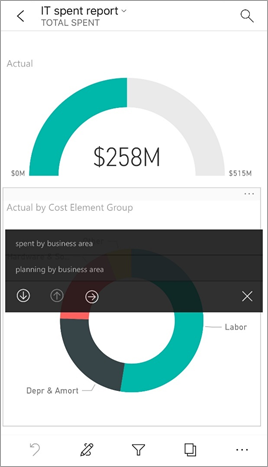
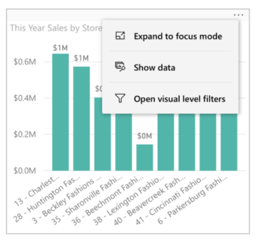
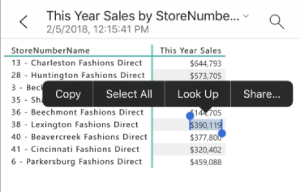

# Explore reports in the Power BI mobile apps
Applies to:

|  |  |  |  |  |
|:--- |:--- |:--- |:--- |:--- |
| iPhones |iPads |Android phones |Android tablets |Windows 10 devices |

A Power BI report is an interactive view of your data, with visuals representing different findings and insights from that data. Viewing reports in the Power BI mobile apps is the third step in a three-step process.

1. [Create reports in Power BI Desktop](../../desktop-report-view.md). You can even [optimize a report for phones](mobile-apps-view-phone-report.md) in Power BI Desktop. 
2. Publish those reports to the Power BI service [(https://powerbi.com)](https://powerbi.com) or [Power BI Report Server](../../report-server/get-started.md).  
3. Then interact with those reports in the Power BI mobile apps.

## Open a Power BI report in the mobile app
Power BI reports are stored in different places in the mobile app, depending on where you got them. They can be in Apps, Shared with me, Workspaces (including My Workspace), or on a report server. Sometimes you go through a related dashboard to get to a report, and sometimes they're listed.

* In a dashboard, tap the ellipsis (...) in the upper-right corner of a tile > **Open report**.
  
  
  
  Not all tiles have the option to open in a report. For example, tiles created by asking a question in the Q&A box don't open reports when you tap them. 
  
  On a phone, the report opens in landscape mode, unless it's [optimized for viewing on a phone](mobile-reports-in-the-mobile-apps.md#view-reports-optimized-for-phones).
  
  

## View reports optimized for phones
Power BI report authors can create a report layout specifically optimized for phones. Report pages optimized for phones have added functionality: for example, you can drill down and sort in visuals, and you can access the [filters the report author added to the report page](mobile-apps-view-phone-report.md#filter-the-report-page-on-a-phone). The report opens on your phone filtered to the values being filtered in the report on the web, with a message that there are active filters on the page. You can change the filters on your phone.

In a list of reports, an optimized report has a special icon :

When you view that report on a phone, it opens in portrait view.

 A report may have a mix of pages that are and aren't optimized for phones. If so, when you flip through the report the view will switch from portrait to landscape for each page.

Read more about [reports optimized for phone view](mobile-apps-view-phone-report.md).

## Use slicers to filter a report
When designing a report in Power BI Desktop or the Power BI service, consider [adding slicers to a report page](../../visuals/power-bi-visualization-slicers.md). You and your colleagues can use the slicers to filter the page in a browser and in the mobile apps. When you view the report on a phone, you can see and interact with the slicers in landscape mode and in a page optimized for the phone's portrait mode. If you select a value in a slicer or filter in the browser, the value will be selected when you view the page in the mobile app, too. You see a message that there are active filters on the page.  

* When you select a value in a slicer on the report page, it filters the other visuals on the page.
  
  
  
  In this illustration, the slicer is filtering the column chart to show only July values.

## Cross-filter and highlight a report
When you select a value in a visual, it doesn't filter the other visuals. It highlights the related values in the other visuals.

* Tap a value in a visual.
  
  
  
  Tapping the Large column in one visual highlights related values in the other visuals. 

## Sort a visual on an iPad or a tablet
* Tap the chart, tap the ellipsis (**...**) and tap the field name.
  
   
* To reverse the sort order, tap the ellipsis (**...**) again, then tap the same field name again.

## Drill down and up in a visual
If a report author has added drill-down capability to a visual, you can drill down in the visual to see the values that make up one part of it. You [add drill down to a visual](../end-user-drill.md) in Power BI Desktop or the Power BI service. 

* Tap and hold a specific bar or point in a visual to display its tooltip. If it has drill-down, the bottom of the tooltip has arrows you can tap. 
  
  

* To drill back up, tap the up arrow in the tooltip.
  
  

* You can also drill down in all the data points in a visual. Open it in focus mode, tap Explore icon, then choose the show all the next level, or expand to show the current and the next level.

   

## Drill through from one page to another

With *drillthrough*, when you tap a specific part of a visual, Power BI takes you to a different page in the report, filtered to the value you tapped. A report author can define one or more drill-through options, each taking you to a different page. In that case, you can choose which one you want to drill through. In the following example, when you tap the value in the gauge, you can choose between drilling through to **spent by business area** or **planning by business area**.

When you drill through, the back button takes you back to the previous report page.

Read about how to [add drill-through in Power BI Desktop](../../desktop-drillthrough.md).

## Show data and copy values

By selecting the Menu options ellipsis (**...**) in the upper-right corner of a visualization in a phone report, and then selecting **Show data**, you can see the data underlying a visualization.

Long tapping on a cell in the table presented will pop the native select and copy menu, so you will be able to choose the copy data from the table (or the entire table).

## Next steps
* [View and interact with Power BI reports optimized for your phone](mobile-apps-view-phone-report.md)
* [Create a version of a report optimized for phones](../../desktop-create-phone-report.md)
* Questions? [Try asking the Power BI Community](http://community.powerbi.com/)

