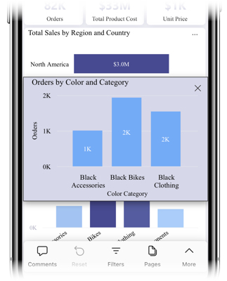

# Explore reports in the Power BI mobile apps
Applies to:

|  |  |  |  |  |
|:---: |:---: |:---: |:---: |:---: |
| iPhones |iPads |Android phones |Android tablets |Windows 10 devices |

A Power BI report is an interactive view of your data, with visuals that represent different findings and insights from that data. Viewing reports in the Power BI mobile apps is the third step in a three-step process:

1. [Create reports in Power BI Desktop](../../desktop-report-view.md). You can even [optimize a report for phones](mobile-apps-view-phone-report.md) in Power BI Desktop.
2. Publish those reports to the Power BI service [(https://powerbi.com)](https://powerbi.com) or [Power BI Report Server](../../report-server/get-started.md).  
3. Interact with the reports in the Power BI mobile apps.

## Open a Power BI report in the mobile app
Power BI reports are stored in different places in the mobile app, depending on where you got them. They can be in Apps, Shared with me, Workspaces (including My Workspace), or on a report server. Sometimes you go through a related dashboard to get to a report, and sometimes they're listed.

In lists and menus, you'll find an icon next to a report name, which helps you understand that the item is a report:

There are two icons for reports in the Power BI mobile apps:

*  indicates a report that will be presented in landscape orientation in the app and will look the same as it looks in the browser.

*  indicates a report that has at least one phone-optimized report page that will be presented in portrait orientation.

> [!NOTE]
> When you hold your phone in a landscape orientation, you'll always get the landscape layout, even if the report page is in phone layout.

To get to a report from a dashboard, tap the ellipsis (...) in the upper-right corner of a tile and then tap **Open report**:
  
  
  
  Not all tiles can be opened as reports. For example, tiles that are created when you ask a question in the Q&A box don't open reports when you tap them.
  
## Interact with reports
After you have a report open in the app, you can start working with it. You can do many things with your report and its data. In the report footer, you'll find actions that you can take on the report. By tapping and long tapping on the data shown in the report, you can also slice and dice the data.

### Using tap and long tap
A tap is the same as a mouse click. So if you want to cross-highlight the report based on a data point, tap that data point.
When you tap a slicer value, the value is selected and the rest of the report is sliced by that value.
When you tap a link, button, or bookmark, the action defined by the report author will occur.

You probably noticed that when you tap a visual, a border appears. In the upper-right corner of the border, you'll see an ellipsis (...). If you tap the ellipsis, you'll see a menu of actions you can take on that visual:

### Tooltip and drill actions

When you long tap (tap and hold) a data point, a tooltip that shows the values the data point represents will appear:

If the report author configured a report page tooltip, the default tooltip will be replaced with report page tooltip:

> [!NOTE]
> Report tooltips are supported for devices of at least 640 pixels and 320 pixel viewports. If your device is smaller, the app shows default tooltips.

Report authors can define hierarchies in the data and relationships among report pages. Hierarchies allow you to drill down, drill up, and drill through to another report page from a visual and a value. So, when you long tap a value, in addition to the tooltip, the relevant drill options will appear in the footer:

When you tap a specific part of a visual and then tap the *drillthrough* option, Power BI takes you to a different page in the report, filtered to the value you tapped. A report author can define one or more drillthrough options, each taking you to a different page. In that case, you can choose which option you want to drill through. The back button takes you back to the previous page.

For more information, read about how to [add drillthrough in Power BI Desktop](../../desktop-drillthrough.md).
   
   > [!IMPORTANT]
   > In the Power BI mobile apps, drill actions in matrix and table visuals are enabled through cell values only, not through column or row headers.
   
   
   
### Using the actions in the report footer
From the report footer, you can perform several actions on the current report page or on the entire report. The footer provides quick access to the most commonly used actions. You can access other actions by tapping the ellipsis (...) botton:

You can perform from these actions from the footer:
- Reset the report filter and cross-highlight selections back to their original state.
- Open the conversation pane to view comments or to add comments to the report.
- Open the filter pane to view or modify the filter currently applied on the report.
- List all pages in the report. Tapping a page name will load and present that page.
You can move between report pages by swiping from the edge of your screen to the center.
- View all report actions.

#### All report actions
When you tap the ellipsis (...) button in the report footer, you'll see all the actions that you can perform on a report:

Some of the actions might be disabled, since they are dependent on the specific report capabilities.
For example:
1) **Filter by current location** is enabled if the data in your report was categorized by the author with geographical data. [Learn how to Identify geographic data in your report](https://docs.microsoft.com/power-bi/desktop-mobile-geofiltering).
2) **Scan to filter the report by barcode** is enabled only if the dataset in your report was tagged as barcode. [How you tag barcodes in Power BI Desktop](https://docs.microsoft.com/power-bi/desktop-mobile-barcodes). 
3) **Invite** is enabled only if you have permission to share this report with others. You will have permission only if you are the owner of the report or if you were given reshare permission by the owner.
4) **Annotate and share** might be disable if there is an [Intune protection policy](https://docs.microsoft.com/intune/app-protection-policies) in your organization that prohibited sharing from Power BI Mobile app. 

## Next steps
* [View and interact with Power BI reports optimized for your phone](mobile-apps-view-phone-report.md)
* [Create a version of a report optimized for phones](../../desktop-create-phone-report.md)
* Questions? [Try asking the Power BI Community](http://community.powerbi.com/)

