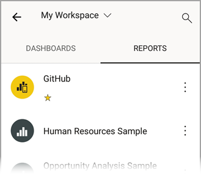
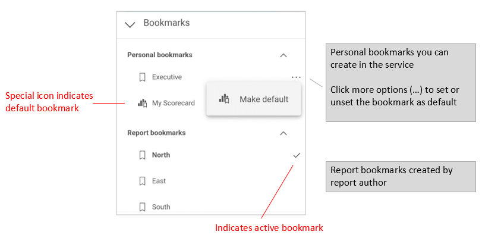

# Explore reports in the Power BI mobile apps
Applies to:

|  |  |  |  |
|:---: |:---: |:---: |:---: |
| iPhones |iPads |Android phones |Android tablets |

>[!NOTE]
> The Power BI Windows app was retired on December 31st, 2023, and is no longer supported. It's been removed from the Microsoft apps store, and no further product updates for it will be released. Please use [the Power BI service](https://app.powerbi.com/) to view your Power BI content on Windows devices.
>
> This notice only applies to the Power BI Windows app. It does not affect the Power BI Desktop app.

A Power BI report is an interactive view of your data, with visuals that represent different findings and insights from that data. Viewing reports in the Power BI mobile apps is the third step in a three-step process:

1. [Create reports in Power BI Desktop](../../create-reports/desktop-report-view.md). You can even [optimize a report for phones](mobile-apps-view-phone-report.md) in Power BI Desktop.
2. Publish those reports to the Power BI service [(https://powerbi.com)](https://powerbi.com) or [Power BI Report Server](../../report-server/get-started.md).  
3. Interact with the reports in the Power BI mobile apps.

## Open a Power BI report in the mobile app
Power BI reports are stored in different places in the mobile app, depending on where you got them. They can be in Apps, Shared with me, Workspaces (including My Workspace), or on a report server. Sometimes, you go through a related dashboard to get to a report, and sometimes they're listed.

In lists and menus, you'll find an icon next to a report name, which helps you understand that the item is a report:

There are two icons for reports in the Power BI mobile apps:

*  indicates a report that will appear in landscape orientation in the app. It will look the same as it looks in a browser.

*  indicates a report that has at least one phone-optimized page that will appear in portrait orientation.

> [!NOTE]
> When you hold your phone in a landscape orientation, you'll always get the landscape layout, even if the report page is in mobile layout.

To get to a report from a dashboard, tap **More options** (...) in the upper-right corner of a tile and then tap **Open report**:
  
  
  
  Not all tiles can be opened as reports. For example, tiles that are created when you ask a question in the Q&A box don't open reports when you tap them.
  
## Zoom in on your data   
Use the pinch gesture to zoom into your reports to examine them in greater detail. Unpinch to zoom back out again. Pinch-to-zoom is supported on Android and iOS phones and tablets.

## Interact with reports
After you have a report open in the app, you can start working with it. You can do many things with your report and its data. In the report footer, you'll find actions that you can take on the report. By tapping and long tapping on the data shown in the report, you can also slice and dice the data.

### Single-tap versus double-tap interaction
When you download the Power BI mobile app, it is set for single tap interaction. This means that when you tap in a visual to do some action, such as selecting a slicer item, cross highlighting, clicking on a link or button, etc., the tap both selects the visual and performs the action you wanted.

If you prefer, you can switch to double-tap interaction. With double tap interaction, you first tap on a visual to select it, and then tap again in the visual to perform your desired action.

To switch to double-tap interaction, or to switch back to single-tap interaction, go to [app interaction settings](./mobile-app-interaction-settings.md).

### Single-select versus multi-select mode for data point selection

In a report, you tap on a data point to select it. You can choose whether you want to use single-select or multi-select mode. In single-select mode, when you tap on a data point to select it, that selection replaces any previous selection you've made. In multi-select mode, when you tap on a data point to select it, your selection is *added* to any selection you currently have, and the combined result of all your selections is highlighted across all the report's visuals.

To deselect a selected data point, simply tap it again.

To switch between single-select and multi-select mode, go to the [app interaction settings](./mobile-app-interaction-settings.md).

### Using tap and long tap
A tap is the same as a mouse click. So, if you want to cross-highlight the report based on a data point, tap that data point.
When you tap a slicer value, the value is selected and the rest of the report is sliced by that value.
When you tap a link, button, or bookmark, the action defined by the report author will occur.

You probably noticed that when you tap a visual, a border appears. In the upper-right corner of the border, you'll see **More options** (...). If you tap the ellipsis, you'll see a menu of actions you can take on that visual:

### Tooltip and drill actions
When you long tap (tap and hold) a data point, a tooltip that shows the values the data point represents will appear:

:::image type="content" source="./media/mobile-reports-in-the-mobile-apps/report-tooltip.png" alt-text="Screenshot of a tool tip on a visual." border="false":::

> [!IMPORTANT]
> Remember, the mobile apps support tooltips on data points only.

If the report author configured a report page tooltip, the default tooltip is replaced with the report page tooltip:

:::image type="content" source="./media/mobile-reports-in-the-mobile-apps/report-page-tooltip.png" alt-text="Screenshot of a report-page tooltip." border="false":::

> [!NOTE]
> Report tooltips are supported for devices of at least 640 pixels and 320 pixel viewports. If your device is smaller, the app shows default tooltips.

Report authors can define hierarchies in the data and relationships among report pages. Hierarchies allow you to drill down, drill up, and drill through to another report page from a visual and a value. So, when you long tap a value, in addition to the tooltip, the relevant drill options will appear in the footer:

:::image type="content" source="./media/mobile-reports-in-the-mobile-apps/report-drill-actions.png" alt-text="Screenshot of tooltip with dril down, drill up, and drill through options.":::

When you tap a specific part of a visual and then tap the *drillthrough* option, Power BI takes you to a different page in the report, filtered to the value you tapped. A report author can define one or more drillthrough options, each taking you to a different page. In that case, you can choose which option you want to drill through. The back button takes you back to the previous page.

For more information, read about how to [add drillthrough in Power BI Desktop](../../create-reports/desktop-drillthrough.md).
   
   > [!IMPORTANT]
   > In the Power BI mobile apps, drill actions in matrix and table visuals are enabled through cell values only, not through column or row headers.
   
   
   
### Using the actions in the report footer
From the report footer, you can perform several actions on the current report page or on the entire report. The footer provides quick access to the most commonly used actions. You can access other actions by tapping the **More options** (...) button:

You can perform from these actions from the footer:
* Reset the report filter and cross-highlight selections back to their original state.
* Open the conversation pane to view comments or to add comments to the report.
* Open the filter pane to view or modify the filter currently applied to the report.
* List all pages in the report. Tapping a page name will load and present that page.
You can move between report pages by swiping from the edge of your screen to the center.
* View all report actions.

#### All report actions
When you tap the **More options** (...) button in the report footer, you'll see all the actions that you can perform on a report:

Some of the actions might be disabled because they're dependent on the specific report capabilities.
For example:

**Bookmarks** is present only if [bookmarks](mobile-reports-in-the-mobile-apps.md#bookmarks) have been set in the report. Both personal bookmarks that you can define in Power BI service and bookmarks defined by the report creator are shown. If one of the bookmarks has been defined as the default bookmark, the report will open to that view when it loads.

**Annotate and share** might be turned off if there's an [Intune protection policy](/mem/intune/apps/app-protection-policies) in your organization that prohibits sharing from a Power BI mobile app.

**Invite** is enabled only if you have permission to share the report with others. You'll have permission only if you're the owner of the report or if the owner has given you reshare permission.

**Filter by current location** is enabled if the report author categorized the report with geographical data. For more information, read about [identifying geographical data in a report](../../transform-model/desktop-mobile-geofiltering.md).

**Scan to filter the report by barcode** is enabled only if the semantic model in your report is tagged as **Barcode**. For more information, read about [tagging barcodes in Power BI Desktop](../../transform-model/desktop-mobile-barcodes.md).

### Bookmarks

The Power BI mobile app supports both report bookmarks that the report creator has defined and personal bookmarks that you can define in the Power BI service. You can find the bookmarks menu under **More options** (...) on the [report actions toolbar](mobile-reports-in-the-mobile-apps.md#all-report-actions).

Default bookmarks are indicated by a special icon. For personal bookmarks you can set, unset, or change the default setting by tapping **More options (...)** next to the bookmark you want to change and choosing **Make default** or **Clear default**.

When a bookmark view of a report is open, the name of the bookmark appears at the top of the report.

> [!NOTE]
> You can't create bookmarks in the mobile apps - you can only use them. Bookmarks are created in Power BI Desktop and in the service.

[Learn more about bookmarks in the Power BI service](../end-user-bookmarks.md).

## Investigate anomalies in time series data

[Anomaly detection](https://powerbi.microsoft.com/blog/anomaly-detection-preview/) is a Power BI feature that automatically detects anomalies (i.e. values that lay outside expected ranges) on line charts with time series data. In addition, it provides possible explanations, ranked according to their explanatory strength, for the cause of the anomalous values. Anomaly detection is available if it has been enabled on the chart by the report creator. 

When you view a report that has anomaly detection enabled on a chart with time series data, you’ll see the anomalies indicated on chart, just like you would in the Power BI service and in Power BI Desktop. 

To see additional information and the explanations, you need to open the Anomalies panel. There are a number of ways to do this:
* Tap the anomaly indication on the chart. 
* Tap **More options (…)** and choose **Show anomalies** from the menu that appears.    
* Tap the data point to display a tooltip, and choose **Anomalies**.

The image below illustrates the three ways of opening the Anomalies panel.

In the anomalies panel you’ll see a natural language explanation of the anomaly detected, as well as associated factors sorted by their explanatory strength. Swipe from right to left to view all relevant factors and their strengths.

While the Anomalies panel is visible, the mobile report is still scrollable under it, so you can continue interacting with your report, slicing and dicing to better understand anomalies in your data. For each interaction, Power BI re-runs anomaly detection to detect anomalies in the data in scope. 

## Refresh your data

If you're not sure you’re viewing the most up-to-date data, you can pull new data down to your report from the Power BI service:

* On iOS devices and Android tablets, pull down slightly from top to bottom on the report page.
* On Android phones, you can use either the pull-down action or a refresh button, depending on how you've set it up in the [interaction settings](mobile-app-interaction-settings.md).

>[!NOTE]
>The above refresh methods do not refresh the underlying semantic model. Rather, they update the report you're viewing on the mobile app with any new data that might exist in Power BI.

### How do I know when my report was last refreshed?

To find out when your report was last refreshed, tap the report header. The navigation tree to the report will be displayed, including the date and time of the last refresh. 

 
## Configure your experience with reports
The Power BI mobile app has a number of settings that enable you to control your report experience. Currently you can configure
* **Interaction with report visuals**: You can choose to use either single-tap or double-tap interaction.
* **Data refresh method**: You can choose to have either a refresh button or a pull-down action for refreshing report data.
* **Report footer visibility**: You can choose to have either a docked footer that is always visible, or a dynamic footer that hides and reappears depending on your actions (scrolling, for instance).

See [app interaction settings](./mobile-app-interaction-settings.md) for information about how to change these settings.

## Related content

* [View and interact with Power BI reports optimized for your phone](mobile-apps-view-phone-report.md)
* [Create a version of a report that's optimized for phones](../../create-reports/power-bi-create-mobile-optimized-report-about.md)
* Questions? [Try asking the Power BI Community](https://community.powerbi.com/)
