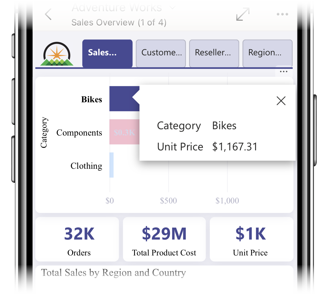

# Explore reports in the Power BI mobile apps
Applies to:

|  |  |  |  |  |
|:--- |:--- |:--- |:--- |:--- |
| iPhones |iPads |Android phones |Android tablets |Windows 10 devices |

A Power BI report is an interactive view of your data, with visuals representing different findings and insights from that data. Viewing reports in the Power BI mobile apps is the third step in a three-step process.

1. [Create reports in Power BI Desktop](../../desktop-report-view.md). You can even [optimize a report for phones](mobile-apps-view-phone-report.md) in Power BI Desktop. 
2. Publish those reports to the Power BI service [(https://powerbi.com)](https://powerbi.com) or [Power BI Report Server](../../report-server/get-started.md).  
3. Then interact with those reports in the Power BI mobile apps.

## Open a Power BI report in the mobile app
Power BI reports are stored in different places in the mobile app, depending on where you got them. They can be in Apps, Shared with me, Workspaces (including My Workspace), or on a report server. Sometimes you go through a related dashboard to get to a report, and sometimes they're listed.

In lists and menus, you will find an icon next to a report name, helping you understand that this item is a report. 
 

There are two icons for reports in Power BI Mobile apps:

*  indicates a report that will be presented in landscape orientation in the app and will look the same as it looks in the browser.

*  indicates a report that has at least one report page that is phone optimized, and therefore will be presentated is portrait. 

Note: Holding your phone in landscape, you will always get the landscpae layout, even if the report page has phone layout. 

To get to a report from a dashboard, tap the ellipsis (...) in the upper-right corner of a tile > **Open report**.
  
  
  
  Not all tiles have the option to open in a report. For example, tiles created by asking a question in the Q&A box don't open reports when you tap them. 
  
## Interacting with reports
Once you have a report opened in the app, you can start working with it. There are many things you can do with your report and its data. In the report footer you will find actions you can preform on the report, and by tapping and long tapping on the data shown in the report you can also slice and dice the data.

### Using tap and long tap
Tap equals to a mouse click. So if you want to cross highlight the report based on a data point, tap on that data point.
Tapping on a slicer value, makes that value selected and slicing the rest of the report by that value. 
Tapping on a link, button or bookmark will activate it based on the action defined by the author.

You probably noticed that when you tap on a visual, a border appears. On the top-right corner of the border there is ellipsis (...) - this is a menu with actions you can do on that visual.

### Tooltip and Drill actions

When you long tap (tap and hold) a data point, a tooltip will show up presenting the values this data point represents. 

Report authors can define hierarchies in the data and relationships between report pages. This allows drill down, drill up and drill through another report page from a visual and a value. So, when you long tap on a value, in addition to the tooltip, the relevant drill options will appear in the footer. 

With *drillthrough*, when you tap a specific part of a visual, Power BI takes you to a different page in the report, filtered to the value you tapped.  A report author can define one or more drill-through options, each taking you to a different page. In that case, you can choose which one you want to drill through. The back button takes you back to the previous report page.

Read about how to [add drill-through in Power BI Desktop](../../desktop-drillthrough.md).
   
   > [!IMPORTANT]
   > Drill in matrix and table visuals is enabled in the app through a cell value only and not by column and row headers.
   
   
   
### Using the actions in the report footer
The report footer has actions you can do on the current report page or on the entire report. The footer has quick access to the most useful actions, and all actions can be access from the ellipsis (...).

The actions you can preform from the footer are:
1) Reset the report filter and cross highlight selections back to its original state.
2) Open the conversation pane to view or add comments on this report.
3) Open the filter pane to view and modify the filter currenly appied on the report.
4) List all the pages in this report. Tapping on page name will load and present that page.
Moving between report pages can be done by swiping from the edge of your screen to the center.
5) View all report actions.

## Next steps
* [View and interact with Power BI reports optimized for your phone](mobile-apps-view-phone-report.md)
* [Create a version of a report optimized for phones](../../desktop-create-phone-report.md)
* Questions? [Try asking the Power BI Community](http://community.powerbi.com/)

