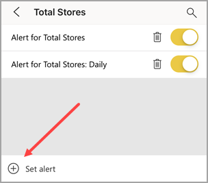

# Set data alerts in the Power BI mobile apps

Applies to:

| :::image type="content" source="./media/mobile-set-data-alerts-in-the-mobile-apps/iphone-logo-50-px.png" alt-text="Screenshot of icon representing an iPhone device category for Power BI mobile app support."::: | :::image type="content" source="./media/mobile-set-data-alerts-in-the-mobile-apps/ipad-logo-50-px.png" alt-text="Screenshot of icon representing an iPad device category for Power BI mobile app support."::: | :::image type="content" source="./media/mobile-set-data-alerts-in-the-mobile-apps/android-phone-logo-50-px.png" alt-text="Screenshot of icon representing an Android phone device category for Power BI mobile app support."::: | :::image type="content" source="./media/mobile-set-data-alerts-in-the-mobile-apps/android-tablet-logo-50-px.png" alt-text="Screenshot of icon representing an Android tablet device category for Power BI mobile app support."::: |
|:--- |:--- |:--- |:--- |
| iPhones |iPads |Android phones |Android tablets |

Set data alerts on dashboards in the Power BI mobile apps and in the Power BI service to stay informed when key values cross thresholds you define. These alerts notify you when data in a tile changes beyond limits you set and work for single-value tiles like cards and gauges (not streaming data). Create data alerts on your mobile device and see them in the Power BI service, and vice versa. Only you see the data alerts you set, even if you share a dashboard or a snapshot of a tile.  

Set alerts on tiles if you have a Power BI Pro license or the shared dashboard is in a Premium capacity.

> [!WARNING]
> Data-driven alert notifications provide information about your data. If your device is stolen, go to the Power BI service and turn off all data-driven alert rules.
>
> Learn more about [managing data alerts in the Power BI service](../../create-reports/service-set-data-alerts.md).

> [!NOTE]
> This article includes consolidated notification center guidance (the previous notification center page is retired).

## Notifications

Notifications include:

- Data alerts (triggered when a threshold is crossed after refresh)
- Newly shared dashboards or reports (where applicable)
- Scheduled alert reminders (hourly or daily, only if the data changes)

Select the bell icon to open notifications. Unread entries are highlighted. Swipe a notification to dismiss it. Change system notification settings in Settings > Notifications > Power BI.

## Data alerts on an iPhone or iPad

### Set an alert on an iPhone or iPad

1. Tap a number or gauge tile in a dashboard to open it in focus mode.  

   :::image type="content" source="media/mobile-set-data-alerts-in-the-mobile-apps/power-bi-iphone-card-visual.png" alt-text="Screenshot of a dashboard on iPhone showing the gauge tile in focus mode.":::
1. Tap the bell icon :::image type="icon" source="media/mobile-set-data-alerts-in-the-mobile-apps/power-bi-iphone-alert-icon.png" border="false"::: to add an alert.  
1. Tap **Add alert rule**.

   :::image type="content" source="media/mobile-set-data-alerts-in-the-mobile-apps/power-bi-iphone-add-alert-rule.png" alt-text="Screenshot of the Add alert rule screen showing no alerts set.":::
1. Choose Above or Below, then enter the threshold value.

   :::image type="content" source="media/mobile-set-data-alerts-in-the-mobile-apps/power-bi-iphone-set-alert-threshold.png" alt-text="Screenshot of alert settings showing title and threshold value fields.":::
1. Select hourly or daily alerts, and optionally select email notification.

   > [!NOTE]
   > You receive an alert only if the data refreshes during that hour or day.

1. Change the alert title if needed.
1. Tap **Save**.
1. To add another alert (above or below), in **Manage alerts**, tap **Add alert rule**.

   

### Manage alerts on your iPhone or iPad

Manage individual alerts on your mobile device or [manage all your alerts in the Power BI service](../../create-reports/service-set-data-alerts.md).

1. In a dashboard, tap a number or gauge tile that has an alert.  

   :::image type="content" source="media/mobile-set-data-alerts-in-the-mobile-apps/power-bi-iphone-card-visual_has_alert.png" alt-text="Screenshot of dashboard showing a number tile with an active alert indicator.":::

1. Tap the bell icon :::image type="icon" source="media/mobile-set-data-alerts-in-the-mobile-apps/power-bi-iphone-has-alert-icon.png" border="false":::.  
1. Tap the alert name to edit it. Tap the slider to turn off email alerts. Tap the garbage can to delete the alert.

    :::image type="content" source="media/mobile-set-data-alerts-in-the-mobile-apps/power-bi-iphone-edit-delete-alert.png" alt-text="Screenshot of alert details showing alert name, delete (garbage can), and email toggle slider.":::

## Data alerts on an Android device

### Set an alert on an Android device

1. In a Power BI dashboard, tap a number or gauge tile to open it.  
1. Tap the bell icon :::image type="icon" source="media/mobile-set-data-alerts-in-the-mobile-apps/power-bi-android-alert-icon.png" border="false"::: to add an alert.  

   :::image type="content" source="media/mobile-set-data-alerts-in-the-mobile-apps/power-bi-android-tap-alert.png" alt-text="Screenshot of Android dashboard showing number tile ready for adding alert.":::
1. Tap the plus icon (+).

   :::image type="content" source="media/mobile-set-data-alerts-in-the-mobile-apps/power-bi-android-plus-alert.png" alt-text="Screenshot of Manage alerts screen highlighting plus icon to add alert.":::

1. Choose whether to receive alerts when the value is above or below a threshold, and enter the threshold.

   :::image type="content" source="media/mobile-set-data-alerts-in-the-mobile-apps/power-bi-android-tablet-set-alert-condition.png" alt-text="Screenshot of Android alert condition settings with Save and Done options.":::

1. Tap **Done**.
1. Decide whether to receive hourly or daily alerts, and whether to also receive an email when you get the alert.

   > [!NOTE]
   > You don't receive alerts every hour or every day unless the data has actually refreshed in that time.

1. You can change the alert title, too.
1. Tap **Save**.

### Manage alerts on an Android device

Manage individual alerts in the Power BI mobile app or [manage all your alerts in the Power BI service](../../create-reports/service-set-data-alerts.md).

1. In a dashboard, tap a card or gauge tile that has an alert.  
1. Tap the solid bell icon :::image type="icon" source="media/mobile-set-data-alerts-in-the-mobile-apps/power-bi-android-filled-alert-bell.png" border="false":::.  
1. Tap the alert to change a value or turn it off.

   :::image type="content" source="media/mobile-set-data-alerts-in-the-mobile-apps/power-bi-android-manage-alerts.png" alt-text="Screenshot of Manage alerts screen on Android showing existing alert and plus icon.":::

1. Tap the plus icon (+) to add another alert to the same tile.
1. Delete the alert: tap the garbage can icon :::image type="content" source="media/mobile-set-data-alerts-in-the-mobile-apps/power-bi-android-delete-alert-icon.png" alt-text="Screenshot of garbage can icon used to delete an alert.":::.

## Receive alerts

Get alerts in the Power BI Notification Center on your mobile device or in the Power BI service, plus notifications when someone shares a dashboard with you.

Data sources usually refresh daily; some refresh more often. When the dashboard data refreshes and reaches a threshold you set, these actions occur.

1. Power BI checks to see if it's been more than an hour or more than 24 hours (depending on the option you selected) since the last alert was sent.

   While the data remains past the threshold, you get an alert every hour or every 24 hours.
1. If you set the alert to email you, you find an email like this in your inbox.

   :::image type="content" source="media/mobile-set-data-alerts-in-the-mobile-apps/powerbi-alerts-email.png" alt-text="Screenshot of email notification message displaying a Power BI data alert.":::

1. Power BI adds a message to your Notification Center and adds a yellow dot to the bell icon :::image type="icon" source="media/mobile-set-data-alerts-in-the-mobile-apps/powerbi-alert-tile-notification-icon.png" border="false"::: on the title bar.

1. Tap the bell icon :::image type="icon" source="media/mobile-set-data-alerts-in-the-mobile-apps/powerbi-alert-tile-notification-icon.png" border="false"::: or the global navigation button :::image type="content" source="./media/mobile-set-data-alerts-in-the-mobile-apps/power-bi-iphone-alert-global-nav-button.png" alt-text="Screenshot of global navigation button icon in the Power BI mobile app."::: to open your **Notification center** and view the alert details.

> [!NOTE]
> Alerts only work on data that refreshes. When data refreshes, Power BI checks whether an alert is set for that data. If the data reaches an alert threshold, Power BI triggers an alert.

## Tips and troubleshooting

- Alerts aren't supported for Bing tiles or card tiles with date or time measures.
- Alerts work only with numeric data.
- Alerts work only on refreshed data, not on static data.
- Alerts don't work with tiles that have streaming data.

## Related content

- [Manage your alerts in the Power BI service](../../create-reports/service-set-data-alerts.md)
- Questions? [Try asking the Power BI Community](https://community.powerbi.com/).
