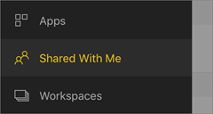
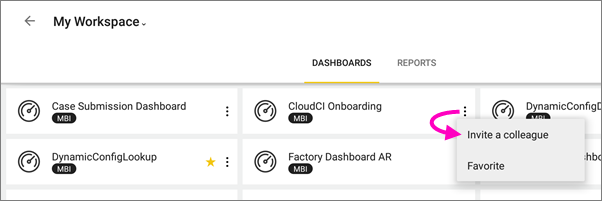
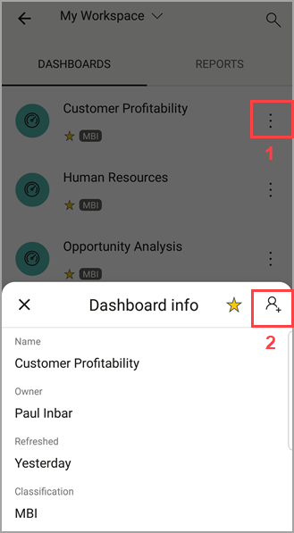
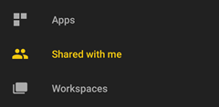
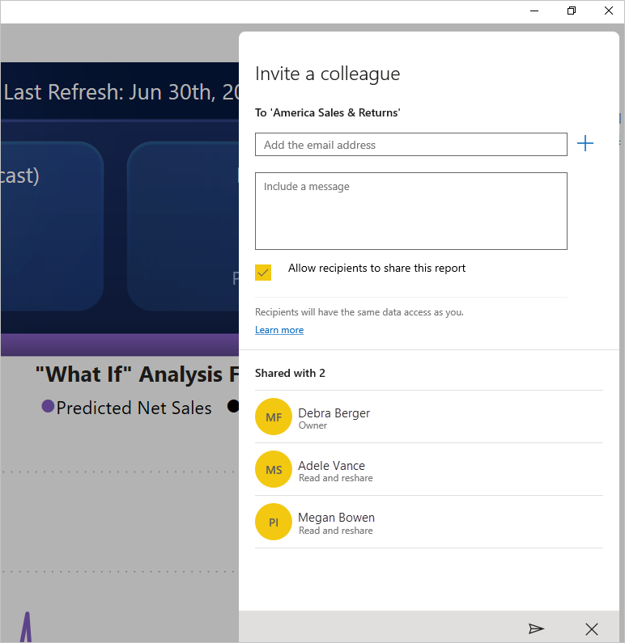

# Share a dashboard or report from the Power BI mobile apps
Applies to:

|  |  |  |  |  |
|:--- |:--- |:--- |:--- |:--- |
| iPhones |iPads |Android phones |Android tablets |Windows 10 devices |

With a [Power BI Pro license](../../service-features-license-type.md), you can invite others to view your dashboards and reports by sharing links from the Power BI mobile apps. You can share with anyone, in or out of your organization, with or without a corporate mail account. They do need to have a Power BI Pro license, too, or the content needs to be in a [Premium capacity](../../service-premium-what-is.md).

From the Power BI mobile apps for iOS and Android, you can also [annotate and share a snapshot of a tile, report, or visual](mobile-annotate-and-share-a-tile-from-the-mobile-apps.md) with anyone. 

## Share from your iPhone
1. In the actions bar at the bottom of the dashboard or report, tap the **Share** icon .
   
   
2. Type names, separated by commas, and a message to accompany your invitation.
3. To allow resharing, leave **Allow recipients to reshare** selected.
   
   Resharing allows your colleagues to forward the email invitation to others in your organization, either through the web or the mobile apps.
5. Tap **Send** in the upper-right corner.
   
   Recipients get an email invitation with a direct link to the dashboard or report. The invitation expires after one month. When they open it, in a browser or in the Power BI mobile app, it's added to the **Shared with me** section of their Power BI account.
   
   
   
   Read more [notes about sharing with colleagues](../../service-share-dashboards.md).

### Unshare from your iPhone
You can only unshare if you're the owner.

1. In the actions bar at the bottom of the dashboard or report, tap the **Share** icon .
2. Tap **Invite a colleague**.
   
   You see the list of colleagues with whom you've shared this dashboard or report, with these phrases:
   
   * **Can View**: They can view but not share.
   * **Can View & Invite**: They can view and share with other colleagues.
1. Tap **Edit**.
   
    
4. To unshare, tap the red circle next to a name and tap **Delete**.

## Share from your iPad
1. Tap the **Share** icon  icon in the upper-right corner of your dashboard or report.
2. Type email addresses and a message to accompany your invitation.
3. To allow resharing, leave **Allow recipients to reshare** selected.
   
   Resharing allows your coworkers to forward the email invitation to others in your organization, either through the web or the mobile apps. 

4. Tap **Send** in the upper-right corner.
   
   Recipients get an email invitation with a direct link to the dashboard or report. The invitation expires after one month. When they open it, in a browser or in the Power BI mobile app, it's added to the **Shared with me** section of their Power BI account
   
   
   
   Read more [notes about sharing with colleagues](../../service-share-dashboards.md).

### Unshare from your iPad
You can only unshare if you're the owner.

1. Tap the **Share** icon  in the upper-right corner of your dashboard or report.
   
   You see the list of colleagues with whom you've shared this dashboard or report, with these phrases:
   
   * **Can View**: They can view but not share.
   * **Can View & Invite**: They can view and share with other colleagues.
2. Tap **Edit**.
3. To unshare, tap the red circle next to a name and tap **Delete**.

## Share from your Android device
1. On the dashboards or reports home page, tap the ellipsis (...) and tap **Invite a colleague**.
   
   
2. Or, in a dashboard or report, tap the invite icon .

    If you're the owner of the dashboard, you see the list of colleagues with whom you've shared this dashboard or report, with these notes:

    -   **Can view**: They can view but not share.
    -   **Can view and reshare**: They can view and share with other colleagues.

1. Type email addresses, and a message to accompany your dashboard invitation. Otherwise Power BI sends a default message.
2. To allow resharing, leave **Allow recipients to share this dashboard** selected.
   
   Resharing allows your coworkers to forward the email invitation to others in your organization, either through the browser or the mobile apps.
   
1. Tap the **Send** icon  in the upper-right corner to send the mail.
   
   Recipients get an email invitation with a direct link to the dashboard. The invitation expires after one month. When they open it, in a browser or in the Power BI mobile app, it's added to the **Shared with me** section of their Power BI account
   
   
   
   Read more [notes about sharing dashboards with colleagues](../../service-share-dashboards.md).

### Unshare from your Android device
You can only unshare if you're the owner.

1. In the upper-right corner of your dashboard or report, tap the invite icon . 
   
   You see the list of colleagues with whom you've shared this dashboard or report.
2. To stop sharing with a colleague, tap the **X** next to a name \> **Remove**.

## Share from your Windows 10 device
1. In a dashboard or report, tap the Invite icon .
   
   Or on the dashboards or reports home page, right-click or press and hold, and tap **Invite**.
   
   
   
   If you're the owner of the dashboard, you see the list of colleagues with whom you've shared this dashboard, with these notes:
   
   **Can view**: They can view but not share.
   
   **Can view and reshare**: They can view and share with other colleagues.
2. Type email addresses, and a message to accompany your invitation. Otherwise Power BI sends a default message.
   
   
3. To allow resharing, leave **Allow recipients to reshare** selected.
   
   Resharing allows your coworkers to share with others in your organization, either through the browser or the mobile apps.
   
1. Tap the **Send** icon .
   
   Recipients get an email invitation with a direct link to the dashboard or report. The invitation expires after one month. When they open it, in a browser or in the Power BI mobile app, it's added to the **Shared with me** section of their Power BI account
   
   
   
   Read more [notes about sharing with colleagues](../../service-share-dashboards.md).

## Next steps
* [Annotate & share a snapshot of a tile, report, or visual in the mobile apps](mobile-annotate-and-share-a-tile-from-the-mobile-apps.md)
* [Share a dashboard or report in Power BI](../../service-share-dashboards.md)
* Questions? [Try asking the Power BI Community](http://community.powerbi.com/)

