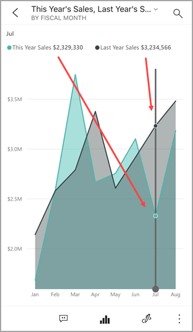
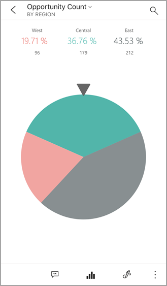
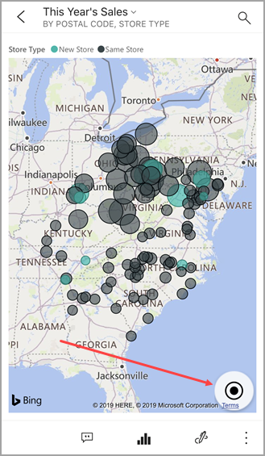
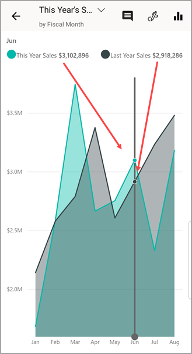

# Explore tiles in the Power BI mobile apps
Applies to:

|  |  |  |  |
|:--- |:--- |:--- |:--- |
| iPhones |iPads |Android phones |Android tablets |

Tiles are live snapshots of your data, pinned to a dashboard. Their values change as the data changes. **You [add tiles to a dashboard in the Power BI service](../end-user-tiles.md).** 

Then in the Power BI mobile apps, you open tiles in focus mode and interact with them. You can open tiles with all kinds of visuals, including tiles based on Bing and R.

## Tiles in the iOS apps

1. Open a [dashboard in the mobile app for iOS](mobile-apps-view-dashboard.md).
2. Tap a tile. It opens in focus mode, where it's easier to view and explore the tile data. In focus mode you can:
   
   In a line, bar, or column chart, tap to view the values for specific parts of the visualization.
   
    
   
   *For example, in this line chart, the selected values are for **This Year Sales** and **Last Year Sales** in **August**.*  
   
   In a pie chart, tap a slice of the pie to show the value of the slice at the top of the pie.  
   
   
3. In a map, tap the **Center Map** icon  to center the map to your current location.

   

4. Tap the pencil icon  to [annotate a tile](mobile-annotate-and-share-a-tile-from-the-mobile-apps.md#annotate-and-share-the-tile-report-or-visual) and then the share icon  to [share it with others](mobile-annotate-and-share-a-tile-from-the-mobile-apps.md#annotate-and-share-the-tile-report-or-visual).

5. [Add an alert to the tile](mobile-set-data-alerts-in-the-mobile-apps.md). If the values go above or below targets, Power BI will notify you.

6. Sometimes the dashboard creator has added a link to a tile. If so, it has a link icon  when it's in focus mode:
   
    
   
    Links can go to other Power BI dashboards or to an external URL. You can [tap the link](../../create-reports/service-dashboard-edit-tile.md#hyperlink) to open it inside the Power BI app. If it's an external site, Power BI asks you to allow it.
   
    
   
    After you open the link in the Power BI app, you can copy the link and open it in a browser window instead.
7. [Open the report](mobile-reports-in-the-mobile-apps.md)  that the tile is based on.
8. To leave tile focus mode, tap the tile name, then tap the dashboard name or **My Workspace**.
   
    

## Tiles in the mobile app for Android phones and tablets
1. Open a [dashboard in the Power BI mobile app](mobile-apps-view-dashboard.md).
2. Tap a tile to open it in focus mode, where it's easier to view and explore the tile data.
   
   
   
    In focus mode, you can:
   
   * Tap the chart to move the bar in a line, bar, column, or bubble chart, to view the values for a specific point in the visualization.  
   * Tap the Pencil icon  to [annotate a tile](mobile-annotate-and-share-a-tile-from-the-mobile-apps.md#annotate-and-share-the-tile-report-or-visual) and then the Share snapshot icon  to [share it](mobile-annotate-and-share-a-tile-from-the-mobile-apps.md#annotate-and-share-the-tile-report-or-visual) with others.
   * Tap the Open report icon  to [view the report](mobile-reports-in-the-mobile-apps.md) in the mobile app.
3. Sometimes the dashboard creator has added a link to a tile. If so, when you tap the vertical ellipsis (**...**) you see **Open link** :
   
    
   
    Links can go to other Power BI dashboards or to an external URL. You can [tap the link](../../create-reports/service-dashboard-edit-tile.md#hyperlink) to open it inside the Power BI app. If it's an external site, Power BI asks you to allow it.
   
    
   
    After you open the link in the Power BI app, you can copy the link and open it in a browser window instead.
4. Tap the arrow in the upper-left corner to close the tile and return to the dashboard.

## Related content

* [What is Power BI?](../../fundamentals/power-bi-overview.md)
* Questions? [Try asking the Power BI Community](https://community.powerbi.com/)