# What's new in the mobile apps for Power BI
For related "What's New" information, see:

* [Power BI team blog for the mobile apps](https://powerbi.microsoft.com/blog/tag/mobile/)
* [What's new in Power BI](../../fundamentals/desktop-latest-update.md)  

>[!NOTE]
>Power BI mobile app support for **phones using Windows 10 Mobile** has been discontinued as of March 16, 2021. [Learn more](/legal/powerbi/powerbi-mobile/power-bi-mobile-app-end-of-support-for-windows-phones)

## July
### New report footer (phones only)
We've updated the report footer to make it easier to find and understand the actions you can do with reports. Just tap **More**!

:::image type="content" source="media/mobile-whats-new-in-the-mobile-apps/new-report-footer-for-phones.png" alt-text="Screenshot new report footer for phones.":::

## June 2021
### Updated look and new home page (preview) (Windows)
We've introduced a new design and home page to simplify the way you find and open content. Turn on the **New look** toggle at the top of your screen and [check it out](mobile-windows-10-phone-app-get-started.md?tabs=new-look)!

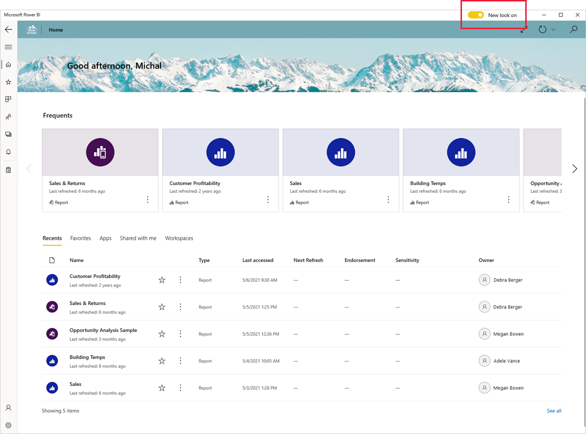

### Paginated Report visuals (preview) now supported (iOS, Android, Windows)
Paginated Report visuals (preview) enable you to render any paginated report uploaded to the service inside a Power BI report.
Just like any other Power BI visual, Paginated Report visuals are fully-interactive, and are also supported in the Power BI Mobile apps.

### Support for passing URL parameters to paginated reports (Android)
Support for passing parameters to paginated reports via the URL now comes to Android! Passing parameters via the report URL automatically sets the report parameters to those values. [Learn more](../../paginated-reports/report-builder-url-pass-parameters.md)

## May 2021
### Support for passing URL parameters to paginated reports (iOS)
We now support passing parameters to paginated reports via the URL. Passing parameters via the report URL automatically sets the report parameters to those values. [Learn more](../../paginated-reports/report-builder-url-pass-parameters.md)

## April 2021
### Support for Power BI in Split View (iPads)
If your iPad supports multitasking, you can view and interact with your data side by side with another app using Split View mode. [Learn more!](mobile-apps-split-screen.md)

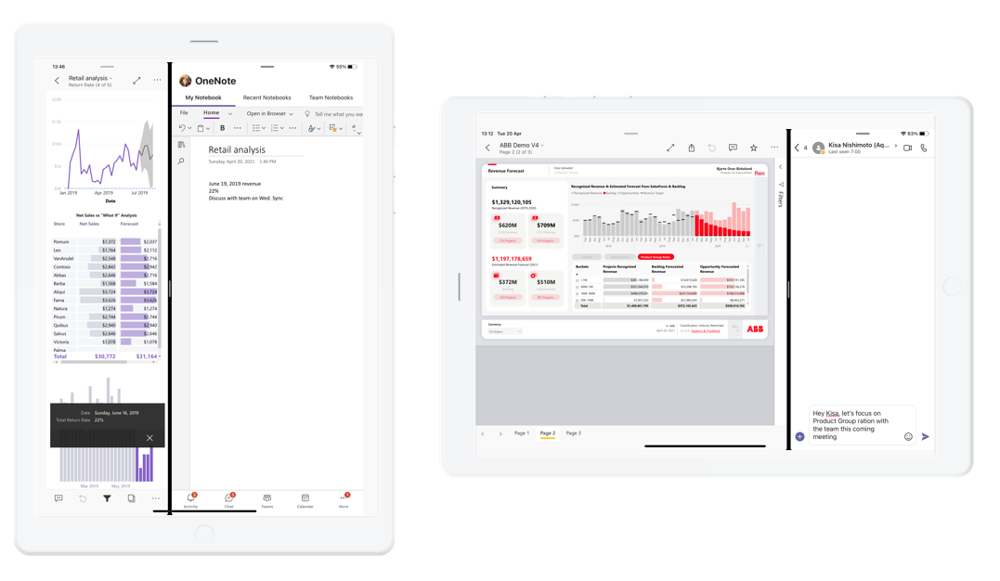

## March 2021
### Easily find content by type
Try out the new categories filter at the top of the Recents, Favorites, and Workspace pages, to filter the listed content by type.

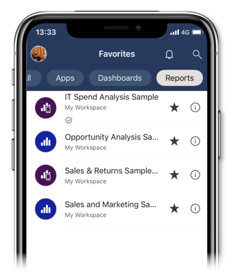

## February 2021
### Support for Power BI in split-screens (Android tablets)

If your Android tablet has multi-window support, you can view and interact with your data side by side with another app using split-screen mode. [Learn more!](mobile-apps-split-screen.md)

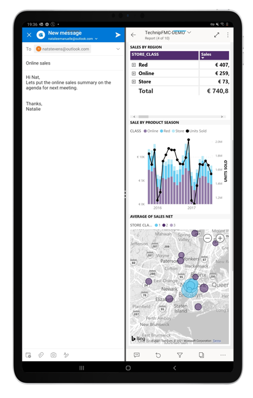

## January 2021
### Workspace support with a Power BI free license
Users with a Power BI free license can now view and access workspaces where they've been added as viewers directly from the workspaces list. This change is applicable for content that's hosted on a Power BI Premium capacity.

## December 2020
### We've added anomaly detection to the mobile apps
If the report creator has set up anomaly detection for a report visual, you can see if there are unexpectedly high peaks or low dips in your data caused by data outliers (i.e., anomalies). [Learn more!](mobile-reports-in-the-mobile-apps.md#investigate-anomalies-in-time-series-data)

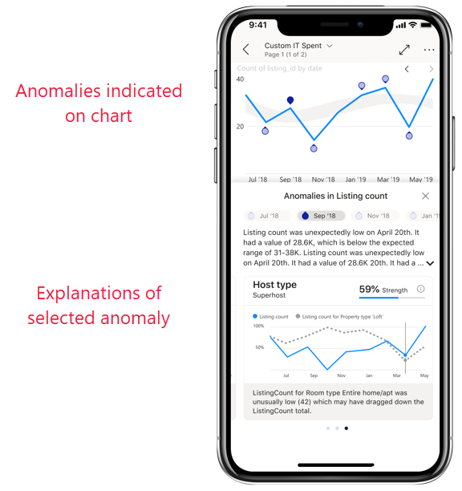

### Easily find your org's endorsed content
Content that's been [promoted or certified](../../collaborate-share/service-endorsement-overview.md) in the Power BI service is now tagged in the app with a badge. Report creators promote their content to show that it's ready for you to use (promoted) or certify their content to show that it's been approved by your org (certified).

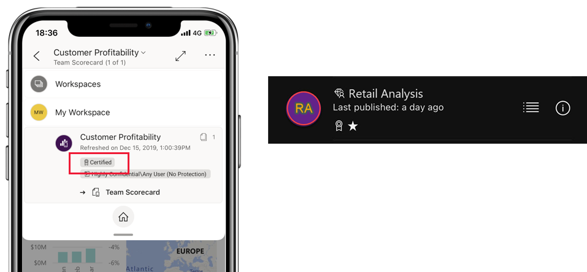

### We've added dark mode to Power BI mobile (Android)
Try out the new dark mode in the Power BI mobile app for Android devices. In dark mode, you'll see light text on a dark background, reducing the brightness of the screen and making it easier to see your content. You can switch between themes in the app appearance settings. [Learn more](mobile-apps-dark-mode.md)

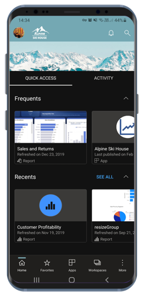

### Maximize the view with full-screen mode (iPads)
We've now added a new button to the mobile app for iPads that lets you remove app headers and footers, giving you the maximum space for viewing your content. Simply tap the full-screen toggle button  in the top right corner of the screen to switch between modes.

## November 2020
### Maximize the view with full-screen mode (Android tablets)
We've added a new button to the mobile app for Android tablets that lets you remove app headers and footers, giving you the maximum space for viewing your content. Simply tap the full-screen toggle button  in the top right corner of the screen to switch between modes.

## October 2020
### Automatic page refresh is now supported (Windows)

Now, report pages configured with [auto page refresh](../../create-reports/desktop-automatic-page-refresh.md) will also automatically refresh in the Power BI app for Windows devices. And this doesn't mean just in regular report view. With auto page refresh, your [presentations and slideshows](mobile-windows-10-app-presentation-mode.md#slideshows) will also update in real-time, ensuring that you're always displaying the latest business data and insights.

### Support for notch displays (iOS)
We've added support for notch displays on iPhone and iPads, giving you more screen space for your reports and dashboards. 

## September 2020
### Power BI app (preview) for HoloLens 2 is out in the stores!

The Power BI app for HoloLens 2 brings you an entirely immersive experience. Using HoloLens 2’s hand gesture system, you can get your favorite reports and dashboards out of the tool belt, resize and place them around you in space where you need them, and even browse through the pages of the report. Reports and dashboards update while you’re using the app, so if data changes you’ll see those changes right away. Learn more in our [documentation](mobile-hololens2-app.md) and [blog](https://powerbi.microsoft.com/blog/power-bi-app-for-mixed-reality-now-available-for-hololens-2/)!

## August 2020
### We've improved how you navigate to your content (iOS and Android)
Now you can get around your content quickly and easily with a **new navigation tree**, available from the header drop down in reports, dashboards, and apps. You see the location hierarchy of your content at a glance, and you can easily navigate up the content hierarchy, go to sibling content, or even get quickly back to your home page. If the item you’re viewing is part of an app, the tree displays the entire contents of the app--sections, links, and all reports and dashboards. If the item you’re viewing is a report, you’ll also find a list of all visible report pages. It's never been so easy to get from one page to another! Check it out! 

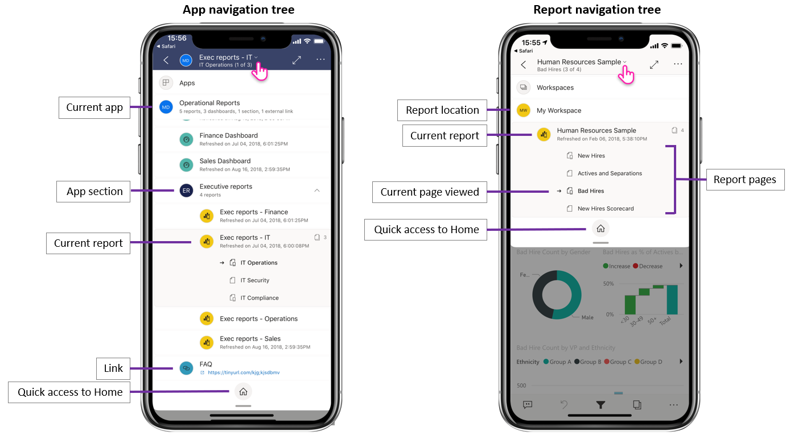

### Share from Power BI using your favorite apps (iOS and Android)
Now you can share links to Power BI content with your contacts. Use the new share action in the header to send the link, using any collaboration app you have on your device, such as Microsoft Teams, a mail app, etc. The link captures the current view, so you can even share filtered report views.

### Pinch and zoom is now available in all report views - on both phones and tablets (iOS and Android)   
We've enabled pinch and zoom in all report views, making it easier for you to zoom in and out of your report content, whether you're on your phone or on your tablet.

### Auto play a slideshow on startup (Windows)
You can choose a report to automatically play in a slideshow when the Power BI Windows app is launched. This is useful for creating a kiosk-like experience that runs a report in public displays without any manual intervention. [Learn more!](mobile-windows-10-app-presentation-mode.md#auto-play-a-slideshow-on-startup)

## July 2020
### The Power BI mobile app for Windows now supports organizational branding
Now, any changes the administrator makes to the look and feel of Power BI in order to match your organization's branding theme will also appear in the Power BI mobile app. Such changes might include a new color scheme for the top navigation bar, your organization's logo, and a banner image.  

### Disable single sign-on via remote configuration (iOS and Android)
IT administrators can now remotely disable single sign-on to the Power BI mobile app, enhancing security and permissions compliance on multi-user devices. [Learn more!](mobile-app-configuration.md#disable-single-sign-on-ios-and-android)

## June 2020
### Show your bookmarks in slideshows (Windows)
Now you can include report and personal bookmarks in your slideshows, automatically as part of the presentation, to highlight specific insights in your data.
[Check it out!](mobile-windows-10-app-presentation-mode.md#use-presentation-mode)

## May 2020
### We've added dark mode to Power BI mobile (iOS)
Try out the new dark mode in the Power BI mobile app for iOS13. In dark mode, you'll see light text on a dark background, reducing the brightness of the screen and making it easier to see your content. You can switch between themes in the app appearance settings. [Learn more](mobile-apps-dark-mode.md)

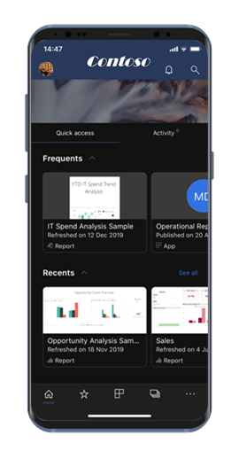

### Apply bookmarks in presentation mode (Windows)
Now, when presenting a report in presentation mode, you can apply both personal and report bookmarks to report pages, telling the story about your data. [Check it out!](mobile-windows-10-app-presentation-mode.md#use-presentation-mode)

## April 2020

### Sharing from workspaces is now available
We've added the capability to share reports and dashboards from workspaces. You can now share your content from "My workspace" and from other workspaces if the workspace owner allows it, just like in the Power BI service. 

### Dashboards now support full-screen mode (iOS and Android)
Now you can view your dashboards in full-screen mode, giving you more space to view your dashboard content. 

## March 2020

### Use shortcuts and Google Search to launch your content (Android)
We've made it easier to find and launch your data by integrating both shortcuts and Google Search with the Power BI app. Create shortcuts for easy access to your favorite reports and dashboards directly from your device's home screen. And use Google Search to quickly search for and open your Power BI content. Learn more about [Android app shortcuts](mobile-app-quick-access-shortcuts.md) and [Google Search](mobile-app-find-access-google-search.md)!

### Enhanced security using device protection (preview) (Android)
Use your device's built-in protection capabilities to secure your Power BI app and get the privacy you need. Requiring biometric authentication (Fingerprint ID) for accessing the Power BI app ensures your data is kept private and seen by your eyes only. [Learn about native secure access](mobile-native-secure-access.md)

### Scanning is now available on iPad
Now, right from your iPad, you can scan barcodes to filter your reports, and use QR codes to open reports quickly.  

### Updated filtering experience
Filters in the Power BI app have new functionality and a new design. This includes improved visibility of applied filters affecting report visuals, and the ability to lock and even hide filters. These changes also provide better compatibility with filtering in the Power BI service.

## February 2020

### Multi-select mode (Android and iOS)

We've added the capability to select multiple data points on a report page. When multi-select is turned on, each data point you tap gets added to the other selected data points, with the combined results automatically highlighted in all the visuals on the page. To turn on multi-select mode, go to the [mobile app settings](./mobile-app-interaction-settings.md) page.

>[!NOTE]
>Multi-select mode will be supported on Power BI Report Server in the next Report Server release.

### Report footer can now always be visible in the mobile app for iPhones

On your iPhone, like on your Android phone, you can now decide to dock the report footer at the bottom of the report page, where it is always visible and available, regardless of your actions on the page. This makes it easy to use all the options it provides. To dock the footer, toggle the **Docked report footer** switch on the [mobile app settings](./mobile-app-interaction-settings.md) page.

### Support for PBIRS reports (preview) (Windows)

You can now open your Power BI Report Server (PBIRS) reports in the Power BI app.

### Quickly access your recent items (Windows)

Right click on Power BI app's icon in Windows taskbar to get a list of all your recently viewed items. Click any item on the list to make a quick return visit.

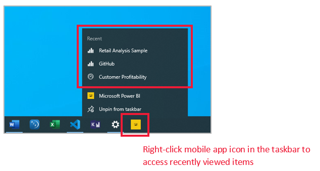

## January 2020

### Share annotations created in presentation mode (Windows)

Annotations you create during presentations become an integral part of the presentation and a key component of the discussion. Now, when you annotate reports in presentation mode, you can share a snapshot of the report page with your colleagues. [Learn more](./mobile-windows-10-app-presentation-mode.md#use-presentation-mode)

## December 2019

### Docked report footer and a refresh button - new experiences for interacting with reports (Android)

We've heard from our Android users that their experience using reports is not optimal - that it is hard to use the report footer and that pull-to-refresh is too sensitive in some devices. Therefore, in this release, we've changed these behaviors:
* **Docked report footer** - now, when you open a report on your phone, you'll find the report footer docked at the bottom of the report page, where it's always visible and available, regardless of your actions on the page. This makes it easy to use all the options it provides.
* **Refresh button on report header** - you'll also find a refresh button in the report header, making it easy to refresh the report exactly when you intend to.

Those users who prefer the previous behavior can restore these behaviors with the mobile app's new, expanded [interaction settings](./mobile-app-interaction-settings.md).

In addition, IT admins can [remotely override the new default settings](./mobile-app-configuration.md#interaction-settings-ios-and-android) on behalf of their users, using their MDM tool of choice with an app configuration file. In this way all users in an organization can have the same behavior configured for them.

> [!NOTE]
> Interaction settings for the refresh button and for docking the report footer do not currently have an effect on Report Server reports. This will change with the January Report Server release!

### Set default bookmarks from your mobile app
Now you can set default bookmarks for your reports directly from your Power BI mobile app. Then, every time you open a report, its default bookmark will be applied automatically. [Learn more!](./mobile-reports-in-the-mobile-apps.md#bookmarks)

### Filtering by location on Android tablets
Geo-filtering lets you filter your reports based on your current location. This feature is now also available in the Power BI app for Android tablets. [Learn more!](./mobile-apps-geographic-filtering.md)

## November 2019

### Power BI app's new look is now on by default
 
Now when you open the app, the new look and navigation bars are automatically turned on, simplifying the way you find and open content. Use the app's [home page](mobile-apps-home-page.md) as your starting point - you'll get quick access to your most important content, as well as an [activity feed](mobile-apps-home-page.md#activity-feed) that keeps you up-to-date with all your latest alerts, notifications, and more.

### See all your latest Power BI activity
 
The activity feed helps you keep track of what's happening with your Power BI content, in real-time. Simply go to the app's home page and open the Activity tab to view all your latest notifications, alerts, comments, @mentions, and more. [Learn more](mobile-apps-home-page.md#activity-feed).

### Use bookmarks in your reports

The Power BI mobile app now supports bookmarks created in Power BI. When you open the app, you can take advantage of bookmarks created by the report author and any personal bookmarks that you yourself have created. [Learn more](mobile-reports-in-the-mobile-apps.md#bookmarks).

## October 2019

### Android support for remote configuration of Report Server access settings

We added Android support for remote configuration of the Power BI mobile app's Report Server access settings. IT admins can now use their organization's MDM tool to remotely configure those settings on both iOS and Android devices. See [Configure Power BI mobile app access to Report Server remotely](../../report-server/configure-powerbi-mobile-apps-remote.md) for details.

### Cross-report drillthrough

This month we've added support for cross-report drillthrough. You can now tap on a data point to drill through to access other reports and report pages. When you drill through to a target page, the content in that page is filtered based on the drillthrough settings.

> [!NOTE]
> Cross-report drillthrough is only available if it was enabled during report creation. [Learn more about cross-report drillthrough](../../create-reports/desktop-cross-report-drill-through.md).

### Data sensitivity labels

You can now see sensitivity labels that content owners have set on reports, dashboards, datasets, and dataflows to classify the sensitivity of their data. Sensitivity labels determine how content can be shared with other users. [Learn more about data sensitivity labels in Power BI](../../admin/service-security-data-protection-overview.md).

### Support for custom app navigation (Windows)

Support for custom app navigation has now been added for Windows devices in addition to iOS and Android (see [September's What's new entry](#september-2019)).

## September 2019

### Support for custom app navigation (iOS and Android)

We've added support for custom app navigation. Now, when you open an app in Power BI Mobile, the custom navigation experience built by the app creator will be available. App navigation can be organized by content, and can include new items such as links and collapsible sections.
Read more about [custom navigation](https://powerbi.microsoft.com/blog/designing-custom-navigation-for-power-bi-apps-is-now-available/).

## August 2019

### Introducting Power BI Mobile new look (preview) (iOS and Android)

We've refreshed our app and introduced new experiences, adding a home page that provides quick access to your commonly used content, and new nav panes that give you an easy way of navigating through the app. With the new and refreshed experiences, it's now quicker and easier to find what you need, when you need it.
Since the new look is in preview, you will need to turn it on to enjoy it.
Read more about [Power BI Mobile new look](https://powerbi.microsoft.com/blog/introducing-power-bi-mobile-apps-new-look-preview/).

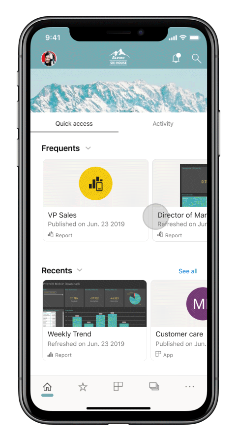

### Secured access with Azure Active Directory (AD) Application Proxy (iOS and Android)

We partnered with Azure Active Directory team to integrate Power BI mobile applications with Azure Active Directory (Azure AD) Application Proxy. With this configuration you can connect to Report Server hosted inside the enterprise boundaries from Power BI Mobile app, without the need to set up complex on-premises configuration. Read more on [Power BI mobile and Azure AD Application Proxy integration](https://powerbi.microsoft.com/blog/access-on-prem-report-server-from-your-power-bi-mobile-app-with-azure-active-directory-application-proxy/). Learn [how to configure Azure AD Application Proxy and Power BI](/azure/active-directory/manage-apps/application-proxy-integrate-with-power-bi).

## July 2019

### Report page tooltips

Report page tooltips are now supported when viewing reports in your mobile app. Simply press and hold on a visual that has a report tooltip tied to it and it will be shown.  

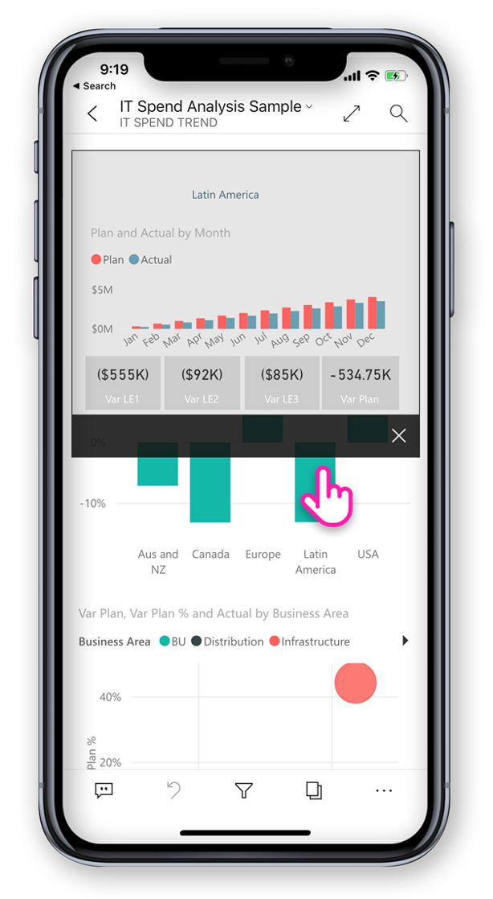
 
> [!NOTE]
> Report tooltips are supported for devices greater than 640 pixel size and 320 viewport. Smaller devices use default tooltips.

## June 2019

### Barcode scanning is now available in Android
Now you can use your Power BI app on Android (phone and tablet) to scan barcodes printed on products or shelves at your store to display related Power BI reports filtered by the scanned value. More about [filtering your data with barcodes](mobile-apps-scan-barcode-iphone.md).

### Supporting PBIX reports hosted in PBI-RS over ADFS configuration (iOS, Android)

Power BI Reports (PBIX) hosted in PBI-RS over ADFS configuration can now be accessed also from Power BI mobile apps.

## May 2019

### Siri Shortcuts support (iOS)
Users can create Siri Shortcuts to their Power BI reports and dashboards, and then open them directly from Siri voice interface. [Read how to use Siri Shortcuts in Power BI iOS app](https://powerbi.microsoft.com/blog/introducing-siri-integration-with-power-bi-mobile-ios-app-preview/).

### Device search (iOS)
Integrating Power BI with iOS device search (Spotlight). Searching for content in iPhone or iPad will now include Power BI items as well. When users use device native search, Power BI reports, dashboards, apps, workspaces and people matching the search criteria, will be listed in the results as well. [Visit the blog post to learn more](https://powerbi.microsoft.com/blog/introducing-siri-integration-with-power-bi-mobile-ios-app-preview/).

### Single tap report interaction - GA

Single tap is now GA, and will become the default touch interaction for new users. Users will still be able to turn it off and have double tap in the app settings.

### Enhanced conditional access protection (iOS, Android)

We integrated with Azure AD [new app protection-based conditional access capability](/azure/active-directory/conditional-access/app-protection-based-conditional-access) to increase security by limiting access to Power BI before app policy is applied.

### Device protection (iOS)

Users can use device built-in protection to secure Power BI, by asking for Face ID, Touch ID or passcode for accessing Power BI. This can be control by the user using the app settings, but also by admins using Intune and any other MDM tool. [Learn more](./mobile-native-secure-access.md).

### One page report Slideshow (Windows)

Supporting auto refresh also for one-page reports in slideshow. So, if the report's underlying data source is updated, we will pick it up and update the data in the page.

## April 2019

### Key Influencers visual 

Key Influencers visual is now available on your mobile app. This visual lets you perform analysis of key drivers over your data with just a few taps.

### Add comments to report content (Android and iOS)

Now you can use comments to collaborate and share your feedback on report pages and visuals. Read more about report commenting in Power BI Service and Mobile [in this blog](https://powerbi.microsoft.com/blog/announcing-report-commenting-for-power-bi-service-and-mobile/). 

### Maximize the view with full screen mode (Android and iOS)

We added new button that let you control when to focus on your data by removing report headers and footers and giving you maximum space for viewing your reports.

## March 2019

### Supporting external guest users in Power BI apps (iOS, Android)

You can access Power BI content shared with you from other organization directly from the app (also known as B2B). Read more on Power BI mobile apps B2B [here](https://powerbi.microsoft.com/blog/power-bi-mobile-apps-now-support-azure-ad-b2b-guest-users/).

### Enhancing Windows presentation mode with slideshow (Windows)

With [slideshow](https://powerbi.microsoft.com/blog/enhancing-presentation-mode-with-slideshow-in-windows-power-bi-app/) you can use public displays located in your office to run Power BI reports in full screen that will auto rotate between report pages.  

### Supporting PBI-RS reports over ADFS and WAP configuration (iOS only)

Power BI Reports (PBIX) hosted in PBI-RS over ADFS configuration can now be accessed from Power BI iOS app.

### Enabling single tap interaction with report visuals

We changed report interaction so it will require only one tap on a visual, button, or slicer to interact with its data right away. Users will no longer need to tap on a visual to select it and to tap again to interact with it,  a single tap will do them both.

> [!NOTE]
> Existing users will need to turn on this behavior in the app setting. For more information, see the [How to configure single tap report interaction](./mobile-app-interaction-settings.md) article.

## January - February 2019
 
### Visio visuals

Enabling Single sign on (SSO) in Visio visuals, so no additional sign-in steps are required when viewing report with Visio visual in the app. 

### Dashboard commenting is coming to Power BI Mobile Windows app

You can add comments directly to dashboards and specific tiles to discuss your data, and anyone viewing the dashboard will see your comments. 

## December 2018

### Filter is now available for landscape reports 

Report's filter pane is now available for landscape reports (in addition to phone report).

## November 2018

### Modern visual header 

Reports using the new 'modern visual header' will no longer allocate space for headers, resulting in less empty space and more room for your visualizations.

### Enhance presentation mode (Windows)

Enhanced presentation mode for Surface Hub and Windows 10 devices.  Enjoy an enhanced Surface Hub meeting room experience, with improved presentation and collaboration tools, and a chromeless, large-screen optimized view, so you can focus on your data. Presentation mode also provides tools such inking to help you effectively present and have discussions about your data. Read more about presentation mode [here](https://powerbi.microsoft.com/blog/presentation-mode-in-power-bi-windows-app/).

### Portrait report layout in tablets (iOS and Android)

We now use phone report layout, when it exists, for displaying reports on tablet in portrait mode orientation. Read more on [how to create phone layout in Power BI Service or Desktop](/power-bi/desktop-create-phone-report/).

### Supporting report query string 

Opening report link that includes query string will now be opened in the mobile app and be pre-filtered based on the conditions defined in the query string. Learn more on [how to create report url with query string](/power-bi/service-url-filters/).  

### Shared credentials (now in Android)

Signing in to Power BI from your mobile app has never been easier. With shared credentials, we simplified the sign-in process by using other Microsoft 365 app credentials on the device to authenticate you in the Power BI service.

### In-app URLs (now in Android) 

Links in reports that point to other Power BI artifacts now open directly inside the app. This enables you to build custom navigation flows, for example, linking from a report into a dashboard.

### Show data and copy values

Report visual action menu (...) now has the option to show the underlying data in table format. Once in the table, you can long-tap to select and copy values from that table (assuming that there is no Intune policy restricting copying).

## October 2018

### Paginated report preview (all devices)

Paginated reports are now available on Power BI service. Users with access to paginated reports in Power BI Service can also access these reports from their mobile app. 

Read the Power BI [blog post about paginated reports in mobile](https://powerbi.microsoft.com/blog/power-bi-paginated-reports-also-available-in-power-bi-mobile-apps-preview/).

### Shared credentials (iOS)

Signing in to Power BI from your mobile app has never been easier. With shared credentials, we simplified the sign-in process by using other Microsoft 365 app credentials on the device to authenticate you in the Power BI service.

### In-app URLs (iOS) 

Links in reports that point to other Power BI artifacts now open directly inside the app. This enables you to build custom navigation flows, for example, linking from a report into a dashboard.

### iOS12 and watchOS 5 support 

We have updated Power BI app for iOS to work seamlessly with the new OS on mobile devices and watch.

## September 2018

### Phone report editing in the browser (all devices)

Now you can create a phone report layout for a report that is already published in the Power BI service, and not just in Power BI Desktop. You create it in Edit mode in your browser.

### Dashboard commenting (iOS and Android) 

You can add comments directly to dashboards and specific tiles to discuss your data, and anyone viewing the dashboard will see your comments. You can also pull others in your organization into the conversation by @mentioning them. Those you've @mentioned receive a push notification with your message to their mobile phone.

Currently available for iOS and Android devices. Windows support coming soon.

Read the Power BI [blog post about dashboard comments](https://powerbi.microsoft.com/blog/announcing-dashboard-comments-in-power-bi/).

### Single Sign-On (Windows)

Single Sign-On (SSO) is one of the most requested capabilities for Power BI mobile for Windows. 
Now you can use your primary organizational account not only to sign in to your domain-joined Windows mobile devices, but also to sign in seamlessly to the Power BI service. Read more about [SSO and the Windows mobile apps](mobile-windows-10-app-single-sign-on-sso.md).

## Previous months

### July 2018

#### iOS and Android only

**Shared filters**

You can now receive reports with shared filters and slicers.

**Background image support**

When you view a report in landscape mode on your mobile device, you see the same background images that you see in Power BI on the web.

### June 2018

#### Full-canvas reports

Top and bottom action bars now disappear shortly after your report loads, so you can see more of your report at once.

#### Increased phone report canvas size

We increased phone report canvas size to have room for more visuals than before.

### May 2018

#### Mobile drillthrough: all mobile apps

You can drill through from a selected data point to another report page in the mobile apps, if the report author has defined that action. 

#### Back button: all mobile apps

Now when you navigate through a report by swiping, choosing a report page on the action bar, or using drillthrough, the back button takes you back to the previous page you were looking at. 

#### Dashboard themes: all mobile apps

When report authors customize dashboard themes in the Power BI service, the look and feel of the dashboard will change in the mobile app, too. However, you won't see background images.

#### iOS: Configure Power BI iOS mobile app access to a report server remotely

Your IT admin can now use an MDM tool to configure Power BI iOS mobile app access to a report server. See [Configure Power BI iOS mobile app access to a report server remotely](../../report-server/configure-powerbi-mobile-apps-remote.md) for details.

#### Power BI for Mixed Reality app (Preview)

The Power BI for Mixed Reality app is now in the Microsoft Store. View your dashboards and reports while immersed in the virtual world, or place them and view them in specific locations in the context of your environment. See the new [Introducing Power BI on HoloLens](https://www.youtube.com/watch?v=J_X_nOFUBss) video for context, or read the article about the new [Power BI for Mixed Reality app](./mobile-hololens2-app.md).

### April 2018

#### Drill-down and drill-up buttons in the mobile app

You can now drill down and drill up to dive into report visuals on your mobile device. To access this new feature, tap and hold to open the tooltip menu on a report visual, and then tap the drill buttons to explore your data in depth. More about [drilling up and down in the mobile apps](https://powerbi.microsoft.com/blog/drill-down-up-in-power-bi-mobile-apps/).

#### Persistent filters

We recently updated report filters and slicers, so they are automatically saved from Power BI on the web to the Power BI mobile app. Now, filters and slicers you set in the mobile app are automatically saved to Power BI on the web.

### March 2018

#### Power BI for Mixed Reality app (Preview)

In the latest move to bring data where you are, we've created the Power BI for Mixed Reality app. View your dashboards and reports while immersed in the virtual world, or place them and view them in specific locations in the context of your environment. Read more about the new [Power BI for Mixed Reality app](./mobile-hololens2-app.md).

#### Share reports and dashboards externally

Share dashboards and reports with users outside of your organization, directly from the app. External sharing in enabled for both organizational and social accounts. 

#### Persistent filters

When you set filters and slicers in Power BI on the web, your filter choices are saved to your mobile app as well, so you can pick up where you left off.

#### Refresh reports on the iPad

Power BI reports now have a refresh button in the iPad app.

### February 2018

#### Share reports

Now you can share a report directly from the mobile apps. Read more about [sharing dashboards and reports from the mobile apps](mobile-share-dashboard-from-the-mobile-apps.md)

#### Improved tooltips

When you tap and hold on a report visual to access tooltips, you can now drag your finger across the visual to explore details about each data point along the way.

### January 2018

#### Report favorites

Tag reports as favorites so they appear on the **Favorites** page. Read more about [favorites in the Power BI mobile apps](mobile-apps-favorites.md).

#### View shared reports

Now when someone shares a report with you, it's listed on the **Shared with me** page along with dashboards.

#### Improved hyperlink support

You can now tap links in Power BI visuals to open them in your mobile browser.

#### Intune integration (Android)

Support for conditional access using Intune mobile device management.

### December 2017

#### Improved security management 

We've added support for conditional access (CA) and Microsoft Intune mobile device management (MDM) on Android devices, to better secure your organization's data. It's already available on iOS.

#### Improved permission management

We've made some changes that allow for more precise management of user permissions for datasets, dashboards, and reports.

#### Auto-installed apps

You don't need to install some of the apps in Power BI at all. Power BI app creators in your organization can create *apps* that contain a collection of dashboards and reports. Then they can publish the app and set it to install automatically in the Power BI service and the Power BI mobile apps. When an app is set to install for you, it automatically appears in your **Apps** menu:

### November 2017
#### iPhone X optimization

We've optimized the app layout for iPhone X, so you can explore your data in style on every device.

### October 2017
#### Filters for phone reports in Android

If you create a report with phone-optimized pages in Power BI Desktop, and the report has filters, you can now apply those filters in the phone report on your Android. Read more about filters for Power BI reports on Android.

#### Show data in reports

You can now switch visuals in your reports to a table view to see the numbers behind the data. To access this feature, tap "Show data" from the visual's ... menu on your report or the new icon on the expanded visual's action menu.

### September 2017
#### Filters for phone reports in iPhones
If you create a report with phone-optimized pages in Power BI Desktop, and the report has filters, you can now apply those filters in the phone report on your iPhone. Read more about [filters for Power BI reports on iPhones](https://powerbi.microsoft.com/blog/filters-coming-for-phone-reports-on-ios/).

### August 2017
#### iOS proxy settings support
You can now set proxy settings in the Power BI iOS mobile app. This means that Power BI will now work with VPN connections on your mobile device, allowing more users and organizations to securely leverage the power of Power BI on the go.

### July 2017
Read the [mobile apps feature summary for July 2017](https://powerbi.microsoft.com/blog/power-bi-service-and-mobile-july-feature-summary/#ios-preview)

#### iOS devices
**New Q&A experience on iOS (Preview)**
Instead of just receiving an answer to your question, you can now use natural language to get scoped insights. Even if you're not sure what you're looking for, Q&A proactively surfaces insights relevant to your data. The new Q&A experience on mobile, developed in collaboration with the Microsoft Research team, showcases powerful technologies within our product. Try the tutorial, [Ask questions about your data in the iOS mobile apps](mobile-apps-ios-qna.md).

### Responsive visuals
**Responsive visual for phone reports and dashboards**
You can set the visuals in your dashboard or report to be *responsive*, to change dynamically to display the maximum amount of data and insight, no matter the screen size. Read the [blog about responsive visuals](https://powerbi.microsoft.com/blog/power-bi-desktop-july-feature-summary-2/#responsiveVisuals).

### June 2107
#### All devices
**Make apps favorites**
You can already make a dashboard a favorite. Recently, [Power BI added apps](../../collaborate-share/service-create-distribute-apps.md), and now you can make apps favorites, too. 

### May 2017
#### All devices
**New menu: Shared with me**
Go to Shared with me in the mobile app menu to see all the content that's been shared with you.

**New menu: Apps**
An app is a collection of dashboards and reports built by your organization to deliver key metrics for faster and easier data-driven decisions.

Read more about [how your Power BI content is organized](mobile-apps-quickstart-view-dashboard-report.md).

#### iOS and Android devices
**Power BI Report Server preview**
Create and publish Power BI reports on premises. Then [view and interact with them in your iOS or Android](mobile-app-ssrs-kpis-mobile-on-premises-reports.md) mobile device. 

### April 2017
Read the [mobile apps feature summary for April 2017](https://powerbi.microsoft.com/blog/power-bi-mobile-apps-feature-summary-march-april-2017/)

#### All devices
**Background color for phone reports**
When you define a background color for a report in Power BI Desktop, the phone report will have the same background color. More about [optimizing report pages for phones](../../create-reports/desktop-create-phone-report.md).

**Develop mobile-friendly Power BI visual**
Read this [Developer guide](https://github.com/PowerBi-Projects/PowerBI-visuals/blob/master/Tutorial/MobileGuideline.md) for tips on creating Power BI visuals that look good and work well on mobile devices.

#### iOS devices
**Talk to your data: ask questions by speaking**
Now you can [ask questions of your data with Q&A](mobile-apps-ios-qna.md) by talking rather than typing. 

### March 2017
Read the [mobile apps feature summary for March 2017](https://powerbi.microsoft.com/blog/power-bi-mobile-apps-feature-summary-march-2017/).

#### All devices
**Slicer interactions**

We've improved touch interaction for time slicers.

#### iOS devices
**Ask questions of your data with Q&A - and give us feedback** 
Try asking questions of your data with Q&A, and then give us a smile or frown to let us know how we did.

**Use 3D touch for common actions** 
Deep-press the Power BI app icon on the home screen of your iPhone 6s or later to access notifications, search, and recently used dashboards.

**Support for right-to-left languages**
Power BI mobile apps now support right-to-left languages. In this context, "right-to-left languages" refers to Hebrew and Arabic writing systems, which are written from right to left and require contextual shaping. See the list of [Supported languages in the Power BI mobile apps](mobile-apps-supported-languages.md).

#### Android devices
**Connect to more than one SSRS server** 

Now you can have connections to up to five SQL Server Reporting Services (SSRS) servers at the same time.

**Request access to dashboards** 

If you scan a QR code for a dashboard that you don't have access to, now you can submit a request for access right from the mobile app.

### February 2017
#### All devices
**Scrolling made easier** 

Now you can scroll in bar and column charts in a report by touching the chart itself, rather than touching the scroll bar on the side.

#### iOS devices
**Ask questions of your data with a preview of Q&A** 

With Q&A, you ask questions about your data in your own words, and Power BI provides the answers. Q&A is already in the Power BI service on https://powerbi.com. Now it's also [available in the mobile app on your iPhone or iPad](mobile-apps-ios-qna.md).

**Connect to more than one SSRS server** 

Now you can have connections to up to five SQL Server Reporting Services (SSRS) servers at the same time.

#### Android tablets
**The Power BI mobile app** for Android tablets is now available globally. Get started with the [Power BI on your Android tablet](mobile-android-app-get-started.md).

#### iOS and Android devices
**New menu for dashboard tiles** Navigate to the underlying report, expand the tile, or manage an alert, all directly from a menu on the tile on a dashboard. 

This menu is new for iOS, Android phones in landscape mode, and Android tablets. It was already in Windows and Android phones in portrait modes.

### January 2017
Read the [January 2017 mobile apps blog feature summary](https://powerbi.microsoft.com/blog/power-bi-mobile-apps-feature-summary-january-2017).

#### All devices
**Load more than 100 rows in tables and matrices**
Now, if you have a large table or matrix on your dashboard or report, we show as much data as possible in the tile. Then in focus mode, you can scroll down to load additional rows.

**Phone report - general availability**
Power BI phone reports are now generally available. In Power BI Desktop, you can tailor a portrait view of an existing report for mobile viewers. Learn more about [authoring phone reports in Power BI Desktop](../../create-reports/desktop-create-phone-report.md) and the [report experience on phones](mobile-apps-view-phone-report.md).

#### iOS
**SSRS Authentication using Active Directory Federation Services (ADFS) Preview**
Now you can sign in to on-premises SQL Server Reporting Services servers from your mobile device with your organizational account. Read more about [using OAuth to connect to SSRS servers](mobile-oauth-ssrs.md).

#### Android
**SSRS Authentication using Active Directory Federation Services (ADFS) Preview**
Now you can sign in to on-premises SQL Server Reporting Services servers from your mobile device with your organizational account. Read more about [using OAuth to connect to SSRS servers](mobile-oauth-ssrs.md).

**New and improved: Annotate and share insights quickly**
Sharing and annotating are now fully functional on Android devices. The improved menu makes it easier and quicker to annotate and share insights, and you can also share an annotated report or directly from the Power BI app.

### December 2016
Read the [December 2016 mobile apps blog feature summary](https://powerbi.microsoft.com/blog/power-bi-mobile-apps-feature-summary-december-2016).

#### All devices
**Offline background refresh**

To make sure you can access your latest data while offline, we perform a refresh in the background of the app so your business information is up to date, even if you haven't accessed it for a while. To make sure certain dashboards are always up to date, just mark them as favorites. Learn more about [offline capabilities in the Power BI mobile apps](mobile-apps-offline-data.md).

#### iOS devices
**Annotate and share**

Now you can annotate and share a tile, report, or visualization from the Power BI mobile app for iOS. 

* [On the iPhone](mobile-annotate-and-share-a-tile-from-the-mobile-apps.md)
* [On the iPad](mobile-annotate-and-share-a-tile-from-the-mobile-apps.md)

**Request access to dashboards**

If you scan a QR code for a dashboard that you don't have access to, now you can submit a request for access right from the mobile app.

**Custom URL on image tile**

If an image tile has a custom URL defined by the dashboard owner, when you tap the tile you go directly to that URL without opening the tile in focus mode. 

#### iPhone
**Apple watch improvements**

You can now refresh Apple Watch data directly from the Watch app. In the dashboard index page, deep press to refresh your data. (The Power BI mobile app must be running in the background on your iPhone for this to work).

#### Android
**Custom URL on image tile**

If an image tile has a custom URL defined by the dashboard owner, when you tap the tile you go directly to that URL without opening the tile in focus mode. Also, dashboard tiles containing predefined custom URLs can now redirect readers to reports within the app.

### November 2016
Read the [November 2016 Power BI mobile apps feature summary](https://powerbi.microsoft.com/blog/power-bi-mobile-apps-feature-summary-november-2016/).

#### Android tablets
**Power BI mobile app for Android tablets** Yes, the preview is here.

* Experience [Power BI on your Android tablet](mobile-android-app-get-started.md)
* Explore [Reporting Services mobile reports and KPIs on your Android tablet](mobile-app-ssrs-kpis-mobile-on-premises-reports.md)

#### Android devices
**Preview: Intune Mobile Application Management** Power BI support for Microsoft Intune Mobile Application Manager (MAM) is now in preview for Power BI Pro users on Android devices. 

**Favorites** Tag your favorite dashboards on your Android device, and see all your [favorite Power BI dashboards and Reporting Services mobile reports and KPIs](mobile-android-app-get-started.md#view-your-favorite-dashboards-and-reports) collected in one convenient location. 

#### iOS devices
**Links** URLs in tiles and visualizations are now clickable, and open in a browser.

#### Windows devices
**Center a map** to focus on data near you in your location

### September/October 2016
Read the [October 2016 Power BI mobile apps feature summary](https://powerbi.microsoft.com/blog/power-bi-mobile-apps-feature-summary-october-2016/).

#### All devices
**Favorites as landing page**
If you've marked any of your dashboards as favorites, then your landing page will be your Favorites entry. 

**Improved navigation**
The main navigation has a new look, and groups navigation has moved to the groups catalog. 

**Report and dashboard performance improvements**
Improved the experience of loading reports and dashboards in the Power BI mobile apps

**Enhanced alert notifications**
Notifications for your data-driven alerts now contain more information on what triggered the alert and why.

#### iOS on iPhones
**Apple Watch refresh improvements**
The Apple Watch mobile app has been improved for Watch OS3

#### Android phones
**Added manual tile refresh**
You can now manually refresh your dashboard tiles. For tiles based on DirectQuery, this will retrieve the latest data from the dataset.

#### Windows 10 phones
**Geographic filtering**
On your Windows 10 phone you can now filter your report based on your current location, and see only the data you need.

**SandDance visualization**
This custom visualization is now available on the Surface Hub

### August 2016
#### All phones
**Favorites** 
View your favorite dashboards from all Power BI mobile apps, and manage the list of favorites from the Power BI mobile apps for iOS and Windows 10 devices. Read more about [favorites in the Power BI mobile apps](mobile-apps-favorites.md).

**Dashboard data classification** See the data classifications that dashboard owners have assigned their dashboards. Read more about [classifying dashboards](../../create-reports/service-data-classification.md).

**Data-driven alerts**
Get notified by an alert when your data changes in pre-set ways for KPI, gauge, and card tiles. Learn more about:

* [Alerts on the Power BI app for Android phones](mobile-set-data-alerts-in-the-mobile-apps.md). 
* [Alerts on the Power BI apps for iOS](mobile-set-data-alerts-in-the-mobile-apps.md). 
* [Alerts on the Power BI app for Windows 10 devices](mobile-set-data-alerts-in-the-mobile-apps.md).

#### iOS on iPhones and iPads
**Tiles full-screen in focus mode on iPad**
When you tap a tile on your iPad, the tile will now open full-screen in focus mode, taking advantage of the entire iPad screen size.

**Manually refresh tiles**
Manually refresh your tiles by opening the dashboard in the Power BI mobile app for iOS and pulling down from the top of the screen. 

**Support for Intune MAM**
Added support for Microsoft Intune mobile application management (MAM) capabilities.

Read more about [Microsoft Intune on Power BI mobile apps](../../admin/service-admin-mobile-intune.md).

#### Windows 10 devices
**Full-screen and presentation modes**
Display reports in presentation mode on Surface Hub, and display dashboards, reports, and tiles in full-screen mode on Windows 10 devices.

### July 2016
#### All phones
In the Power BI service you can now [create a view of a dashboard specifically for phones](../../create-reports/service-create-dashboard-mobile-phone-view.md) in portrait mode. 

#### Android phones
**Favorites tab**
Access all your favorite dashboards from a single location.

**Improved security management**
Select a risk classification for the business data presented in a specific dashboard.

**Improved warning and banners**
We've improved warnings and banners for the mobile app.

**QR codes for report pages**
A QR code generated in the service will link to a specific page rather than the entire report.

**Improved alerts**
Data-driven alerts are now formatted based on your device's locale.

#### iOS on iPhones and iPads
**Improved security management**
Select a risk classification for the business data presented in a specific dashboard.

**Mobile insights**
View summary data (max, min, and all) on clustered column chart tiles.

**Improved manual refresh**
You can now manually refresh your dashboard tiles. For tiles based on Direct Query, this retrieves the latest data from the data model.

**Improved warning and banners**
We've improved warnings and banners for the mobile app.

**QR codes for report pages**
A QR code generated in the service will link to a specific page rather than the entire report.

**General improvements**
We've improved error messages for tiles in the mobile app.

#### Windows 10 devices
**Improved security management**
Select a risk classification for the business data presented in a specific dashboard.

**Improved warning and banners**
We've improved warnings and banners for the mobile app.

### June 2016
See the [June Power BI mobile apps blog post](https://powerbi.microsoft.com/blog/power-bi-mobile-apps-update-june-2016/) for more details.

#### QR codes now display in augmented reality (iOS)
Now when you scan a QR code generated by the Power BI service, the tile renders in augmented reality. 

More about [connecting to data in the real world](mobile-apps-data-in-real-world-context.md).

#### Filter data with barcodes (iPhone)
Now you can scan barcodes printed on products or shelves at your store to display related Power BI reports filtered by the scanned value. 

More about [filtering your data with barcodes](mobile-apps-scan-barcode-iphone.md).

#### SQL Server 2016 Reporting Services mobile reports
Now you can drill through from a Reporting Services KPI or a mobile report to another mobile report or to any custom URL.

#### Notification center
The notification center in your Power BI mobile app shows new data or dashboards that are shared with you, or changes to groups you belong to.

### May 2016
#### iOS devices and Android phones
* **QR codes** are now available **for reports**, too. Scan the code with your Power BI app to go directly to a related report, with no navigation or search needed.
* **Improved data management** for SQL Server 2016 Reporting Services: Reduced load times and data consumption on your device.
* **SQL Server 2016 themed mobile reports**: See themes for mobile reports on your device.
* **Geo-filtering**: Filter reports by your current location.

### April 2016
See the [April Power BI Mobile Apps blog](https://powerbi.microsoft.com/blog/power-bi-mobile-apps-update-april-2016/) for more details.

#### All apps
* Select more than one option in a report slicer.

#### Android mobile app
* **SQL Server 2016 [Reporting Services mobile reports](mobile-app-ssrs-kpis-mobile-on-premises-reports.md)** now on Android phones.
* **Report gallery** Open your reports directly in the report gallery.​
* **NTLM authentication** support for mobile reports in SQL Server 2016 Reporting Services.

#### Power BI app for Windows 10 devices
* **Presentation mode** Display Power BI dashboards and reports in presentation mode from the Power BI app.
* **SQL Server 2016 [Reporting Services mobile reports](mobile-app-windows-10-ssrs-kpis-mobile-reports.md)** now on Windows 10 devices.
* See **data tooltips** when you hover your mouse over a dashboard tile.

### March 2016
Read the [Power BI Mobile Apps blog for March 2016](https://powerbi.microsoft.com/blog/power-bi-mobile-apps-update-march-2016/).

#### iPhone mobile app
**Apple Watch** View your Power BI tiles and KPIs on your [Apple Watch](mobile-apple-watch.md).

**iOS 9.0 and later** To accommodate the best possible experience and new features for Power BI, we are now supporting only devices running iOS 9.0 and later.​

**Global search** Added a new "recently viewed" list and global search so you can find the data you need quickly.

**Report gallery** Open your reports directly in the report gallery.​

**Fresh data offline** New background refresh automatically updates your cached data when you're online, so you have the freshest data [even when you're offline](mobile-apps-offline-data.md). 

**Bing and R tiles** Open Bing and R tiles in focus mode.​

#### Android mobile app
**SQL Server 2016 mobile reports and KPIs** [View SQL Server 2016 mobile reports and KPIs](mobile-app-ssrs-kpis-mobile-on-premises-reports.md), and navigate between SSRS folders.​

**View reports** Open reports from tiles on your dashboards.​

**Fresh data offline** New background refresh automatically updates your cached data when you're online, so you have the freshest data [even when you're offline](mobile-apps-offline-data.md). 

#### Power BI app for Windows 10 devices
**Quick access** Access your dashboards, reports, and groups quickly with a new "recently viewed" list and global search so you can find the data you need.

**Bing and R tiles** Open Bing and R tiles in focus mode.​

**More live tiles on your Start screen** [Pin KPIs and row cards to your Start screen](mobile-pin-dashboard-start-screen-windows-10-phone-app.md) as live tiles, so you can see all of your critical metrics at a glance.

**Pinch to zoom** Use pinch-to-zoom on your tablet to examine dashboards in greater detail.

**Notifications** Get notified when your datasets, reports, and dashboards update with new data.

**Report gallery** Open your reports directly in the report gallery.​

### February 2016
#### Android
View dashboards in [landscape mode on Android phones](mobile-apps-view-dashboard.md#view-dashboards-on-your-android-phone). 

#### Power BI app for Windows 10 devices
View [reports on your Windows 10 phone](mobile-reports-in-the-mobile-apps.md).

Faster time to [insights on your Windows 10 mobile dashboards](mobile-tiles-in-the-mobile-apps.md): Share a tile snapshot or open a report directly from the dashboard.

### January 2016

All of the January improvements are already in the new [Power BI app for Windows 10 phones](mobile-windows-10-phone-app-get-started.md), released in December 2015. Now they're rolling out to the other Power BI apps for mobile devices. Read the blog post about these improvements.

**Real-time data support** Dashboards refresh in real time, so you don't need to refresh them manually.

**Offline indicators** When you don't have signal, you see an offline indicator at the top of your dashboard.

**Access cached data** Cached data no longer expires, so you have access to your cached data indefinitely while offline.

**R tiles and web widgets** View these new tile types in dashboards on your mobile device.

**Bing dashboards** In the Power BI service, you can now create [dashboards with Bing search results](../../connect-data/service-connect-to-services.md), and view them on your mobile device.

**Report pages pinned as tiles to dashboards** Now that you can pin a whole report page to a dashboard in the Power BI service, you can view report pages in the Power BI app on your iPhone or on your Android phone.

### December 2015
The Power BI team ended 2015 strong, with several major additions and updates.

#### SQL Server 2016 Reporting Services mobile reports in iOS
Now you can view your SQL Server mobile reports in the Power BI app on your iOS device, be it iPad or iPhone. Read more:

* [SQL 16 SSRS on Power BI app for iOS](https://powerbi.microsoft.com/blog/sql-16-ssrs-on-power-bi-app-for-ios/
) blog post
* View [SQL Server mobile reports and KPIs in the iPhone and iPad apps](mobile-app-ssrs-kpis-mobile-on-premises-reports.md) documentation

#### Power BI app for Windows 10 phones
The new Power BI app for Windows 10 phones is optimized for touch and mobile productivity. Explore dashboards and reports, invite colleagues to view data, and share insights over email to engage your team. Plus you can [pin Power BI dashboards to your Windows phone Start screen](mobile-pin-dashboard-start-screen-windows-10-phone-app.md).

* Read the [Power BI app for Windows 10 phones blog post](https://powerbi.microsoft.com/blog/announcing-the-power-bi-app-for-windows-10-mobile/).
* [Get started with the Power BI app for Windows 10 phones](mobile-windows-10-phone-app-get-started.md).

#### Other additions
Read the [Power BI mobile apps December blog post](https://powerbi.microsoft.com/blog/power-bi-mobile-apps-update-2d00-december-2015/) for more details.

* Receive notifications when a colleague shares a dashboard with you. (iOS)
* View entire pinned report pages in your dashboards. (iOS and Android)
* [Scan a QR code](https://powerbi.microsoft.com/blog/bridge-the-gap-between-your-physical-world-and-your-bi-using-qr-codes/) and go directly to a relevant tile on your Android phone.

### November 2015
Read the [November 2015 Power BI mobile blog post](https://powerbi.microsoft.com/blog/power-bi-mobile-apps-update-2d00-november-2015/).

#### All Power BI mobile apps
* A new welcome experience.
* Improved chart data capacity.

#### iOS and Android mobile apps
* Enterprises can now [configure Power BI mobile apps for iOS and Android with Microsoft Intune](../../admin/service-admin-mobile-intune.md) to manage devices and applications.

#### iPhone mobile app
* [Add a picture tile to a dashboard](mobile-iphone-app-get-started.md) directly from your iPhone.
* [Create QR codes in the Power BI service](../../create-reports/service-create-qr-code-for-tile.md), then scan them from your iPhone to open the Power BI app to a specific tile.

#### The Power BI app for Windows devices
* [Link directly from a tile to a specific URL](../../create-reports/service-dashboard-edit-tile.md#hyperlink).

### October 2015
Read the [mid-October Power BI mobile blog post](https://powerbi.microsoft.com/blog/power-bi-mobile-mid-october-updates-are-here/).

#### All Power BI mobile apps
* Line charts with a percentage-based Y-axis now calculate the visual range according to your actual data. The graph now starts from the lowest data point in the chart, instead of from a default value.
* Line, column, and bar charts can now have data labels. 
  
    

#### iPhone
* Stay up to date with your groups' newest dashboards -- receive notifications on your iPhone each time a team member adds a dashboard to one of your groups.
  
    
* You can now view dashboards horizontally, just by turning your phone. Read more about [landscape mode in the iPhone app](https://powerbi.microsoft.com/blog/enjoy-the-landscape-with-the-power-bi-iphone-app/).
  
    

### September 2015
Improvements in the Power BI mobile apps -- Android, iOS (iPhone and iPad), and Windows. Read the [mid-September Power BI mobile blog post](https://powerbi.microsoft.com/blog/power-bi-mobile-mid-september-updates-are-here/).

#### Android
* Support for group workspaces: Collaborate with colleagues in group workspaces. 
* Support for non-authenticated users:  For the few scenarios when users fail or can't sign in to the app, we added a fast, convenient way to contact support and send feedback.
* Improved user experience when accessing dashboards using role-based security.          
* Improved data formatting of charts and alignment of all dashboard tiles. 

#### iOS (iPhone and iPad)
* New & improved navigation: New drawer navigation maximizes screen real estate and improves navigation throughout the app. 
* Group workspaces: Collaborate with colleagues in group workspaces. 
* Authentication process upgrade Quality, performance, and functionality improvements enhance the app authentication process, including support for SSO (Single Sign-On). 
* Improved data representation of line chart tiles to better compress the x-axis.
* Improved user experience when using with role-based security.
* Touch-optimized improvements for matrix chart tiles: Now you can easily scroll through your matrix data and view all its data easily and intuitively.
* Improved data formatting of charts and alignments of dashboard tiles. 
* Removal of iOS 7 support: To maintain highest security standards for Power BI, we will no longer support iOS 7 installed devices. iOS 8 and above is required. 
* Send feedback and rating added in app: Added in-app capability to send feedback and provide ratings so that we can increase the community's influence on our roadmap and promote issues easily and directly from the app.

#### Windows
* Improved map tile rendering in in-focus mode to maximize screen real estate.
* Improved user experience when accessing dashboards using role-based security. 
* A new capability allows you to browse back and forth through dashboard tiles exploring them directly in in-focus mode without the need to return to the dashboard to select the next tile.
* Additional stability and performance improvements.