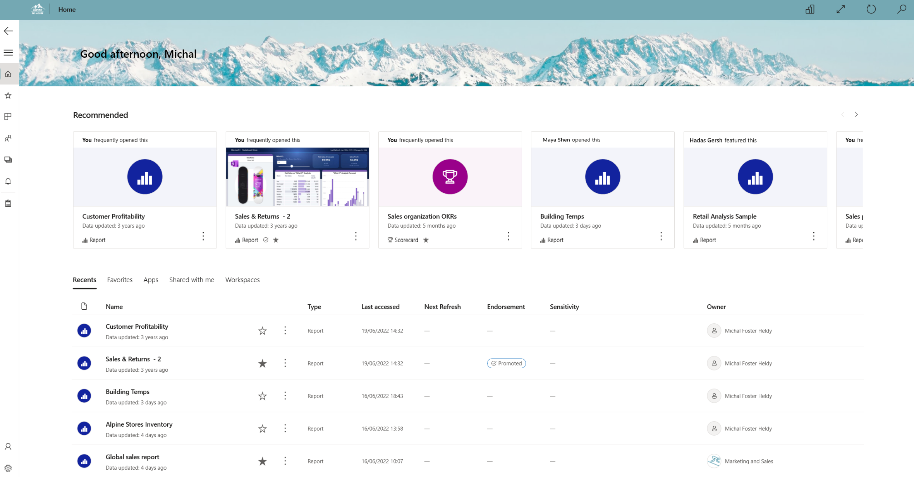
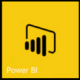
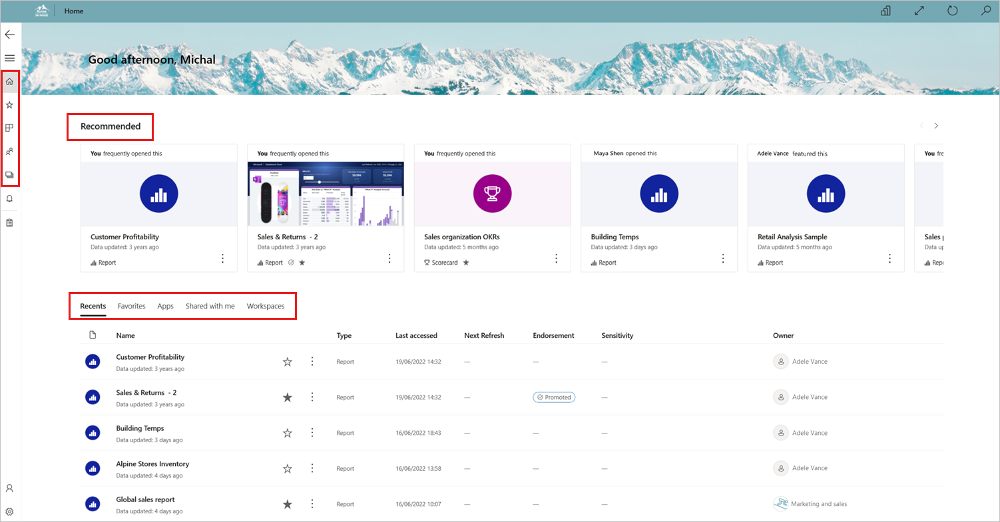
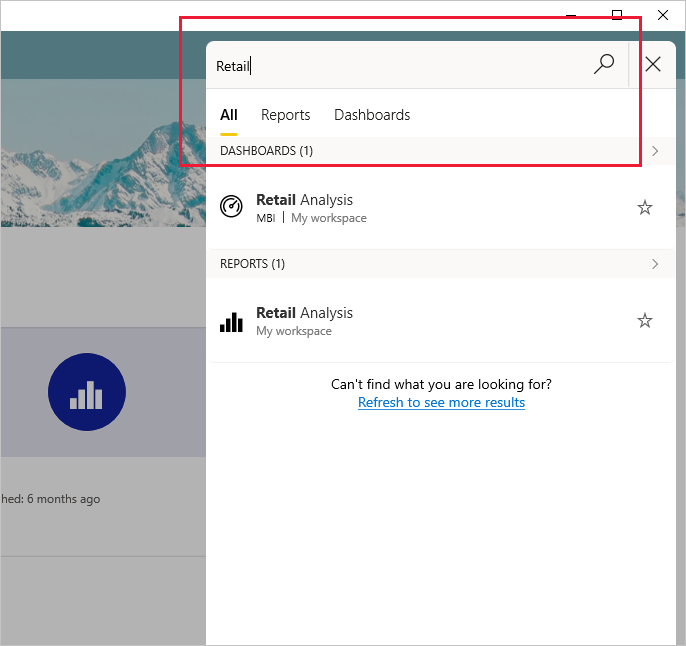
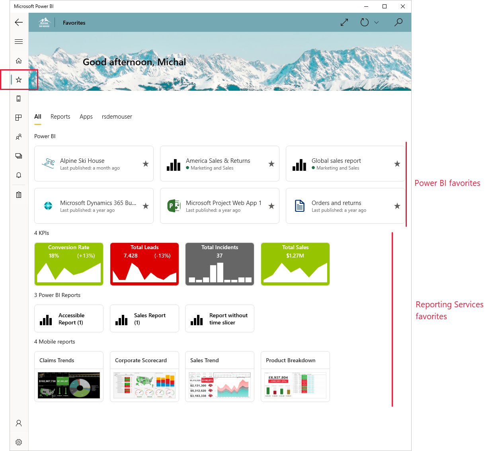
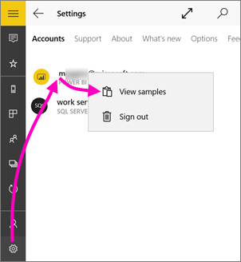
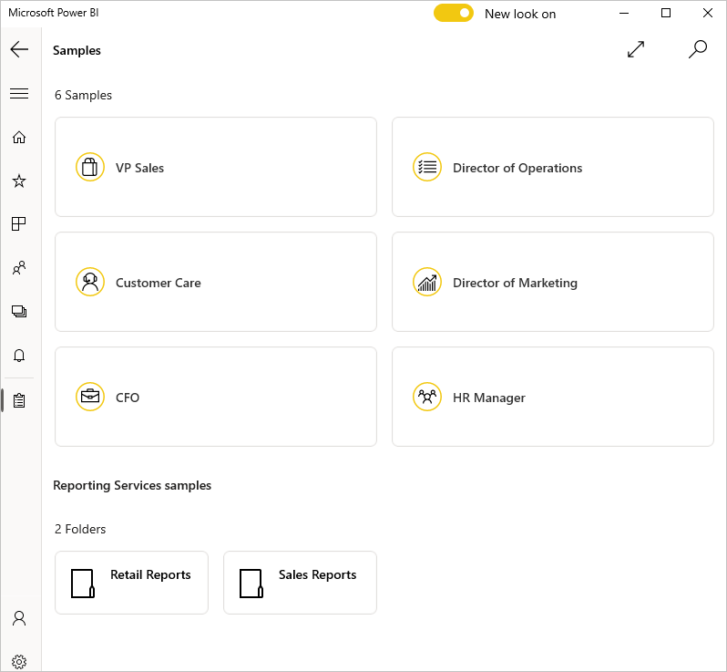
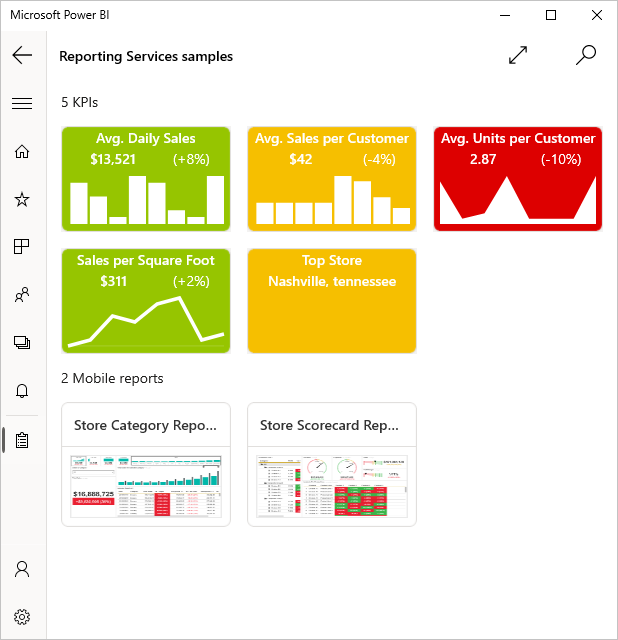

# Get started with the Power BI app for Windows

>[!NOTE]
> The Power BI Windows app was retired on December 31st, 2023, and is no longer supported. It's been removed from the Microsoft apps store, and no further product updates for it will be released. Please use [the Power BI service](https://app.powerbi.com/) to view your Power BI content on Windows devices.
>
> This notice only applies to the Power BI Windows app. It does not affect the Power BI Desktop app.

The Power BI app for Windows brings Power BI to your Windows device. You get up-to-date, touch-enabled access to your business information. You can interact with all the Power BI reports, dashboards, and apps that are available to you in the Power BI service - both those that you've [created](../../fundamentals/service-get-started.md) yourself as well as those that have been created by others and shared with you. All this from the Power BI app for Windows.

## First things first
* [**Get the Power BI app for Windows**](https://go.microsoft.com/fwlink/?LinkID=526478) from the Windows Store.
  
  Your device must run Windows 10 version 17763 or higher and have [WebView2 installed](./mobile-windows-10-phone-app-webview2-installation.md) (this doesn't apply to Microsoft Surface Hub).  App upgrades will not be available for Windows devices running on earlier versions. The app can run on devices with at least 3-GB RAM and 8-GB internal storage.

    The app is designed for a minimum resolution of 460x500.
   
* Find out [what's new in the Power BI apps for mobile devices.](mobile-whats-new-in-the-mobile-apps.md).

## Sign up for the Power BI service on the web
If you haven't signed up yet, go to the [Power BI service](https://powerbi.com/). Sign up for your own account to create and store dashboards and reports, and bring your data together. Then, sign in to Power BI from your Windows device to see your own dashboards from anywhere.

1. In the Power BI service, tap [Sign up](https://go.microsoft.com/fwlink/?LinkID=513879) to create a Power BI account.
2. Start [creating your own dashboards and reports](../../fundamentals/service-get-started.md).

## Get started with the Power BI app
1. On the Start screen of your Windows device, open the Power BI app.
   
   
2. To view your Power BI dashboards and reports, tap **Power BI**. Sign in with the same credentials as your Power BI account on the web. 
   
   To view your Reporting Services KPIs, tap **SQL Server 2016 Reporting Services**. Sign in with your SQL Server Reporting Services credentials.
   
   
3. Tap **Start exploring**  to view your own dashboards.

## Find your content in the Power BI app for Windows

Your dashboards and reports are stored in different locations in the Power BI app for Windows, depending on where they came from. You can get to them from the left-hand navigation bar, or from the home page, which shows you your recommended content, and also provides tabs that get you to lists of your recents, favorites, apps, shared with me, and workspaces. Read more about [finding your content in the Power BI apps for mobile devices.](mobile-apps-quickstart-view-dashboard-report.md). In addition, you can use the search to find anything you have in the app.

## Search for dashboards, reports, and apps
Click the magnifying glass icon at the top right of the app to find your dashboards, reports, and apps quickly. In the search pane that opens, start typing the name of what your looking for. Matching results will appear as you type. You can filter the results by selecting one of the tabs.

## View your Power BI and Reporting Services favorites
Tap **Favorites** on the left-hand navigation pane to view your favorite Power BI and Reporting Services content on the Favorites page. When you make a report, dashboard, or app a *favorite* in the Power BI app for Windows, you can access it from all of your devices, including the Power BI service in your browser. 

   

Read more about [favorites in the Power BI apps for mobile devices.](mobile-apps-favorites.md).

## Try the Power BI and Reporting Services samples
Even without signing up, you can play with the Power BI and Reporting Services samples. After you download the app, you can view the samples or get started. Go back to the samples whenever you want from the dashboards home page.

To see the samples, tap the global navigation button in the upper-left corner and then select **Samples**.

Six sample dashboards are available for Power BI, and two folders containing KPIs are available for Reporting Services.

### Power BI samples
Pick a role to start exploring one of the sample dashboards Power BI. You can view and interact with the Power BI dashboard samples, but you can't open the reports behind the dashboards, share the samples with others, or make them your favorites.

### Reporting Services samples

Open the Retail Reports or Sales Reports folder to explore their KPIs.

## Other tasks
Here are some other things you can do in the Power BI app for Windows devices with reports, dashboards, and apps in Power BI, and with Reporting Services KPIs in the Reporting Services web portal.

### Power BI content
* View [your apps](../../collaborate-share/service-create-distribute-apps.md).
* View your [dashboards](mobile-apps-view-dashboard.md).
* [Pin Power BI tiles and dashboards](mobile-pin-dashboard-start-screen-windows-10-phone-app.md) to your device's Start screen as live tiles.
* [Share tiles](mobile-windows-10-phone-app-get-started.md).
* Share [dashboards](mobile-share-dashboard-from-the-mobile-apps.md).

### Reporting Services KPIs
* [View Reporting Services KPIs](mobile-app-windows-10-ssrs-kpis-mobile-reports.md) in the Power BI app for Windows devices.
* Create [KPIs on the Reporting Services web portal](/sql/reporting-services/working-with-kpis-in-reporting-services).

## Related content

* [Download the Power BI app](https://go.microsoft.com/fwlink/?LinkID=526478) from the Windows Store  
* [What is Power BI?](../../fundamentals/power-bi-overview.md)
* Questions? [Try asking the Power BI Community](https://community.powerbi.com/)
